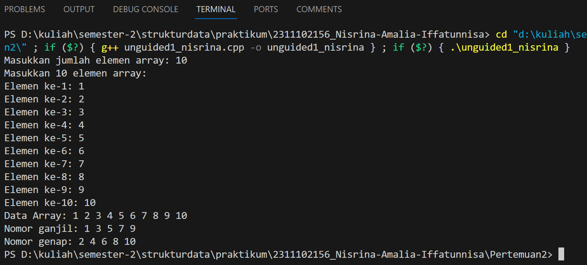
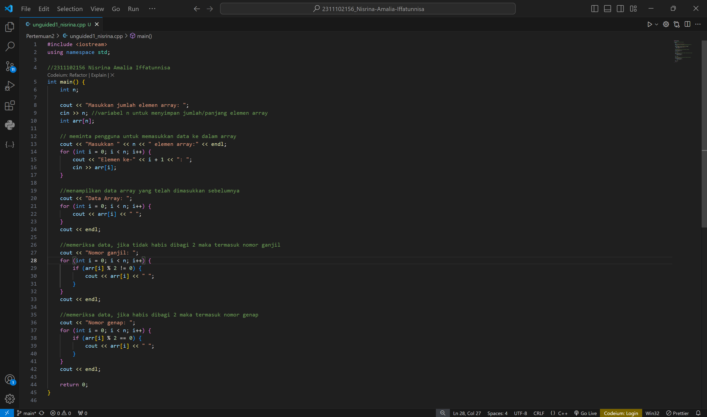
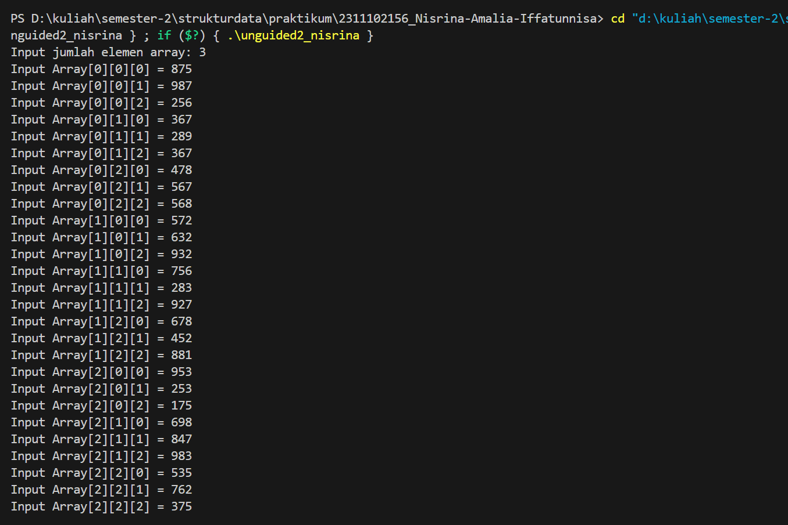
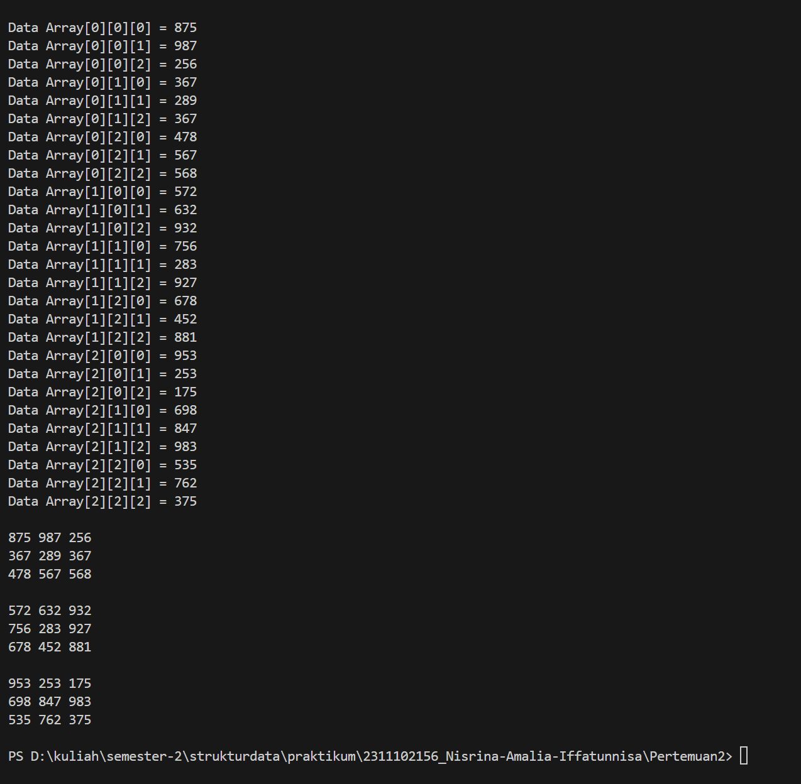
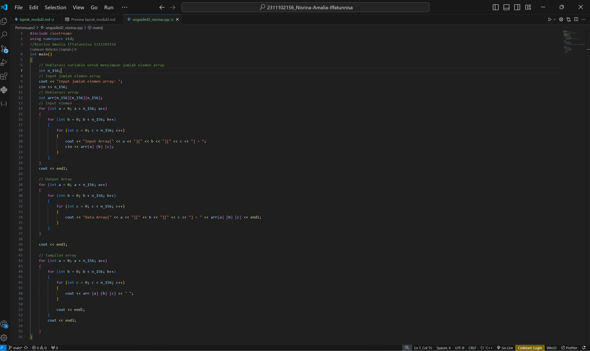
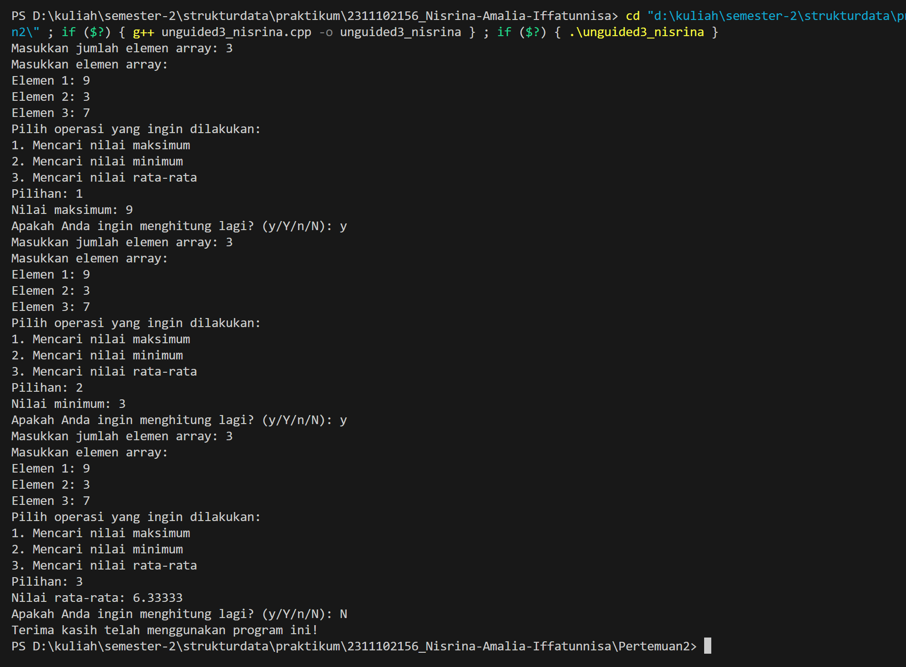
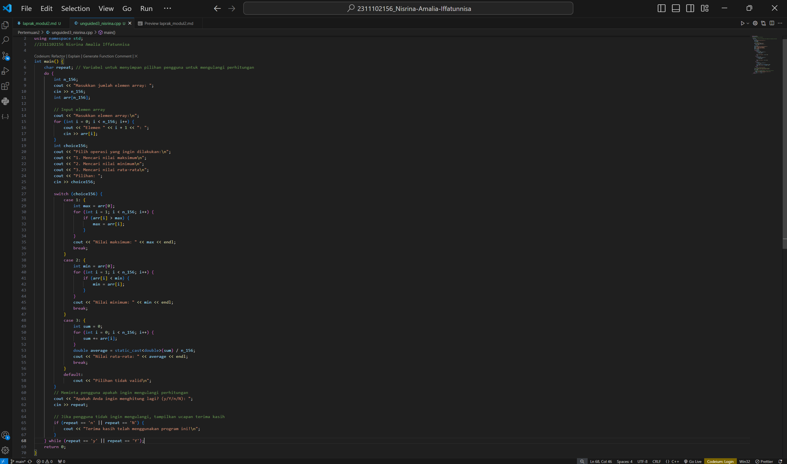

# <h1 align="center">Laporan Praktikum - Modul Array</h1>
<p align="center">2311102156 - Nisrina Amalia Iffatunnisa</p>

## Dasar Teori

Array adalah suatu struktur yang terdiri dari kumpulan dari nilai-nilai data yang terstruktur atau sejumlah elemen yang memiliki tipe data yang sama. Elemen-elemen array tersusun secara sekuensial dalam memori komputer. Array sering disebut juga sebagai tabel, vektor, atau larik. Dilihat dari dimensinya, Array dibagi menjadi :

1. Array Satu Dimensi merupakan kumpulan elemen-elemen identik yang tersusun dalam satu baris, tetapi isi dari elemen tersebut boleh berbeda. Array satu dimensi diakses mealui indeksnya. Setiap elemen di dalam array memiliki sebuah indeks atau nomor yang digunakan untuk mengakses elemen tersebut. Indeks dimulai dari 0 dan berakhir pada jumlah elemen dikurangi satu. Bentuk umumnya adalah: tipe_array nama_array [ukuran];

2. Array Dua Dimensi merupakan perluasan dari sebuah array satu dimensi. Array dua dimensi terdiri dari beberapa baris (row) dan beberapa kolom (column) elemen yang bertipe sama. Array dua dimensi terdapat dua jumlah elemen array yang terdapat di dalam kurung siku dan keduanya boleh tidak sama. Jika ingin memasukkan atau membaca sebuah nilai pada matriks, maka harus diketahui terlebih dahulu indeks baris dan kolomnya. Bentuk umumnya adalah : tipedata nama_array[baris][kolom];

3. Array Multidimensi merupakan array yang mempunyai ukuran lebih dari dua. Namun, dalam kenyataannya, tipe data array ini dapat dibentuk menjadi lebih dari 3 diemnsi atau menjadi n dimensi. Bentuk umumnya adalah: tipedata nama_array [indeks1][indeks2][indeks3];

## Guided 

### 1. Program Input Array 3 Dimensi

```C++
#include <iostream>
using namespace std;
// PROGRAM INPUT ARRAY 3 DIMENSI
int main()
    {
    // Deklarasi array
    int arr[2][3][3];
    // Input elemen
    for (int x = 0; x < 2; x++)
    {
        for (int y = 0; y < 3; y++)
        {
             for (int z = 0; z < 3; z++)
        {
            cout << "Input Array[" << x << "][" << y << "][" << z << "] = ";
            cin >> arr[x] [y] [z];
        }
    }
    cout << endl;
    }

    // Output Array
    for (int x = 0; x < 2; x++)
    {
        for (int y = 0; y < 3; y++)
        {
            for (int z = 0; z < 3; z++)
            {
            cout << "Data Array[" << x << "][" << y << "][" << z << "] = " << arr[x] [y] [z] << endl;
            }
        }
    }
    
    cout << endl;
    // Tampilan array
    for (int x = 0; x < 2; x++)
    {
        for (int y = 0; y < 3; y++)
        {
            for (int z = 0; z < 3; z++)
        {
        cout << arr [x] [y] [z] << ends;
        }
    
        cout << endl;
        }
        cout << endl;

    }
}
```
Kode di atas digunakan untuk menginput, menampilkan data array satu persatu, serta menampilkan semuanya dalam bentuk array 3 dimensi. Program mendeklarasikan array 3 dimensi dengan ukuran 2 x 3 x 3 menggunakan tipe data integer. Terdapat perulangan for yang dimana meminta pengguna memasukkan nilai array beberapa kali. Kemudian, program akan menampilkan array secara berurutan dengan perulangan lagi.

### 2. Mencari Nilai Maksimum dari Data Array

```C++
#include <iostream>
using namespace std;
int main()
{
    int maks, a, i = 1, lokasi;
    cout << "Masukkan panjang array: ";
    cin >> a;
    int array[a];
    cout << "Masukkan " << a << " angka\n";
    for (i = 0; i < a; i++)
    {
        cout << "Array ke-" << (i) << ": ";
        cin >> array[i];
    }
    maks = array[0];
    for (i = 0; i < a; i++)
    {
        if (array[i] > maks)
        {
        maks = array[i];
        lokasi = i;
        }
    }
    cout << "Nilai maksimum adalah " << maks << " berada di Array ke " << lokasi << endl;
}
```
Kode di atas digunakan untuk mencari dan menampilkan nilai maksimum yang ada dalam sebuah array. Data tersebut sebelumnya telah dimasukkan oleh pengguna dengan panjang tertentu. Setelah program meminta pengguna menginputkan panjang dan data array, maka program akan menampilkan nilai maksimum beserta indeksnya di dalam array tersebut.

## Unguided 

### 1. Buatlah program untuk menampilkan Output seperti modul dengan data yang diinputkan oleh user!

```C++
#include <iostream>
using namespace std;

//2311102156 Nisrina Amalia Iffatunnisa
int main() {
    int n;

    cout << "Masukkan jumlah elemen array: ";
    cin >> n; //variabel n untuk menyimpan jumlah/panjang elemen array
    int arr[n];

    // meminta pengguna untuk memasukkan data ke dalam array
    cout << "Masukkan " << n << " elemen array:" << endl;
    for (int i = 0; i < n; i++) {
        cout << "Elemen ke-" << i + 1 << ": ";
        cin >> arr[i];
    }

    //menampilkan data array yang telah dimasukkan sebelumnya
    cout << "Data Array: ";
    for (int i = 0; i < n; i++) {
        cout << arr[i] << " ";
    }
    cout << endl;

    //memeriksa data, jika tidak habis dibagi 2 maka termasuk nomor ganjil
    cout << "Nomor ganjil: ";
    for (int i = 0; i < n; i++) {
        if (arr[i] % 2 != 0) {
            cout << arr[i] << " ";
        }
    }
    cout << endl;

    //memeriksa data, jika habis dibagi 2 maka termasuk nomor genap
    cout << "Nomor genap: ";
    for (int i = 0; i < n; i++) {
        if (arr[i] % 2 == 0) {
            cout << arr[i] << " ";
        }
    }
    cout << endl;

    return 0;
}
```
#### Output:


Kode di atas digunakan untuk menampilkan data array termasuk nomor genap ataupun ganjil. Sebelumnya, program meminta pengguna memasukkan panjang/emen array yang tersimpan dalam variabel "n". Kemudian akan mencetak semua nilai yang sebelumnya telah dimasukkan. Setelah itu, data array tersebut akan diperiksa dengan kondisi, apabila suatu data tidak habis dibagi 2 maka data tersebut termasuk nomor ganjil. Sebaliknya, jika suatu data habis dibagi 2 maka data tersebut termasuk nomor genap.

#### Full Code Program:


## 2. Buatlah program Input array tiga dimensi (seperti pada guided) tetapi jumlah atau ukuran elemennya diinputkan oleh user!
```C++
#include <iostream>
using namespace std;
//Nisrina Amalia Iffatunnisa 2311102156
int main()
{
    // Deklarasi variable untuk menyimpan jumlah elemen array
    int n_156;
    // Input jumlah elemen array
    cout << "Input jumlah elemen array: ";
    cin >> n_156;
    // Deklarasi array
    int arr[n_156][n_156][n_156];
    // Input elemen
    for (int a = 0; a < n_156; a++)
    {
        for (int b = 0; b < n_156; b++)
        {
            for (int c = 0; c < n_156; c++)
            {
                cout << "Input Array[" << a << "][" << b << "][" << c << "] = ";
                cin >> arr[a] [b] [c];
            }
        }
    }
    cout << endl;

    // Output Array
    for (int a = 0; a < n_156; a++)
    {
        for (int b = 0; b < n_156; b++)
        {
            for (int c = 0; c < n_156; c++)
            {
                cout << "Data Array[" << a << "][" << b << "][" << c << "] = " << arr[a] [b] [c] << endl;
            }
        }
    }

    cout << endl;

    // Tampilan array
    for (int a = 0; a < n_156; a++)
    {
        for (int b = 0; b < n_156; b++)
        {
            for (int c = 0; c < n_156; c++)
            {
                cout << arr [a] [b] [c] << " ";
            }

            cout << endl;
        }
        cout << endl;

    }
}
```
#### Output:




Kode di atas digunakan untuk menampilkan array 3 dimensi dengan jumlah atau ukuran elemennya diinputkan oleh pengguna nya sendiri, serta menampilkan isi array tersebut. Terdapat variabel n_156 yang akan digunakan untuk menyimpan jumlah elemen array. Kemudian, program meminta pengguna untuk memasukkan jumlah/ukuran elemen array. Terdapat perulangan saat pengguna memasukkan nilai-nilai elemen array sesuai dengan indeksnya. Setelah dimasukkan, kembali ada perulangan untuk menampilkan nilai array tadi. Program berakhir dengan menampilkan array tiga dimensi sesuai dengan elemen yang telah dimasukkan pengguna.

#### Full Code Program:


## 3. Buatlah program menu untuk mencari nilai maksimum, minimum, dan nilai rata – rata dari suatu array dengan input yang dimasukkan oleh user!

```C++
#include <iostream>
using namespace std;
//2311102156 Nisrina Amalia Iffatunnisa

int main() {
    char repeat; // Variabel untuk menyimpan pilihan pengguna untuk mengulangi perhitungan
    do {
        int n_156;
        cout << "Masukkan jumlah elemen array: ";
        cin >> n_156;
        int arr[n_156];

        // Input elemen array
        cout << "Masukkan elemen array:\n";
        for (int i = 0; i < n_156; i++) {
            cout << "Elemen " << i + 1 << ": ";
            cin >> arr[i];
        }
        int choice156;
        cout << "Pilih operasi yang ingin dilakukan:\n";
        cout << "1. Mencari nilai maksimum\n";
        cout << "2. Mencari nilai minimum\n";
        cout << "3. Mencari nilai rata-rata\n";
        cout << "Pilihan: ";
        cin >> choice156;

        switch (choice156) {
            case 1: {
                int max = arr[0];
                for (int i = 1; i < n_156; i++) {
                    if (arr[i] > max) {
                        max = arr[i];
                    }
                }
                cout << "Nilai maksimum: " << max << endl;
                break;
            }
            case 2: {
                int min = arr[0];
                for (int i = 1; i < n_156; i++) {
                    if (arr[i] < min) {
                        min = arr[i];
                    }
                }
                cout << "Nilai minimum: " << min << endl;
                break;
            }
            case 3: {
                int sum = 0;
                for (int i = 0; i < n_156; i++) {
                    sum += arr[i];
                }
                double average = static_cast<double>(sum) / n_156;
                cout << "Nilai rata-rata: " << average << endl;
                break;
            }
            default:
                cout << "Pilihan tidak valid\n";
        }
        // Meminta pengguna apakah ingin mengulangi perhitungan
        cout << "Apakah Anda ingin menghitung lagi? (y/Y/n/N): ";
        cin >> repeat;

        // Jika pengguna tidak ingin mengulangi, tampilkan ucapan terima kasih
        if (repeat == 'n' || repeat == 'N') {
            cout << "Terima kasih telah menggunakan program ini!\n";
        }
    } while (repeat == 'y' || repeat == 'Y');
    return 0;
}

```
#### Output:


Kode di atas digunakan untuk menampilkan nilai maksimum, minimum, dan rata-rata dari elemen array yang telah diinputkan. Pertama, terdapat deklarasi variabel repeat untuk menyimpan pilihan pengguna yang akan mengulangi perhitungan. Lalu perulangan do-while yang akan terus berjalan selama pengguna memilih untuk mengulangi perhitungan. Program meminta pengguna untuk memasukkan jumlah/ukuran elemen array yang akan dijalankan. Setelah diinput, pengguna diminta untuk memasukkan nilai elemen array. Program menampilkan 3 opsi menu pilihan (dalam choice156), yaitu mencari nilai maksimum, minimum, dan rata-rata. Kemudian pengguna diminta memilih dari ketiga pilihan tadi. Program mengeksekusi dan menampilkan output. Setelah operasi selesai dilakukan, pengguna diminta untuk mengetikkan 'y' atau 'Y' untuk mengulangi perhitungan, dan 'n' atau 'N' untuk mengakhiri program.

#### Full Code Program:


## Kesimpulan
Array merupakan kumpulan dari nilai-nilai data yang bertipe sama dalam urutan tertentu yang menggunakan nama yang sama. Letak atau posisi dari elemen array ditunjukkan oleh suatu index. Dilihat dari dimensinya array dapat dibagi menjadi: array satu dimensi, array dua dimensi, dan array multi-dimensi. Cara membedakan antara satu variabel dengan variabel lain didalam array dilihat dari subscript. Subcript adalah berupa bilangan di dalam kurung siku [ ]. Melalui subcript elemen array dapat diakses. Elemen array tidak lain adalah masing-masing variabel di dalam array. Pada array berdimensi satu digunakan pada kumpulan data bertipe sama yang menggunakan nama yang sama, misalnya array bernama buah = { manggis, mangga, kurma }. Array dimensi dua diimplementasikan pada pembuatan matrik. Array dimensi banyak dalam aplikasinya tidak terlalu sering dipakai. Namun demikian tidak berarti array dimensi banyak tidak dipelajari.[2].

## Referensi
[1]Asisten Praktikum, " Modul 2 Array ", Learning Management System, 2024.

[2]Esabella, Shinta., Mifathul Haq. 2021. Dasar-Dasar Pemrograman. Sumbawa Besar : Olat Maras Publising (OMP) 

[3]Pratama, M.Aldi. 2020. STRUKTUR DATA ARRAY DUA DIMENSI PADA PEMROGRAMAN C++. Fakultas Komputer: Universitas Mitra Indonesia.

