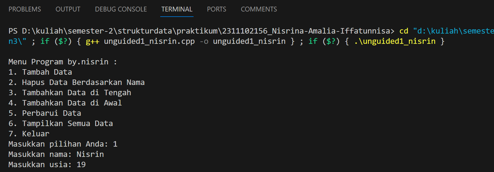
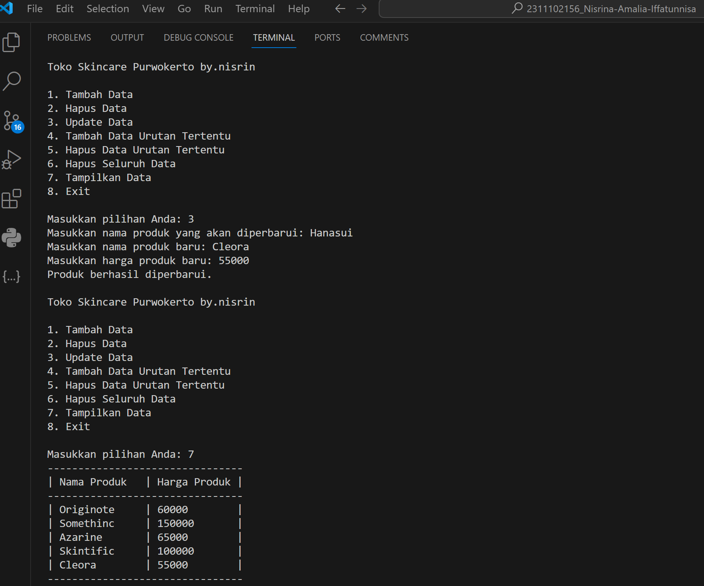

# <h1 align="center">Laporan Praktikum - Modul 3 Single and Double Linked List</h1>
<p align="center">2311102156 - Nisrina Amalia Iffatunnisa</p>

## Dasar Teori

Linked List merupakan suatu bentuk struktur data yang berisi kumpulan data yang disebut sebagai node yang tersusun secara sekuensial, saling sambung
menyambung, dinamis, dan terbatas. Kumpulan komponen tersebut yang saling berkaitan satu dengan yang lain dihubungkan melalui pointer. Masing-masing komponen sering disebut dengan simpul atau node atau verteks. Linked List juga dapat diartikan sebagai structure atau komponen yang
berangakai elemennya saling terhubung ke elemen lainnya melalui tipe variable pointer, yang disebut sebagai node dan terbagi dua bagian. Bagian
pertama adalah isi atau data yang disimpan oleh node. Bagian kedua disebut pointer berisi alamat node berikutnya dan sebelumnya.

a. Single Linked List

Dalam operasi Single Linked List, umumnya dilakukan operasi penambahan dan penghapusan simpul pada awal atau akhir list, serta pencarian dan
pengambilan nilai pada simpul tertentu dalam list. Karena struktur data ini hanya memerlukan satu pointer untuk setiap simpul, maka Single Linked List
lebih efisien dalam penggunaan memori dibandingkan dengan jenis Linked List lainnya. Pada list ini, Node atau simpul pertama dihubungkan pada node
kedua/akhir melalui pointer sampai node akhir. Pointer akhir yang tidak terhubung ke node lainnya disebut NULL.

    1. Single LinkedList Non Circular, setiap node mempunyai field yang berisi data dan pointer ke node berikutnya & sebelumnya. Untuk pembentukan node baru, mulanya pointer next dan prev akan menunjuk ke nilai NULL. Selanjutnya pointer prev akan menunjuk ke node sebelumnya, dan pointer next akan  menunjuk ke node selanjutnya pada list

    2. Single Linked list Circular Single Linked List yang pointer nextnya menunjuk pada dirinya sendiri. Jika Single Linked List tersebut terdiri dari beberapa node, maka pointer next pada node terakhir akan menunjuk ke node terdepannya.

b. Double Linked List

Pada dasarnya, penggunaan Double Linked List hampir sama dengan penggunaan Single Linked List. Hanya saja Double Linked List menerapkan sebuah pointer baru, yaitu prev, yang digunakan untuk menggeser ke belakang atau mundur selain tetap mempertahankan pointer next.

    1. Keberadaan 2 pointer penunjuk (next dan prev) menjadikan Double Linked List menjadi lebih fleksibel dibandingkan Single Linked List, namun dengan mengorbankan adanya memori tambahan dengan adanya pointer tambahan tersebut.

    2. Ada 2 jenis Double Linked List, yaitu: Double Linked List Non Circular dan Double Linked List Circular

    3. Setiap node memiliki 3 field, yaitu 1 field pointer yang menunjuk pointer berikutnya (next), 1 field menunjuk pointer sebelumnya (prev), serta sebuah field yang berisi data untuk node tersebut.

## Guided 

### 1.  Latihan Single Linked List

```C++
#include <iostream>
using namespace std;

/// PROGRAM SINGLE LINKED LIST NON-CIRCULAR
// Deklarasi Struct Node
struct Node
{
    int data;
    Node *next;
};
Node *head;
Node *tail;
// Inisialisasi Node
void init()
{
    head = NULL;
    tail = NULL;
}
// Pengecekan
bool isEmpty()
{
    if (head == NULL)
        return true;
    else
        return false;
}
// Tambah Depan
void insertDepan(int nilai)
{
    // Buat Node baru
    Node *baru = new Node;
    baru->data = nilai;
    baru->next = NULL;
    if (isEmpty() == true)
    {
        head = tail = baru;
        tail->next = NULL;
    }

    else
    {
        baru->next = head;
        head = baru;
    }
}
// Tambah Belakang
void insertBelakang(int nilai)
{
    // Buat Node baru
    Node *baru = new Node;
    baru->data = nilai;
    baru->next = NULL;
    if (isEmpty() == true)
    {
        head = tail = baru;
        tail->next = NULL;
    }
    else
    {
        tail->next = baru;
        tail = baru;
    }
}
// Hitung Jumlah List
int hitungList()
{
    Node *hitung;
    hitung = head;
    int jumlah = 0;
    while (hitung != NULL)
    {
        jumlah++;
        hitung = hitung->next;
    }
    return jumlah;
}
// Tambah Tengah
void insertTengah(int data, int posisi)
{
    if (posisi < 1 || posisi > hitungList())
    {
        cout << "Posisi diluar jangkauan" << endl;
    }
    else if (posisi == 1)
    {
        cout << "Posisi bukan posisi tengah" << endl;
    }
    else
    {
        Node *baru, *bantu;
        baru = new Node();
        baru->data = data;
        // tranversing
        bantu = head;
        int nomor = 1;
        while (nomor < posisi - 1)
        {
            bantu = bantu->next;
            nomor++;
        }
        baru->next = bantu->next;
        bantu->next = baru;
    }
}
// Hapus Depan
void hapusDepan()
{
    Node *hapus;
    if (isEmpty() == false)
    {
        if (head->next != NULL)
        {
            hapus = head;
            head = head->next;
            delete hapus;
        }
        else
        {
            head = tail = NULL;
        }
    }
    else
    {
        cout << "List kosong!" << endl;
    }
}
// Hapus Belakang
void hapusBelakang()
{
    Node *hapus;
    Node *bantu;
    if (isEmpty() == false)
    {
        if (head != tail)
        {
            hapus = tail;
            bantu = head;
            while (bantu->next != tail)
            {
                bantu = bantu->next;
            }
            tail = bantu;
            tail->next = NULL;
            delete hapus;
        }
        else
        {
            head = tail = NULL;
        }
    }
    else
    {
        cout << "List kosong!" << endl;
    }
}
// Hapus Tengah
void hapusTengah(int posisi)
{
    Node *hapus, *bantu, *bantu2;
    if (posisi < 1 || posisi > hitungList())
    {
        cout << "Posisi di luar jangkauan" << endl;
    }
    else if (posisi == 1)
    {
        cout << "Posisi bukan posisi tengah" << endl;
    }
    else
    {
        int nomor = 1;
        bantu = head;
        while (nomor <= posisi)
        {
            if (nomor == posisi - 1)
            {
                bantu2 = bantu;
            }
            if (nomor == posisi)
            {
                hapus = bantu;
            }
            bantu = bantu->next;
            nomor++;
        }
        bantu2->next = bantu;
        delete hapus;
    }
}
// Ubah Depan
void ubahDepan(int data)
{
    if (isEmpty() == false)
    {
        head->data = data;
    }
    else
    {
        cout << "List masih kosong!" << endl;
    }
}
// Ubah Tengah
void ubahTengah(int data, int posisi)
{
    Node *bantu;
    if (isEmpty() == false)
    {
        if (posisi < 1 || posisi > hitungList())
        {
            cout << "Posisi di luar jangkauan" << endl;
        }
        else if (posisi == 1)
        {
            cout << "Posisi bukan posisi tengah" << endl;
        }
        else
        {
            bantu = head;
            int nomor = 1;
            while (nomor < posisi)
            {
                bantu = bantu->next;
                nomor++;
            }
            bantu->data = data;
        }
    }
    else
    {
        cout << "List masih kosong!" << endl;
    }
}
// Ubah Belakang
void ubahBelakang(int data)
{
    if (isEmpty() == false)
    {
        tail->data = data;
    }
    else
    {
        cout << "List masih kosong!" << endl;
    }
}
// Hapus List
void clearList()
{
    Node *bantu, *hapus;
    bantu = head;
    while (bantu != NULL)
    {
        hapus = bantu;
        bantu = bantu->next;
        delete hapus;
    }
    head = tail = NULL;
    cout << "List berhasil terhapus!" << endl;
}
// Tampilkan List
void tampil()
{
    Node *bantu;
    bantu = head;
    if (isEmpty() == false)
    {
        while (bantu != NULL)
        {
            cout << bantu->data << ends;
            bantu = bantu->next;
        }
        cout << endl;
    }
    else
    {
        cout << "List masih kosong!" << endl;
    }
}
int main()
{
    init();
    insertDepan(3);
    tampil();
    insertBelakang(5);
    tampil();
    insertDepan(2);
    tampil();
    insertDepan(1);
    tampil();
    hapusDepan();
    tampil();
    hapusBelakang();
    tampil();
    insertTengah(7, 2);
    tampil();
    hapusTengah(2);
    tampil();
    ubahDepan(1);
    tampil();
    ubahBelakang(8);
    tampil();
    ubahTengah(11, 2);
    tampil();
    return 0;
}
```
Kode di atas digunakan untuk menampilkan data dengan fungsi dan indeks tertentu manipulasi linked list, seperti  menambahkan node di depan (insertDepan), menambahkan node di belakang (insertBelakang), menambahkan node di tengah (insertTengah), menghapus node di depan (hapusDepan), menghapus node di belakang (hapusBelakang), menghapus node di tengah (hapusTengah), serta mengubah nilai data pada node di depan (ubahDepan), node di belakang (ubahBelakang), node di tengah (ubahTengah), dan tampil. Fungsi clearList untuk menghapus seluruh isi linked list. Terdapat juga fungsi-fungsi pendukung isEmpty untuk memeriksa isi linked list apakah kosong dan hitungList untuk menghitung jumlah node dalam linked list. Fungsi yang ada di dalam int main() hanya sebagai ilustrasi fungsionalitas semata, seperti operasi tambah, hapus, dan ubah data. Artinya dalam pengujian yang dilakukan, operasi tersebut hanya menunjukkan bagaimana cara kerja dari setiap operasi yang ada.

### 2.  Latihan Double Linked List

```C++
#include <iostream>
using namespace std;
class Node
{
public:
    int data;
    Node *prev;
    Node *next;
};
class DoublyLinkedList
{
public:
    Node *head;
    Node *tail;
    DoublyLinkedList()
    {
        head = nullptr;
        tail = nullptr;
    }
    void push(int data)
    {
        Node *newNode = new Node;
        newNode->data = data;
        newNode->prev = nullptr;
        newNode->next = head;
        if (head != nullptr)
        {
            head->prev = newNode;
        }
        else
        {
            tail = newNode;
        }
        head = newNode;
    }
    void pop()
    {
        if (head == nullptr)
        {
            return;
        }
        Node *temp = head;
        head = head->next;
        if (head != nullptr)
        {
            head->prev = nullptr;
        }
        else
        {
            tail = nullptr;
        }
        delete temp;
    }
    bool update(int oldData, int newData)
    {
        Node *current = head;
        while (current != nullptr)
        {
            if (current->data == oldData)
            {
                current->data = newData;
                return true;
            }
            current = current->next;
        }
        return false;
    }
    void deleteAll()
    {
        Node *current = head;
        while (current != nullptr)
        {
            Node *temp = current;
            current = current->next;
            delete temp;
        }
        head = nullptr;
        tail = nullptr;
    }
    void display()
    {
        Node *current = head;
        while (current != nullptr)
        {
            cout << current->data << " ";
            current = current->next;
        }
        cout << endl;
    }
};
int main()
{
    DoublyLinkedList list;
    while (true)
    {
        cout << "1. Add data" << endl;
        cout << "2. Delete data" << endl;
        cout << "3. Update data" << endl;
        cout << "4. Clear data" << endl;
        cout << "5. Display data" << endl;
        cout << "6. Exit" << endl;
        int choice;
        cout << "Enter your choice: ";
        cin >> choice;
        switch (choice)
        {
        case 1:
        {
            int data;
            cout << "Enter data to add: ";
            cin >> data;
            list.push(data);
            break;
        }
        case 2:
        {
            list.pop();
            break;
        }
        case 3:
        {
            int oldData, newData;
            cout << "Enter old data: ";
            cin >> oldData;
            cout << "Enter new data: ";
            cin >> newData;
            bool updated = list.update(oldData,
                                       newData);
            if (!updated)
            {
                cout << "Data not found" << endl;
            }
            break;
        }
        case 4:
        {
            list.deleteAll();
            break;
        }
        case 5:
        {
            list.display();
            break;
        }
        case 6:
        {
            return 0;
        }
        default:
        {
            cout << "Invalid choice" << endl;
            break;
        }
        }
    }
    return 0;
}
```
Kode di atas digunakan untuk menampilkan data dari implementasi doubly linked list di mana setiap node memiliki dua pointer, yaitu pointer ke node sebelumnya (prev) dan pointer ke node berikutnya (next). Ini memiliki atribut head dan tail yang merepresentasikan pointer ke node pertama dan terakhir dalam linked list. Metode push digunakan untuk menambahkan node baru di depan, pop untuk menghapus node dari depan. Update digunakan untuk memperbarui nilai data pada node dengan nilai data tertentu, deleteAll untuk menghapus seluruh isi linked list, dan display untuk menampilkan isi linked list. Fungsi yang ada di dalam main memberikan pilihan kepada pengguna untuk melakukan aksi berupa menambah, menghapus, memperbarui, menghapus semua data, menampilkan data, atau keluar dari program

## Unguided 

### 1. Buatlah program menu Single Linked List Non-Circular untuk menyimpan nama dan usia mahasiswa, dengan menggunakan inputan dari user! Dengan ketentuan seperti di modul.

```C++
#include <iostream>
#include <iomanip> //import library untuk setw di tabel
using namespace std;
//2311102156 Nisrina Amalia Iffatunnisa

// Struktur Node
struct Node {
    string namaMhs_156; //nama Mahasiswa
    int usiaMhs_156;    //usia Mahasiswa
    Node* next;
};

//class LinkedList
class LinkedList {
private:
    Node* head;

public:
    LinkedList() {
        head = nullptr;
    }

    //fungsi untuk memasukkan data di akhir
    void insertData(string namaMhs_156, int usiaMhs_156) {
        Node* newNode = new Node; //node baru
        newNode->namaMhs_156 = namaMhs_156;
        newNode->usiaMhs_156 = usiaMhs_156;
        newNode->next = nullptr;

        if (head == nullptr) {
            head = newNode;
        } else {
            Node* temp = head;
            while (temp->next != nullptr) {
                temp = temp->next;
            }
            temp->next = newNode;
        }
    }

    //fungsi untuk menampilkan semua data
    void displayData() {
        cout << "------------------------------------\n";
        cout << "| Nama Mahasiswa  | Usia Mahasiswa |\n";
        cout << "------------------------------------\n";
        Node* temp = head;
        while (temp != nullptr) {
            cout << "| " << setw(14) << left << temp->namaMhs_156 << " | " << setw(14) << left << temp->usiaMhs_156 << " |\n";
            temp = temp->next;
        }
        cout << "------------------------------------\n";
    }

    //fungsi untuk menghapus data berdasarkan nama
    void deleteNode(string targetnamaMhs_156) {
        Node* temp = head;
        Node* prev = nullptr;

        if (temp != nullptr && temp->namaMhs_156 == targetnamaMhs_156) {
            head = temp->next;
            delete temp;
            return;
        }

        while (temp != nullptr && temp->namaMhs_156 != targetnamaMhs_156) {
            prev = temp;
            temp = temp->next;
        }

        if (temp == nullptr)
            return;

        prev->next = temp->next;
        delete temp;
    }

    //fungsi untuk menambahkan data di antara dua node
    void addBetweenNodes(string prevnamaMhs_156, string namaMhs_156, int usiaMhs_156) {
        Node* newNode = new Node;
        newNode->namaMhs_156 = namaMhs_156;
        newNode->usiaMhs_156 = usiaMhs_156;
        newNode->next = nullptr;

        Node* temp = head;
        while (temp != nullptr && temp->namaMhs_156 != prevnamaMhs_156) {
            temp = temp->next;
        }

        if (temp == nullptr)
            return;

        newNode->next = temp->next;
        temp->next = newNode;
    }

    //fungsi untuk menambahkan data di awal/paling depan
    void addAtBeginning(string namaMhs_156, int usiaMhs_156) {
        Node* newNode = new Node;
        newNode->namaMhs_156 = namaMhs_156;
        newNode->usiaMhs_156 = usiaMhs_156;
        newNode->next = head;
        head = newNode;
    }

    //fungsi untuk memperbarui data pada node tertentu
    void updateData(string targetnamaMhs_156, string newnamaMhs_156, int newusiaMhs_156) {
        Node* temp = head;
        while (temp != nullptr && temp->namaMhs_156 != targetnamaMhs_156) {
            temp = temp->next;
        }
        if (temp != nullptr) {
            temp->namaMhs_156 = newnamaMhs_156;
            temp->usiaMhs_156 = newusiaMhs_156;
        }
    }
};

int main() {
    LinkedList list;
    int choice;
    string namaMhs_156, newnamaMhs_156, targetnamaMhs_156;
    int usiaMhs_156;

    do { //pilihan menu
        cout << "\nMenu Program by.nisrin :\n";
        cout << "1. Tambah Data\n";
        cout << "2. Hapus Data Berdasarkan Nama\n";
        cout << "3. Tambahkan Data di Tengah\n";
        cout << "4. Tambahkan Data di Awal\n";
        cout << "5. Perbarui Data\n";
        cout << "6. Tampilkan Semua Data\n";
        cout << "7. Keluar\n";
        cout << "Masukkan pilihan Anda: ";
        cin >> choice;

        switch (choice) {
            case 1: //add data mahasiswa
                cout << "Masukkan nama: ";
                cin >> namaMhs_156;
                cout << "Masukkan usia: ";
                cin >> usiaMhs_156;
                list.insertData(namaMhs_156, usiaMhs_156);
                break;
            case 2: //delete data
                cout << "Masukkan nama yang akan dihapus: ";
                cin >> targetnamaMhs_156;
                list.deleteNode(targetnamaMhs_156);
                break;
            case 3: //add data di tengah
                cout << "Masukkan nama sebelumnya: ";
                cin >> namaMhs_156;
                cout << "Masukkan nama: ";
                cin >> newnamaMhs_156;
                cout << "Masukkan usia: ";
                cin >> usiaMhs_156;
                list.addBetweenNodes(namaMhs_156, newnamaMhs_156, usiaMhs_156);
                break;
            case 4: //add data di paling awal/depan
                cout << "Masukkan nama: ";
                cin >> namaMhs_156;
                cout << "Masukkan usia: ";
                cin >> usiaMhs_156;
                list.addAtBeginning(namaMhs_156, usiaMhs_156);
                break;
            case 5: //update data
                cout << "Masukkan nama yang akan diperbarui: ";
                cin >> targetnamaMhs_156;
                cout << "Masukkan nama baru: ";
                cin >> newnamaMhs_156;
                cout << "Masukkan usia baru: ";
                cin >> usiaMhs_156;
                list.updateData(targetnamaMhs_156, newnamaMhs_156, usiaMhs_156);
                break;
            case 6: //show data
                cout << "\nData Mahasiswa FIF Telkom Purwokerto:\n";
                list.displayData();
                break;
            case 7:
                cout << "Keluar.";
                break;
            default:
                cout << "Pilihan tidak valid. Silakan coba lagi" <<endl;
        }
    } while (choice != 7);

    return 0;
}
```
#### Output "Tambah Data":



#### Output "Hapus Data Akechi":


#### Output "Tambah Data Futaba diantara John dan Jane":


#### Output "Tambah Data paling awal, yaitu Igor":


#### Output "Ubah Data Michael menjadi Reyn dan Tampilan Akhir":


Kode di atas digunakan untuk menampilkan data skincare berupa nama dan harga. Program di atas merupakan salah satu bentuk implementasi struktur data linked list (Single Linked List). Setiap node memiliki atribut nama mahasiswa (namaMhs_156), usia mahasiswa (usiaMhs_156), serta pointer yang menunjuk ke node selanjutnya (next). Kelas LinkedList mengimplementasikan linked list dengan menyediakan fungsi-fungsi untuk operasi dasar seperti memasukkan data di akhir, menampilkan semua data mahasiswa yang tersimpan dalam linked list, menghapus data berdasarkan nama, menambah data di antara dua node, menambah data di awal, dan memperbarui data pada node tertentu. 

Saat pertama dijalankan, terdapat beberapa menu yang bisa pengguna pilih. Jika memilih 1, maka akan menjalankan void insertData dan memasukkan nama dan usianya, dilakukan beberapa kali input data sesuai perintah di modul. Jika memilih 2, maka akan menjalankan void deleteNode yang menghapus data berdasarkan nama (dalam modul diperintahkan menghapus "Akechi"). Jika memilih 3, maka akan menjalankan void addBetweenNodes dimana bisa menambahkan data di tengah atau di antara 2 node tertentu (dalam modul menambahkan data Futaba di antara John dan Jane). Jika memilih 4, maka akan menjalankan void addAtBeginning dimana menambahkan data paling pertama/depan (dalam modul menambahkan data Igor). Jika memilih 5, maka akan menjalankan void updateData dimana bisa memperbarui data berdasarkan nama(dalam modul mengupdate data Michael menjadi Reyn). Jika memilih 6, maka menjalankan void displayData dimana menampilkan keseluruhan data.

#### Full Code Program:


### 2. Modifikasi Guided Double Linked List dilakukan dengan penambahan operasi untuk menambah data, menghapus, dan update di tengah / di urutan tertentu yang diminta. Buatlah agar tampilannya menampilkan nama produk dan harga!

```C++
#include <iostream>
#include <string>
#include <iomanip>
using namespace std;
//2311102156 Nisrina Amalia Iffatunnisa

//deklarasi class node untuk merepresentasikan node dalam linked list
class Node {
public:
    string productName_156; // Variabel 'productName_156' menyimpan nama produk skincare
    int productPrice_156; //variabel 'productPrice_156' menyimpan harga skincare
    Node* prev; //pointer ke node sebelumnya dalam linked list
    Node* next; //pointer ke node selanjutnya dalam linked list
};

//deklarasi class DoublyLinkedList untuk merepresentasikan linked list
class DoublyLinkedList {
public:
    Node* head; //pointer ke node pertama dalam linked list
    Node* tail; //pointer ke node terakhir dalam linked list

    DoublyLinkedList() {
        head = nullptr;
        tail = nullptr;
    }

    //fungsi untuk menambahkan node baru ke akhir linked list
    void push(string productName_156, int productPrice_156) {
        Node* newNode = new Node;
        newNode->productName_156 = productName_156;
        newNode->productPrice_156 = productPrice_156;
        newNode->prev = tail;
        newNode->next = nullptr;
        if (tail != nullptr) {
            tail->next = newNode;
        }
        else {
            head = newNode;
        }
        tail = newNode;
    }

    //fungsi untuk menyisipkan node baru setelah node tertentu dalam linked list
    void insertAfter(string productName_156, int productPrice_156, Node* prevNode) {
        if (prevNode == nullptr) {
            cout << "Node sebelumnya tidak boleh kosong." << endl;
            return;
        }
        Node* newNode = new Node;
        newNode->productName_156 = productName_156;
        newNode->productPrice_156 = productPrice_156;
        newNode->prev = prevNode;
        newNode->next = prevNode->next;
        if (prevNode->next != nullptr) {
            prevNode->next->prev = newNode;
        }
        prevNode->next = newNode;
        if (prevNode == tail) {
            tail = newNode;
        }
    }

    //fungsi untuk menghapus node tertentu dari linked list
    void deleteNode(Node* delNode) {
        if (delNode == nullptr) {
            cout << "Node yang akan dihapus tidak boleh kosong." << endl;
            return;
        }
        if (delNode == head) {
            head = delNode->next;
        }
        if (delNode == tail) {
            tail = delNode->prev;
        }
        if (delNode->prev != nullptr) {
            delNode->prev->next = delNode->next;
        }
        if (delNode->next != nullptr) {
            delNode->next->prev = delNode->prev;
        }
        delete delNode;
    }

    //fungsi untuk memperbarui data node tertentu dalam linked list
    bool updateNode(Node* targetNode, string newproductName_156, int newproductPrice_156) {
        if (targetNode == nullptr) {
            cout << "Node yang akan diperbarui tidak boleh kosong." << endl;
            return false;
        }
        targetNode->productName_156 = newproductName_156;
        targetNode->productPrice_156 = newproductPrice_156;
        return true;
    }

    //fungsi untuk menampilkan isi semua data linked list dengan tabel
    void display() {
        cout << "--------------------------------\n";
        cout << "| Nama Produk   | Harga Produk |\n";
        cout << "--------------------------------\n";
        Node* current = head;
        while (current != nullptr) {
            cout << "| " << setw(13) << left << current->productName_156 << " | " << setw(12) << left << current->productPrice_156 << " |\n";
            current = current->next;
        }
        cout << "--------------------------------\n";
        cout << endl;
    }

    //fungsi untuk menghapus seluruh isi linked list
    void deleteAll() {
        Node* current = head;
        while (current != nullptr) {
            Node* nextNode = current->next;
            delete current;
            current = nextNode;
        }
        head = nullptr;
        tail = nullptr;
    }
};

int main() {
    DoublyLinkedList products; //membuat objek DoublyLinkedList untuk menyimpan produk-produk
    while (true) {
        //menampilkan menu
        cout << "\nToko Skincare Purwokerto by.nisrin\n" <<endl;
        cout << "1. Tambah Data" << endl;
        cout << "2. Hapus Data" << endl;
        cout << "3. Update Data" << endl;
        cout << "4. Tambah Data Urutan Tertentu" << endl;
        cout << "5. Hapus Data Urutan Tertentu" << endl;
        cout << "6. Hapus Seluruh Data" << endl;
        cout << "7. Tampilkan Data" << endl;
        cout << "8. Exit" << endl;

        int choice;
        cout << "\nMasukkan pilihan Anda: ";
        cin >> choice;

        //melakukan aksi sesuai inputan user
        switch (choice) {
            case 1: { //add data baru
                string productName_156;
                int productPrice_156;
                cout << "Masukkan nama produk: ";
                cin.ignore(); // Ignore newline character
                getline(cin, productName_156);
                cout << "Masukkan harga produk: ";
                cin >> productPrice_156;
                products.push(productName_156, productPrice_156);
                break;
            }
            case 2: { //delete data
                string productName_156;
                cout << "Masukkan nama produk yang akan dihapus: ";
                cin.ignore(); // Ignore newline character
                getline(cin, productName_156);
                Node* current = products.head;
                while (current != nullptr) {
                    if (current->productName_156 == productName_156) {
                        products.deleteNode(current);
                        cout << "Produk berhasil dihapus." << endl;
                        break;
                    }
                    current = current->next;
                }
                if (current == nullptr) {
                    cout << "Produk tidak ditemukan." << endl;
                }
                break;
            }
            case 3: { //update data
                string productName_156, newproductName_156;
                int productPrice_156, newproductPrice_156;
                cout << "Masukkan nama produk yang akan diperbarui: ";
                cin.ignore(); // Ignore newline character
                getline(cin, productName_156);
                cout << "Masukkan nama produk baru: ";
                getline(cin, newproductName_156);
                cout << "Masukkan harga produk baru: ";
                cin >> newproductPrice_156;
                Node* current = products.head;
                while (current != nullptr) {
                    if (current->productName_156 == productName_156) {
                        products.updateNode(current, newproductName_156, newproductPrice_156);
                        cout << "Produk berhasil diperbarui." << endl;
                        break;
                    }
                    current = current->next;
                }
                if (current == nullptr) {
                    cout << "Produk tidak ditemukan." << endl;
                }
                break;
            }
            case 4: { //add data posisi tertentu
                string prevproductName_156, newproductName_156;
                int productPrice_156;
                cout << "Masukkan nama produk setelah produk tertentu: ";
                cin.ignore(); // Ignore newline character
                getline(cin, prevproductName_156);
                cout << "Masukkan nama produk baru: ";
                getline(cin, newproductName_156);
                cout << "Masukkan harga produk: ";
                cin >> productPrice_156;
                Node* current = products.head;
                while (current != nullptr) {
                    if (current->productName_156 == prevproductName_156) {
                        products.insertAfter(newproductName_156, productPrice_156, current);
                        break;
                    }
                    current = current->next;
                }
                if (current == nullptr) {
                    cout << "Produk tidak ditemukan." << endl;
                }
                break;
            }
            case 5: { //delete data posisi tertentu
                string prevproductName_156;
                cout << "Masukkan nama produk setelah produk tertentu yang akan dihapus: ";
                cin.ignore(); // Ignore newline character
                getline(cin, prevproductName_156);
                Node* current = products.head;
                while (current != nullptr) {
                    if (current->productName_156 == prevproductName_156 && current->next != nullptr) {
                        products.deleteNode(current->next);
                        cout << "Produk berhasil dihapus." << endl;
                        break;
                    }
                    current = current->next;
                }
                if (current == nullptr || current->next == nullptr) {
                    cout << "Produk tidak ditemukan atau tidak ada produk untuk dihapus setelahnya." << endl;
                }
                break;
            }
            case 6: { //delete all data
                products.deleteAll();
                cout << "Semua produk berhasil dihapus." << endl;
                break;
            }
            case 7: { //show all data yang ada
                products.display();
                break;
            }
            case 8: { //program keluar
                cout << "Terima kasih telah menggunakan program Toko Skincare Pwt by.nisrin" <<endl;
                return 0;
            }
            default: {
                cout << "Maaf, pilihan Anda tidak valid." << endl;
                break;
            }
        }
    }
    return 0;
}
```
#### Output:


#### Output "Tambah Produk Azarine diantara Somethinc dan Skintific" :


#### Output "Hapus Produk Wardah":


#### Output "Update produk Hanasui menjadi Cleora dan Tampilan Akhir":


Kode di atas digunakan untuk menampilkan data skincare berupa nama dan harga. Program di atas merupakan salah satu bentuk implementasi struktur data linked list ganda (Double Linked List) dalam pengelolaan produk skincare di sebuah toko. DoublyLinkedList merupakan implementasi dari linked list ganda yang memiliki pointer ke head dan tail dari linked list. Program tersebut memiliki beberapa menu fitur, antara lain: menambahkan data produk baru, menghapus data produk, memperbarui data produk, menambah data produk pada posisi tertentu, menghapus data produk pada posisi tertentu, menghapus seluruh data produk, dan menampilkan seluruh data produk. Setiap node dalam program memiliki atribut nama produk (productName_156), harga produk (productPrice_156), serta pointer yang menunjuk ke node sebelumnya (prev) dan node selanjutnya (next). Pada menu pertama, pengguna diminta memasukkan data baru berupa nama dan harga produk skincare. Menu kedua, pengguna bisa menghapus produk. Menu ketiga, pengguna bisa memperbarui dengan memasukkan nama produk lama yang akan diganti ke produk baru dengan harga tertentu. Menu keempat, pengguna bisa menambahkan data baru sesuai keinginan dimana tempatnya (setelah produk tertentu). Menu kelima, pengguna menghapus data dengaan menginputkan nama produk sebelumnya. Menu keenam, pengguna bisa menghapus keseluruhan data. Sedangkan menu ketujuh pengguna bisa meminta program menampilkan keseluruhan produk yang ada.

#### Full Code Program:


## Kesimpulan
Linked List merupakan koleksi data yang tersusun secara linear dalam sebuah barisan, dengan penyisipan dan pemindahan dapat dilakukan dalam semua tempat di Linked List ini. Single linked list hanya memiliki satu pointer yang menunjuk ke node selanjutnya. Setiap node hanya memiliki satu pointer yang menunjuk ke node selanjutnya. Dalam hal ini lebih efisien dalam penggunaan memori, tetapi tidak dapat dilakukan dalam arah yang berlawanan.

Double Linked List memiliki dua pointer, yaitu pointer ke node selanjutnya dan pointer ke node sebelumnya. Setiap node memiliki pointer ke node selanjutnya dan pointer ke node sebelumnya. Dalam hal ini lebih efisien, tetapi membutuhkan lebih banyak memori. Serta dapat dilakukan dalam arah yang berlawanan.

## Referensi
[1]Arraffi, Adzriel. 2019. “PENGERTIAN LINIER DALAM STRUKTUR DATA MAJEMUK.” OSF Preprints. March 30. doi:10.31219/osf.io/sczvp.

[2]Nurhasanah, Yudi Kurniawan, Sholihin. 2021. PRAKTIKUM STRUKTUR DATA. Tangerang Selatan : UNPAM Press.