# <h1 align="center">Laporan Praktikum Modul 4 - LINKED LIST CIRCULAR DAN NON CIRCULAR</h1>
<p align="center">2311102156 - Nisrina Amalia Iffatunnisa</p>

## Dasar Teori

a. Linked List Circular adalah sebuah Linked List yang terdiri dari beberapa node, maka pointer next pada node terakhir akan menunjuk ke node terdepan. Kemudian pointer nextnya menunjuk pada dirinya sendiri, sehingga berputar. Dan field pointer-nya hanya satu buah saja dan satu arah. Pada akhir linked list, node terakhir akan menunjuk ke node terdepan sehingga linked list tersebut berputar. Node terakhir akan menunjuk lagi ke head. Fungsi yang digunakan antara lain : </br>
    (1.) Penambahan data di depan (node baru) akan dikaitan di node paling depan, saat pertama kali (data masih kosong), maka penambahan data dilakukan pada head nya. Kemudian head akan menunjuk pada data baru tersebut sehingga head akan tetap selalu menjadi data terdepan.  Pointer bantu dibutuhkan untuk menghubungkan node terakhir dengan node terdepan </br>
Linked List Circular ini tidak memiliki akhir karena node terakhir (tail) tidak bernilai ‘NULL’, tetapi terhubung dengan node pertama (head).

b. Linked List Non Circular adalah sebuah Linked List yang node pertama (head) dan 
node terakhir (tail) yang tidak saling terhubung. Field pointer-nya hanya satu buah saja dan satu arah serta pada akhir node, pointernya menunjuk NULL yang akan digunakan sebagai kondisi berhenti pada saat pembacaan isi linked list. Setiap node pada linked list mempunyai field yang berisi pointer ke node berikutnya, dan juga memiliki field yang berisi data. Dalam SLLNC dibutuhkan satu buah variabel pointer "head" dan head tersebut akan selalu menunjuk pada node pertama. SLLNC dengan head & tail dibutuhkan dua buah variabel pointer, head dan tail. Head akan selalu menunjuk pada node pertama sedangkan tail akan selalu menunjuk pad node terakhir.

Langkah-langkah proses tambah pada SLLNC adalah: </br>
    (1.)Tambah di depan penambahan node baru akan dikaitkan di node paling depan. namun pada saat pertama kali (data masih kosong), maka penambahan data dilakukan pada headnya. </br>
    (2.) Tambah di belakang penambahan data dilakukan, namun pada saat pertama kali node langsung ditunjuk pada head-nya. Penambahan di belakang lebih sulit karena kita membutuhkan pointer bantu untuk mengetahui node terbelakang, kemudian setelah itu dikaitkan dengan node baru. </br>
    (3.) Tambah Tengah merupakan roses penambahan di tengah berarti proses penyisipan data pada posisi tertentu. </br>


## Guided 

### 1. Linked List Non Circular

```C++
#include <iostream>
using namespace std;
// PROGRAM SINGLE LINKED LIST NON-CIRCULAR
// Deklarasi Struct Node
struct Node
{
    int data;
    Node *next;
};
Node *head;
Node *tail;

// Inisialisasi Node
void init()
{
    head = NULL;
    tail = NULL;
}

// Pengecekan
bool isEmpty()
{
    if (head == NULL)
    {
        return true;
    }
    else
    {
        return false;
    }
}

// Tambah Depan
void insertDepan(int nilai)
{
    // Buat Node baru
    Node *baru = new Node;
    baru->data = nilai;
    baru->next = NULL;
    if (isEmpty() == true)
    {
        head = tail = baru;
        tail->next = NULL;
    }
    else
    {
        baru->next = head;
        head = baru;
    }
}

// Tambah Belakang
void insertBelakang(int nilai)
{
    // Buat Node baru
    Node *baru = new Node;
    baru->data = nilai;
    baru->next = NULL;
    if (isEmpty() == true)
    {
        head = tail = baru;
        tail->next = NULL;
    }
    else
    {
        tail->next = baru;
        tail = baru;
    }
}

// Hitung Jumlah List
int hitungList()
{
    Node *hitung;
    hitung = head;
    int jumlah = 0;
    while (hitung != NULL)
    {
        jumlah++;
        hitung = hitung->next;
    }
    return jumlah;
}

// Tambah Tengah
void insertTengah(int data, int posisi)
{
    if (posisi < 1 || posisi > hitungList())
    {
        cout << "Posisi diluar jangkauan" << endl;
    }
    else if (posisi == 1)
    {
        cout << "Posisi bukan posisi tengah" << endl;
    }
    else
    {
        Node *baru, *bantu;
        baru = new Node();
        baru->data = data;
        // tranversing
        bantu = head;
        int nomor = 1;
        while (nomor < posisi - 1)
        {
            bantu = bantu->next;
            nomor++;
        }

        baru->next = bantu->next;

        bantu->next = baru;
    }
}

// hapus Depan
void hapusDepan()
{
    Node *hapus;
    if (isEmpty() == false)
        if (head->next != NULL)
        {
            hapus = head;
            head = head->next;
            delete hapus;
        }
        else
        {
            head = tail = NULL;
        }
    else
    {
        cout << "List kosong!" << endl;
    }
}

// Hapus Belakang
void hapusBelakang()
{
    Node *hapus;
    Node *bantu;
    if (isEmpty() == false)
    {
        if (head != tail)
        {
            hapus = tail;
            bantu = head;
            while (bantu->next != tail)
            {
                bantu = bantu->next;
            }
            tail = bantu;
            tail->next = NULL;
            delete hapus;
        }
        else
        {
            head = tail = NULL;
        }
    }
    else
    {
        cout << "List kosong!" << endl;
    }
}


// Hapus Tengah
void hapusTengah(int posisi)
{
    Node *bantu, *hapus, *sebelum;
    if (posisi < 1 || posisi > hitungList())
    {
        cout << "Posisi di luar jangkauan" << endl;
    }
    else if (posisi == 1)
    {
        cout << "Posisi bukan posisi tengah" << endl;
    }
    else
    {
        int nomor = 1;
        bantu = head;
        while (nomor <= posisi)
        {
            if (nomor == posisi - 1)
            {
                sebelum = bantu;
            }
            if (nomor == posisi)
            {
                hapus = bantu;
            }
            bantu = bantu->next;
            nomor++;
        }
        sebelum->next = bantu;
        delete hapus;
    }
}

// Ubah Depan
void ubahDepan(int data)
{
    if (isEmpty() == 0)
    {
        head->data = data;
    }
    else
    {
        cout << "List masih kosong!" << endl;
    }
}
// Ubah Tengah
void ubahTengah(int data, int posisi)
{
    Node *bantu;
    if (isEmpty() == 0)
    {
        if (posisi < 1 || posisi > hitungList())
        {
            cout << "Posisi di luar jangkauan" << endl;
        }
        else if (posisi == 1)
        {
        }
        else
        {
            cout << "Posisi bukan posisi tengah" << endl;
            bantu = head;
            int nomor = 1;
            while (nomor < posisi)
            {
                bantu = bantu->next;
                nomor++;
            }
            bantu->data = data;
        }
    }
    else
    {
        cout << "List masih kosong!" << endl;
    }
}
// Ubah Belakang
void ubahBelakang(int data)
{
    if (isEmpty() == 0)
    {
        tail->data = data;
    }
    else
    {
        cout << "List masih kosong!" << endl;
    }
}
// Hapus List
void clearList()
{
    Node *bantu, *hapus;
    bantu = head;
    while (bantu != NULL)
    {
        hapus = bantu;
        bantu = bantu->next;
        delete hapus;
    }
    head = tail = NULL;
    cout << "List berhasil terhapus!" << endl;
}
// Tampilkan List
void tampil()
{
    Node *bantu;
    bantu = head;
    if (isEmpty() == false)
    {
        while (bantu != NULL)
        {
            cout << bantu->data << ends;
            bantu = bantu->next;
        }
        cout << endl;
    }
    else
    {
        cout << "List masih kosong!" << endl;
    }
}
int main()
{
    init();
    insertDepan(3);
    tampil();
    insertBelakang(5);
    tampil();
    insertDepan(2);
    tampil();
    insertDepan(1);
    tampil();
    hapusDepan();
    tampil();
    hapusBelakang();
    tampil();
    insertTengah(7, 2);
    tampil();
    hapusTengah(2);
    tampil();
    ubahDepan(1);
    tampil();
    ubahBelakang(8);
    tampil();
    ubahTengah(11, 2);
    tampil();

    return 0;
}
```
Kode di atas digunakan untuk mencetak data yang mengelola sebuah single linked list non-circular. Pada program di atas terdapat fungsi-fungsi untuk menjalankan linkedlist, seperti operasi penambahan elemen di depan, belakang, dan di tengah. Lalu operasi enghapusan elemen di depan, belakang, dan di tengah, serta operasi perubahan isi node/elemen di depan, belakang, dan di tengah. Terdapat juga fungsi untuk menghitung jumlah elemen dalam linked list serta untuk menghapus seluruh isi dari linked list.

### 2. Linked List Circular

```C++
#include <iostream>
using namespace std;

// Deklarasi Struct Node
struct Node
{
    string data;
    Node* next;
};

Node* head, * tail, * baru, * bantu, * hapus;

void init()
{
    head = NULL;
    tail = head;
}

// Pengecekan
int isEmpty()
{
    if (head == NULL)
        return 1; // true
    else
        return 0; // false
}

// Buat Node Baru
void buatNode(string data)
{
    baru = new Node;
    baru->data = data;
    baru->next = NULL;
}

// Hitung List
int hitungList()
{
    bantu = head;
    int jumlah = 0;
    while (bantu != NULL)
    {
        jumlah++;
        bantu = bantu->next;
    }
    return jumlah;
}

// Tambah Depan
void insertDepan(string data)
{
    // Buat Node baru
    buatNode(data);

    if (isEmpty() == 1)
    {
        head = baru;
        tail = head;
        baru->next = head;
    }
    else
    {
        while (tail->next != head)
        {
            tail = tail->next;
        }
        baru->next = head;
        head = baru;
        tail->next = head;
    }
}

// Tambah Belakang
void insertBelakang(string data)
{
    // Buat Node baru
    buatNode(data);

    if (isEmpty() == 1)
    {
        head = baru;
        tail = head;
        baru->next = head;
    }
    else
    {
        while (tail->next != head)
        {
            tail = tail->next;
        }
        tail->next = baru;
        baru->next = head;
    }
}

// Tambah Tengah
void insertTengah(string data, int posisi)
{
    if (isEmpty() == 1)
    {
        head = baru;
        tail = head;
        baru->next = head;
    }
    else
    {
        baru->data = data;
        // transversing
        int nomor = 1;
        bantu = head;
        while (nomor < posisi - 1)
        {
            bantu = bantu->next;
            nomor++;
        }
        baru->next = bantu->next;
        bantu->next = baru;
    }
}

// Hapus Depan
void hapusDepan()
{
    if (isEmpty() == 0)
    {
        hapus = head;
        tail = head;
        if (hapus->next == head)
        {
            head = NULL;
            tail = NULL;
            delete hapus;
        }
        else
        {
            while (tail->next != hapus)
            {
                tail = tail->next;
            }
            head = head->next;
            tail->next = head;
            hapus->next = NULL;
            delete hapus;
        }
    }
    else
    {
        cout << "List masih kosong!" << endl;
    }
}

// Hapus Belakang
void hapusBelakang()
{
    if (isEmpty() == 0)
    {
        hapus = head;
        tail = head;
        if (hapus->next == head)
        {
            head = NULL;
            tail = NULL;
            delete hapus;
        }
        else
        {
            while (hapus->next != head)
            {
                hapus = hapus->next;
            }
            while (tail->next != hapus)
            {
                tail = tail->next;
            }
            tail->next = head;
            hapus->next = NULL;
            delete hapus;
        }
    }
    else
    {
        cout << "List masih kosong!" << endl;
    }
}

// Hapus Tengah
void hapusTengah(int posisi)
{
    if (isEmpty() == 0)
    {
        // transversing
        int nomor = 1;
        bantu = head;
        while (nomor < posisi - 1)
        {
            bantu = bantu->next;
            nomor++;
        }
        hapus = bantu->next;
        bantu->next = hapus->next;
        delete hapus;
    }
    else
    {
        cout << "List masih kosong!" << endl;
    }
}

// Hapus List
void clearList()
{
    if (head != NULL)
    {
        hapus = head->next;
        while (hapus != head)
        {
            bantu = hapus->next;
            delete hapus;
            hapus = bantu;
        }
        delete head;
        head = NULL;
    }
    cout << "List berhasil terhapus!" << endl;
}

// Tampilkan List
void tampil()
{
    if (isEmpty() == 0)
    {
        tail = head;
        do
        {
            cout << tail->data << ends;
            tail = tail->next;
        } while (tail != head);
        cout << endl;
    }
    else
    {
        cout << "List masih kosong!" << endl;
    }
}

int main()
{
    init();
    insertDepan("Ayam");
    tampil();
    insertDepan("Bebek");
    tampil();
    insertBelakang("Cicak");
    tampil();
    insertBelakang("Domba");
    tampil();
    hapusBelakang();
    tampil();
    hapusDepan();
    tampil();
    insertTengah("Sapi", 2);
    tampil();
    hapusTengah(2);
    tampil();
    return 0;
}
```
Kode di atas digunakan untuk mencetak data yang mengelola sebuah single linked list circular. Setiap node/elemen dalam linked list tersebut direpresentasikan oleh sebuah node yang memiliki data bertipe string dan pointer next yang menunjukkan ke node selanjutnya. Fungsi-fungsi yang tersedia dalam kode di atas, antara lain operasi penambahan elemen di depan, belakang, dan di tengah, penghapusan elemen di depan, belakang, dan di tengah, serta untuk menghapus keseluruhan isi dari linked list. Saat menambahkan atau menghapus elemen di depan atau belakang, program memastikan agar head dan tail terupdate dengan baik dan benar.

## Unguided 1
<p>Buatlah program menu Linked List Non Circular untuk menyimpan Nama dan NIM mahasiswa, dengan menggunakan input dari user. </p>

### 1. Buatlah menu untuk menambahkan, mengubah, menghapus, dan melihat Nama dan NIM mahasiswa

```C++
#include <iostream>
#include <string>
#include <iomanip>
using namespace std;
/* oleh 2311102156 Nisrina Amalia Iffatunnisa
*/

// Struct untuk Mahasiswa156
struct Mahasiswa156
{
    string nama_mhs156; //variabel menyimpan nama_mhs156 mahasiswa
    string nim_mhs156; //variabel menyimpan nim_mhs156 mahasiswa
    Mahasiswa156 *next; //pointer yang menunjuk ke Mahasiswa156 selanjutnya dalam linkedlist
};

class LinkedList
{
private:
    Mahasiswa156 *head;

public:
    LinkedList()
    {
        head = nullptr;
    }

    // Fungsi untuk menambahkan Mahasiswa156 di depan
    void tambahDepan(string nama_mhs156, string nim_mhs156)
    {
        Mahasiswa156 *newMahasiswa156 = new Mahasiswa156;
        newMahasiswa156->nama_mhs156 = nama_mhs156;
        newMahasiswa156->nim_mhs156 = nim_mhs156;
        newMahasiswa156->next = head;
        head = newMahasiswa156;
        cout << "Data telah ditambahkan.\n";
    }

    // Fungsi untuk menambahkan Mahasiswa156 di belakang
    void tambahBelakang(const string &nama_mhs156, const string &nim_mhs156)
    {
        Mahasiswa156 *newMahasiswa156 = new Mahasiswa156;
        newMahasiswa156->nama_mhs156 = nama_mhs156;
        newMahasiswa156->nim_mhs156 = nim_mhs156;
        newMahasiswa156->next = nullptr;

        if (head == nullptr)
        {
            head = newMahasiswa156;
        }
        else
        {
            Mahasiswa156 *temp = head;
            while (temp->next != nullptr)
            {
                temp = temp->next;
            }
            temp->next = newMahasiswa156;
        }
        cout << "Data " << nama_mhs156 << " dengan " << nim_mhs156 << " telah ditambahkan di belakang.\n";
    }

    // Fungsi untuk menambahkan Mahasiswa156 di tengah
    void tambahTengah(string nama_mhs156, string nim_mhs156, int posisi)
    {
        if (posisi <= 0)
        {
            cout << "Posisi tidak valid.\n";
            return;
        }
        Mahasiswa156 *newMahasiswa156 = new Mahasiswa156;
        newMahasiswa156->nama_mhs156 = nama_mhs156;
        newMahasiswa156->nim_mhs156 = nim_mhs156;
        if (posisi == 1)
        {
            newMahasiswa156->next = head;
            head = newMahasiswa156;
            cout << "Data telah ditambahkan.\n";
            return;
        }
        Mahasiswa156 *temp = head;
        for (int i = 1; i < posisi - 1; i++)
        {
            if (temp == nullptr)
            {
                cout << "Posisi tidak valid.\n";
                return;
            }
            temp = temp->next;
        }
        newMahasiswa156->next = temp->next;
        temp->next = newMahasiswa156;
        cout << "Data telah ditambahkan.\n";
    }
    // Fungsi untuk mengubah data di depan
    void ubahDepan(const string &nama_mhs156Baru, const string &nim_mhs156Baru)
    {
        if (head == nullptr)
        {
            cout << "Linked list kosong.\n";
            return;
        }
        head->nama_mhs156 = nama_mhs156Baru;
        head->nim_mhs156 = nim_mhs156Baru;
        cout << "Data telah diganti dengan nama " << nama_mhs156Baru << ".\n";
    }

    // Fungsi untuk mengubah data di belakang
    void ubahBelakang(const string &nama_mhs156Baru, const string &nim_mhs156Baru)
    {
        if (head == nullptr)
        {
            cout << "Linked list kosong.\n";
            return;
        }
        Mahasiswa156 *temp = head;
        while (temp->next != nullptr)
        {
            temp = temp->next;
        }
        cout << "Data " << temp->nama_mhs156 << " telah diganti dengan data " << nama_mhs156Baru << ".\n";
        temp->nama_mhs156 = nama_mhs156Baru;
        temp->nim_mhs156 = nim_mhs156Baru;
    }

    // Fungsi untuk mengubah data di tengah
    void ubahTengah(const string &nama_mhs156Baru, const string &nim_mhs156Baru, int posisi)
    {
        if (posisi <= 0)
        {
            cout << "Posisi tidak valid.\n";
            return;
        }
        Mahasiswa156 *temp = head;
        for (int i = 1; i < posisi; i++)
        {
            if (temp == nullptr)
            {
                cout << "Posisi tidak valid.\n";
                return;
            }
            temp = temp->next;
        }
        if (temp == nullptr)
        {
            cout << "Posisi tidak valid.\n";
            return;
        }
        cout << "Data " << temp->nama_mhs156 << " telah diganti dengan data " << nama_mhs156Baru << ".\n";
        temp->nama_mhs156 = nama_mhs156Baru;
        temp->nim_mhs156 = nim_mhs156Baru;
    }

    // Fungsi untuk menghapus data pertama/depan
    void hapusDepan()
    {
        if (head == nullptr)
        {
            cout << "Linked list kosong.\n";
            return;
        }
        Mahasiswa156 *temp = head;
        head = head->next;
        cout << "Data " << temp->nama_mhs156 << " berhasil dihapus.\n";
        delete temp;
    }
    // Fungsi untuk menghapus data terakhir/belakang
    void hapusBelakang()
    {
        if (head == nullptr)
        {
            cout << "Linked list kosong.\n";
            return;
        }
        if (head->next == nullptr)
        {
            cout << "Data " << head->nama_mhs156 << " berhasil dihapus.\n";
            delete head;
            head = nullptr;
            return;
        }
        Mahasiswa156 *prev = nullptr;
        Mahasiswa156 *current = head;
        while (current->next != nullptr)
        {
            prev = current;
            current = current->next;
        }
        prev->next = nullptr;
        cout << "Data " << current->nama_mhs156 << " berhasil dihapus.\n";
        delete current;
    }
    // Fungsi untuk menghapus data di tengah
    void hapusTengah(int posisi)
    {
        if (posisi <= 0)
        {
            cout << "Posisi tidak valid.\n";
            return;
        }
        if (head == nullptr)
        {
            cout << "Linked list kosong.\n";
            return;
        }
        if (posisi == 1)
        {
            Mahasiswa156 *temp = head;
            head = head->next;
            cout << "Data " << temp->nama_mhs156 << " berhasil dihapus.\n";
            delete temp;
            return;
        }

        Mahasiswa156 *prev = nullptr;
        Mahasiswa156 *current = head;
        int count = 1;

        while (current != nullptr && count != posisi)
        {
            prev = current;
            current = current->next;
            count++;
        }

        if (current == nullptr)
        {
            cout << "Posisi tidak valid.\n";
            return;
        }

        prev->next = current->next;
        cout << "Data " << current->nama_mhs156 << " berhasil dihapus.\n";
        delete current;
    }
    // Fungsi untuk menghapus semua data Mahasiswa156
    void hapusList()
    {
        Mahasiswa156 *temp;
        while (head != nullptr)
        {
            temp = head;
            head = head->next;
            delete temp;
        }
        cout << "Semua data berhasil dihapus.\n";
    }
    // Fungsi untuk menampilkan semua data dalam format tabel dua kolom
    void tampilkanData()
    {
        if (head == nullptr)
        {
            cout << "Linked list kosong.\n";
            return;
        }
        // Judul tabel
        cout << "DATA MAHASISWA FIF TELKOM PWT" <<endl;
        cout << "===========================================\n";
        cout << "|   Nama Mahasiswa   |         NIM        |\n";
        cout << "===========================================\n";
        Mahasiswa156 *temp = head;
        while (temp != nullptr)
        {
            // Menampilkan data dalam format tabel
            cout << "| " << setw(18) << left << temp->nama_mhs156 << " | " << setw(18) << left << temp->nim_mhs156 << " |\n";
            temp = temp->next;
        }
        // Garis penutup tabel
        cout << "===========================================\n";
    }
};

    int main()
    {
        LinkedList list;
        int choice;
        string nama_mhs156, nim_mhs156;
        do
        {
            cout << "\nPROGRAM SINGLE LINKED LIST NON-CIRCULAR by Nisrin\n"; //menu
            cout << "1. Tambah Depan\n";
            cout << "2. Tambah Belakang\n";
            cout << "3. Tambah Tengah\n";
            cout << "4. Ubah Depan\n";
            cout << "5. Ubah Belakang\n";
            cout << "6. Ubah Tengah\n";
            cout << "7. Hapus Depan\n";
            cout << "8. Hapus Belakang\n";
            cout << "9. Hapus Tengah\n";
            cout << "10. Hapus List\n";
            cout << "11. TAMPILKAN\n";
            cout << "0. Keluar\n";
            cout << "Pilihan Anda: ";
            cin >> choice; //pilihan menu
            switch (choice)
            {
            case 1:
                cout << "Masukkan Nama Mahasiswa: ";
                cin >> nama_mhs156;
                cout << "Masukkan NIM Mahasiswa: ";
                cin >> nim_mhs156;
                list.tambahDepan(nama_mhs156, nim_mhs156); //akan menjalankan void tambahDepan()
                break;
            case 2:
                cout << "Masukkan Nama Mahasiswa: ";
                cin >> nama_mhs156;
                cout << "Masukkan NIM Mahasiswa: ";
                cin >> nim_mhs156;
                list.tambahBelakang(nama_mhs156, nim_mhs156);//akan menjalankan void tambahBelakang()
                break;
            case 3:
                int posisi;
                cout << "Masukkan Nama Mahasiswa: ";
                cin >> nama_mhs156;
                cout << "Masukkan NIM Mahasiswa: ";
                cin >> nim_mhs156;
                cout << "Masukkan posisi untuk menambahkan data: ";
                cin >> posisi;
                list.tambahTengah(nama_mhs156, nim_mhs156, posisi); //akan menjalankan void tambahTengah()
                break;
            case 4:
                cout << "Masukkan Nama baru untuk data di depan: ";
                cin >> nama_mhs156;
                cout << "Masukkan NIM baru: ";
                cin >> nim_mhs156;
                list.ubahDepan(nama_mhs156, nim_mhs156); //akan menjalankan void ubahDepan()
                break;
            case 5:
                cout << "Masukkan Nama baru untuk data di belakang: ";
                cin >> nama_mhs156;
                cout << "Masukkan NIM baru: ";
                cin >> nim_mhs156;
                list.ubahBelakang(nama_mhs156, nim_mhs156); //akan menjalankan void ubahBelakang()
                break;
            case 6:
                cout << "Masukkan Nama baru: ";
                cin >> nama_mhs156;
                cout << "Masukkan NIM baru: ";
                cin >> nim_mhs156;
                cout << "Masukkan posisi yang ingin diubah: ";
                cin >> posisi;
                list.ubahTengah(nama_mhs156, nim_mhs156, posisi); //akan menjalankan void ubahTengah()
                break;
            case 7:
                list.hapusDepan(); //akan menjalankan void hapusDepan()
                break;
            case 8:
                list.hapusBelakang(); //akan menjalankan void hapusBelakang()
                break;
            case 9:
                int posisiHapus;
                cout << "Masukkan posisi yang ingin dihapus: ";
                cin >> posisiHapus;
                list.hapusTengah(posisiHapus); //akan menjalankan void hapusTengah()
                break;
            case 10:
                list.hapusList(); //akan menjalankan void hapusList()
                break;
            case 11:
                list.tampilkanData(); //akan menjalankan void tampilkanData()
                break;
            case 0:
                cout << "Terima kasih sudah menggunakan program ini!\n";
                break;
            default:
                cout << "Maaf, pilihan tidak valid. Silakan coba lagi.\n";
            }
        } while (choice != 0);
    
        return 0;
    }
```
#### Output Menu Utama :
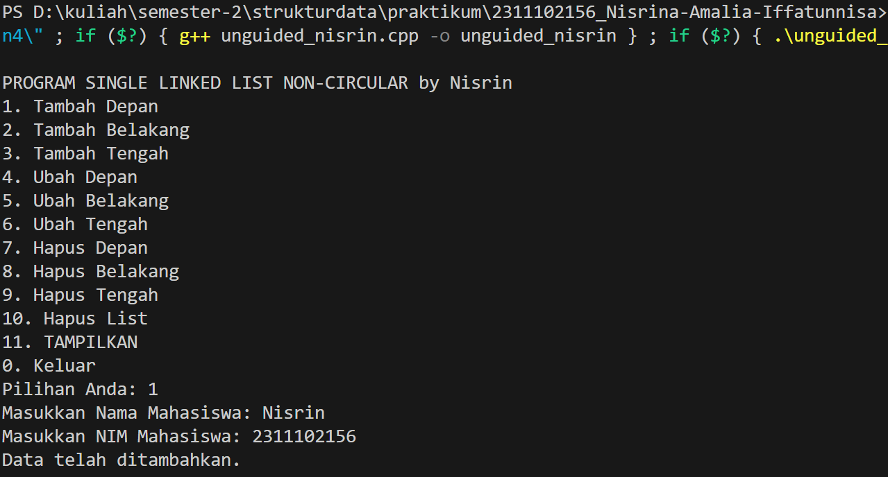

Kode di atas digunakan untuk mencetak nama dan NIM mahasiswa berdasarkan inputan dari pengguna dengan bentuk Single Linked List Non-Circular. Program tersebut mengimplementasikan menu switch-case dan perulangan do-while. Serta single linked list merupakan sebuah struktur data yang setiap node-nya terdiri dari dua bagian, yakni data dan pointer yang menunjuk ke node berikutnya dalam sebuah list. LinkedList tersebut menyediakan beberapa prosedur/fungsi untuk mengelola list seperti menambahkan, mengubah, dan menghapus data, serta menampilkan keseluruhan data linked list. Dalam class LinkedList terdapat anggota private, yakni pointer "head" (yang menunjuk ke node pertama) kemudian diinisialisasi menjadi nullptr, menandakan bahwa linked list awalnya kosong. Beberapa fungsi/prosedur yang telah dibahas sebelumnya, lebih detailnya sebagai berikut:

a. tambahDepan(): Menambahkan node baru di depan linked list. </br>
b. tambahBelakang(): Menambahkan node baru di belakang linked list. </br>
c. tambahTengah(): Menambahkan node baru di posisi tertentu dalam linked list. </br>
d. ubahDepan(): Mengubah data pada node di depan/awal </br>
e. ubahBelakang(): Mengubah data pada node di belakang/akhir </br>
f. ubahTengah(): Mengubah data pada node di posisi tertentu sesuai inputan pengguna </br>
g. hapusDepan() : Menghapus node di depan </br>
h. hapusBelakang() : Menghapus node di belakang </br>
i. hapusTengah() : Menghapus node di posisi tertentu dalam linked list sesuai dengan input pengguna</br>
j. hapusList(): Menghapus semua node/elemen data dalam linked list</br>
k. tampilkanData(): Menampilkan semua data dalam linked list dalam format tabel dengan dua kolom: Nama Mahasiswa dan NIM </br>

### Full Code Program
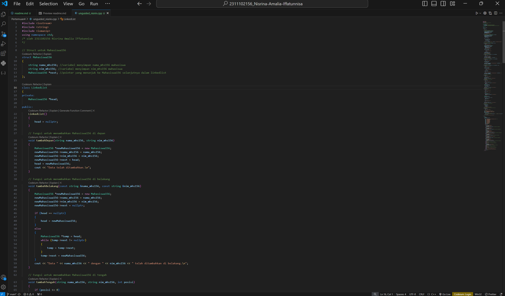


## Unguided 2
### 2. Setelah membuat menu tersebut, masukkan data sesuai urutan berikut, lalu tampilkan data yang telah dimasukkan. (Gunakan insert depan, belakang atau tengah)

```C++
#include <iostream>
#include <string>
#include <iomanip>
using namespace std;
/* oleh 2311102156 Nisrina Amalia Iffatunnisa
*/

// Struct untuk Mahasiswa156
struct Mahasiswa156
{
    string nama_mhs156; //variabel menyimpan nama_mhs156 mahasiswa
    string nim_mhs156; //variabel menyimpan nim_mhs156 mahasiswa
    Mahasiswa156 *next; //pointer yang menunjuk ke Mahasiswa156 selanjutnya dalam linkedlist
};

class LinkedList
{
private:
    Mahasiswa156 *head;

public:
    LinkedList()
    {
        head = nullptr;
    }

    // Fungsi untuk menambahkan Mahasiswa156 di depan
    void tambahDepan(string nama_mhs156, string nim_mhs156)
    {
        Mahasiswa156 *newMahasiswa156 = new Mahasiswa156;
        newMahasiswa156->nama_mhs156 = nama_mhs156;
        newMahasiswa156->nim_mhs156 = nim_mhs156;
        newMahasiswa156->next = head;
        head = newMahasiswa156;
        cout << "Data telah ditambahkan.\n";
    }

    // Fungsi untuk menambahkan Mahasiswa156 di belakang
    void tambahBelakang(const string &nama_mhs156, const string &nim_mhs156)
    {
        Mahasiswa156 *newMahasiswa156 = new Mahasiswa156;
        newMahasiswa156->nama_mhs156 = nama_mhs156;
        newMahasiswa156->nim_mhs156 = nim_mhs156;
        newMahasiswa156->next = nullptr;

        if (head == nullptr)
        {
            head = newMahasiswa156;
        }
        else
        {
            Mahasiswa156 *temp = head;
            while (temp->next != nullptr)
            {
                temp = temp->next;
            }
            temp->next = newMahasiswa156;
        }
        cout << "Data " << nama_mhs156 << " dengan " << nim_mhs156 << " telah ditambahkan di belakang.\n";
    }

    // Fungsi untuk menambahkan Mahasiswa156 di tengah
    void tambahTengah(string nama_mhs156, string nim_mhs156, int posisi)
    {
        if (posisi <= 0)
        {
            cout << "Posisi tidak valid.\n";
            return;
        }
        Mahasiswa156 *newMahasiswa156 = new Mahasiswa156;
        newMahasiswa156->nama_mhs156 = nama_mhs156;
        newMahasiswa156->nim_mhs156 = nim_mhs156;
        if (posisi == 1)
        {
            newMahasiswa156->next = head;
            head = newMahasiswa156;
            cout << "Data telah ditambahkan.\n";
            return;
        }
        Mahasiswa156 *temp = head;
        for (int i = 1; i < posisi - 1; i++)
        {
            if (temp == nullptr)
            {
                cout << "Posisi tidak valid.\n";
                return;
            }
            temp = temp->next;
        }
        newMahasiswa156->next = temp->next;
        temp->next = newMahasiswa156;
        cout << "Data telah ditambahkan.\n";
    }
    // Fungsi untuk mengubah data di depan
    void ubahDepan(const string &nama_mhs156Baru, const string &nim_mhs156Baru)
    {
        if (head == nullptr)
        {
            cout << "Linked list kosong.\n";
            return;
        }
        head->nama_mhs156 = nama_mhs156Baru;
        head->nim_mhs156 = nim_mhs156Baru;
        cout << "Data telah diganti dengan nama " << nama_mhs156Baru << ".\n";
    }

    // Fungsi untuk mengubah data di belakang
    void ubahBelakang(const string &nama_mhs156Baru, const string &nim_mhs156Baru)
    {
        if (head == nullptr)
        {
            cout << "Linked list kosong.\n";
            return;
        }
        Mahasiswa156 *temp = head;
        while (temp->next != nullptr)
        {
            temp = temp->next;
        }
        cout << "Data " << temp->nama_mhs156 << " telah diganti dengan data " << nama_mhs156Baru << ".\n";
        temp->nama_mhs156 = nama_mhs156Baru;
        temp->nim_mhs156 = nim_mhs156Baru;
    }

    // Fungsi untuk mengubah data di tengah
    void ubahTengah(const string &nama_mhs156Baru, const string &nim_mhs156Baru, int posisi)
    {
        if (posisi <= 0)
        {
            cout << "Posisi tidak valid.\n";
            return;
        }
        Mahasiswa156 *temp = head;
        for (int i = 1; i < posisi; i++)
        {
            if (temp == nullptr)
            {
                cout << "Posisi tidak valid.\n";
                return;
            }
            temp = temp->next;
        }
        if (temp == nullptr)
        {
            cout << "Posisi tidak valid.\n";
            return;
        }
        cout << "Data " << temp->nama_mhs156 << " telah diganti dengan data " << nama_mhs156Baru << ".\n";
        temp->nama_mhs156 = nama_mhs156Baru;
        temp->nim_mhs156 = nim_mhs156Baru;
    }

    // Fungsi untuk menghapus data pertama/depan
    void hapusDepan()
    {
        if (head == nullptr)
        {
            cout << "Linked list kosong.\n";
            return;
        }
        Mahasiswa156 *temp = head;
        head = head->next;
        cout << "Data " << temp->nama_mhs156 << " berhasil dihapus.\n";
        delete temp;
    }
    // Fungsi untuk menghapus data terakhir/belakang
    void hapusBelakang()
    {
        if (head == nullptr)
        {
            cout << "Linked list kosong.\n";
            return;
        }
        if (head->next == nullptr)
        {
            cout << "Data " << head->nama_mhs156 << " berhasil dihapus.\n";
            delete head;
            head = nullptr;
            return;
        }
        Mahasiswa156 *prev = nullptr;
        Mahasiswa156 *current = head;
        while (current->next != nullptr)
        {
            prev = current;
            current = current->next;
        }
        prev->next = nullptr;
        cout << "Data " << current->nama_mhs156 << " berhasil dihapus.\n";
        delete current;
    }
    // Fungsi untuk menghapus data di tengah
    void hapusTengah(int posisi)
    {
        if (posisi <= 0)
        {
            cout << "Posisi tidak valid.\n";
            return;
        }
        if (head == nullptr)
        {
            cout << "Linked list kosong.\n";
            return;
        }
        if (posisi == 1)
        {
            Mahasiswa156 *temp = head;
            head = head->next;
            cout << "Data " << temp->nama_mhs156 << " berhasil dihapus.\n";
            delete temp;
            return;
        }

        Mahasiswa156 *prev = nullptr;
        Mahasiswa156 *current = head;
        int count = 1;

        while (current != nullptr && count != posisi)
        {
            prev = current;
            current = current->next;
            count++;
        }

        if (current == nullptr)
        {
            cout << "Posisi tidak valid.\n";
            return;
        }

        prev->next = current->next;
        cout << "Data " << current->nama_mhs156 << " berhasil dihapus.\n";
        delete current;
    }
    // Fungsi untuk menghapus semua data Mahasiswa156
    void hapusList()
    {
        Mahasiswa156 *temp;
        while (head != nullptr)
        {
            temp = head;
            head = head->next;
            delete temp;
        }
        cout << "Semua data berhasil dihapus.\n";
    }
    // Fungsi untuk menampilkan semua data dalam format tabel dua kolom
    void tampilkanData()
    {
        if (head == nullptr)
        {
            cout << "Linked list kosong.\n";
            return;
        }
        // Judul tabel
        cout << "DATA MAHASISWA FIF TELKOM PWT" <<endl;
        cout << "===========================================\n";
        cout << "|   Nama Mahasiswa   |         NIM        |\n";
        cout << "===========================================\n";
        Mahasiswa156 *temp = head;
        while (temp != nullptr)
        {
            // Menampilkan data dalam format tabel
            cout << "| " << setw(18) << left << temp->nama_mhs156 << " | " << setw(18) << left << temp->nim_mhs156 << " |\n";
            temp = temp->next;
        }
        // Garis penutup tabel
        cout << "===========================================\n";
    }
};

    int main()
    {
        LinkedList list;
        int choice;
        string nama_mhs156, nim_mhs156;
        do
        {
            cout << "\nPROGRAM SINGLE LINKED LIST NON-CIRCULAR by Nisrin\n"; //menu
            cout << "1. Tambah Depan\n";
            cout << "2. Tambah Belakang\n";
            cout << "3. Tambah Tengah\n";
            cout << "4. Ubah Depan\n";
            cout << "5. Ubah Belakang\n";
            cout << "6. Ubah Tengah\n";
            cout << "7. Hapus Depan\n";
            cout << "8. Hapus Belakang\n";
            cout << "9. Hapus Tengah\n";
            cout << "10. Hapus List\n";
            cout << "11. TAMPILKAN\n";
            cout << "0. Keluar\n";
            cout << "Pilihan Anda: ";
            cin >> choice; //pilihan menu
            switch (choice)
            {
            case 1:
                cout << "Masukkan Nama Mahasiswa: ";
                cin >> nama_mhs156;
                cout << "Masukkan NIM Mahasiswa: ";
                cin >> nim_mhs156;
                list.tambahDepan(nama_mhs156, nim_mhs156); //akan menjalankan void tambahDepan()
                break;
            case 2:
                cout << "Masukkan Nama Mahasiswa: ";
                cin >> nama_mhs156;
                cout << "Masukkan NIM Mahasiswa: ";
                cin >> nim_mhs156;
                list.tambahBelakang(nama_mhs156, nim_mhs156);//akan menjalankan void tambahBelakang()
                break;
            case 3:
                int posisi;
                cout << "Masukkan Nama Mahasiswa: ";
                cin >> nama_mhs156;
                cout << "Masukkan NIM Mahasiswa: ";
                cin >> nim_mhs156;
                cout << "Masukkan posisi untuk menambahkan data: ";
                cin >> posisi;
                list.tambahTengah(nama_mhs156, nim_mhs156, posisi); //akan menjalankan void tambahTengah()
                break;
            case 4:
                cout << "Masukkan Nama baru untuk data di depan: ";
                cin >> nama_mhs156;
                cout << "Masukkan NIM baru: ";
                cin >> nim_mhs156;
                list.ubahDepan(nama_mhs156, nim_mhs156); //akan menjalankan void ubahDepan()
                break;
            case 5:
                cout << "Masukkan Nama baru untuk data di belakang: ";
                cin >> nama_mhs156;
                cout << "Masukkan NIM baru: ";
                cin >> nim_mhs156;
                list.ubahBelakang(nama_mhs156, nim_mhs156); //akan menjalankan void ubahBelakang()
                break;
            case 6:
                cout << "Masukkan Nama baru: ";
                cin >> nama_mhs156;
                cout << "Masukkan NIM baru: ";
                cin >> nim_mhs156;
                cout << "Masukkan posisi yang ingin diubah: ";
                cin >> posisi;
                list.ubahTengah(nama_mhs156, nim_mhs156, posisi); //akan menjalankan void ubahTengah()
                break;
            case 7:
                list.hapusDepan(); //akan menjalankan void hapusDepan()
                break;
            case 8:
                list.hapusBelakang(); //akan menjalankan void hapusBelakang()
                break;
            case 9:
                int posisiHapus;
                cout << "Masukkan posisi yang ingin dihapus: ";
                cin >> posisiHapus;
                list.hapusTengah(posisiHapus); //akan menjalankan void hapusTengah()
                break;
            case 10:
                list.hapusList(); //akan menjalankan void hapusList()
                break;
            case 11:
                list.tampilkanData(); //akan menjalankan void tampilkanData()
                break;
            case 0:
                cout << "Terima kasih sudah menggunakan program ini!\n";
                break;
            default:
                cout << "Maaf, pilihan tidak valid. Silakan coba lagi.\n";
            }
        } while (choice != 0);
    
        return 0;
    }
```
#### Output Data Setelah di Tambahkan :
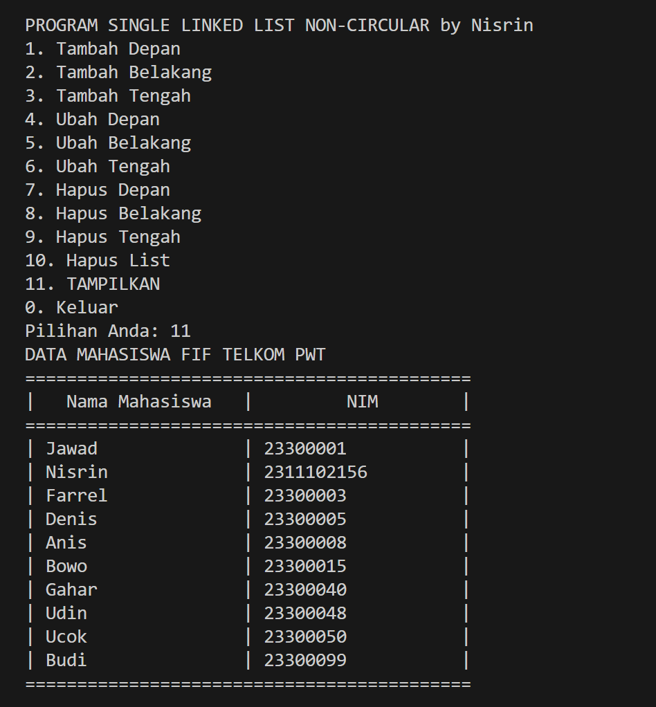

Kode di atas digunakan untuk mencetak nama dan NIM mahasiswa berdasarkan inputan dari pengguna dengan bentuk Single Linked List Non-Circular. Dengan menggunakan tambahDepan(), tambahTengah(), dan tambahBelakang(). Data yang pertama kali dimasukkan adalah Jawad (23300001) dengan menu opsi pertama, yaitu Tambah Depan. Kedua menggunakan Tambah Tengah dengan inputan posisi kedua dengan nama Nisrin (2311102156). Ketiga menggunakan menu Tambah Belakang menginputkan mahasiswa dengan nama Farrel (23300003). Keempat menggunakan menu Tambah Belakang menginputkan mahasiswa dengan nama Denis (23300005). Kelima menggunakan menu Tambah Belakang menginputkan mahasiswa dengan nama Anis 23300008. Keenam menggunakan menu Tambah Belakang menginputkan mahasiswa dengan nama Bowo(23300015). Ketujuh menggunakan menu Tambah Belakang menginputkan mahasiswa dengan nama Gahar (23300040). Kedelapan menggunakan menu Tambah Belakang menginputkan mahasiswa dengan nama Udin (23300048). Kesembilan menggunakan menu Tambah Belakang menginputkan mahasiswa dengan nama Ucok (23300050). Dan yang terakhir, kesepuluh menggunakan menu Tambah Belakang menginputkan mahasiswa dengan nama Budi(23300099)</br>

### Full Code Program


## Unguided 3
### 3. Lakukan perintah berikut (seperti di modul):

```C++
#include <iostream>
#include <string>
#include <iomanip>
using namespace std;
/* oleh 2311102156 Nisrina Amalia Iffatunnisa
*/

// Struct untuk Mahasiswa156
struct Mahasiswa156
{
    string nama_mhs156; //variabel menyimpan nama_mhs156 mahasiswa
    string nim_mhs156; //variabel menyimpan nim_mhs156 mahasiswa
    Mahasiswa156 *next; //pointer yang menunjuk ke Mahasiswa156 selanjutnya dalam linkedlist
};

class LinkedList
{
private:
    Mahasiswa156 *head;

public:
    LinkedList()
    {
        head = nullptr;
    }

    // Fungsi untuk menambahkan Mahasiswa156 di depan
    void tambahDepan(string nama_mhs156, string nim_mhs156)
    {
        Mahasiswa156 *newMahasiswa156 = new Mahasiswa156;
        newMahasiswa156->nama_mhs156 = nama_mhs156;
        newMahasiswa156->nim_mhs156 = nim_mhs156;
        newMahasiswa156->next = head;
        head = newMahasiswa156;
        cout << "Data telah ditambahkan.\n";
    }

    // Fungsi untuk menambahkan Mahasiswa156 di belakang
    void tambahBelakang(const string &nama_mhs156, const string &nim_mhs156)
    {
        Mahasiswa156 *newMahasiswa156 = new Mahasiswa156;
        newMahasiswa156->nama_mhs156 = nama_mhs156;
        newMahasiswa156->nim_mhs156 = nim_mhs156;
        newMahasiswa156->next = nullptr;

        if (head == nullptr)
        {
            head = newMahasiswa156;
        }
        else
        {
            Mahasiswa156 *temp = head;
            while (temp->next != nullptr)
            {
                temp = temp->next;
            }
            temp->next = newMahasiswa156;
        }
        cout << "Data " << nama_mhs156 << " dengan " << nim_mhs156 << " telah ditambahkan di belakang.\n";
    }

    // Fungsi untuk menambahkan Mahasiswa156 di tengah
    void tambahTengah(string nama_mhs156, string nim_mhs156, int posisi)
    {
        if (posisi <= 0)
        {
            cout << "Posisi tidak valid.\n";
            return;
        }
        Mahasiswa156 *newMahasiswa156 = new Mahasiswa156;
        newMahasiswa156->nama_mhs156 = nama_mhs156;
        newMahasiswa156->nim_mhs156 = nim_mhs156;
        if (posisi == 1)
        {
            newMahasiswa156->next = head;
            head = newMahasiswa156;
            cout << "Data telah ditambahkan.\n";
            return;
        }
        Mahasiswa156 *temp = head;
        for (int i = 1; i < posisi - 1; i++)
        {
            if (temp == nullptr)
            {
                cout << "Posisi tidak valid.\n";
                return;
            }
            temp = temp->next;
        }
        newMahasiswa156->next = temp->next;
        temp->next = newMahasiswa156;
        cout << "Data telah ditambahkan.\n";
    }
    // Fungsi untuk mengubah data di depan
    void ubahDepan(const string &nama_mhs156Baru, const string &nim_mhs156Baru)
    {
        if (head == nullptr)
        {
            cout << "Linked list kosong.\n";
            return;
        }
        head->nama_mhs156 = nama_mhs156Baru;
        head->nim_mhs156 = nim_mhs156Baru;
        cout << "Data telah diganti dengan nama " << nama_mhs156Baru << ".\n";
    }

    // Fungsi untuk mengubah data di belakang
    void ubahBelakang(const string &nama_mhs156Baru, const string &nim_mhs156Baru)
    {
        if (head == nullptr)
        {
            cout << "Linked list kosong.\n";
            return;
        }
        Mahasiswa156 *temp = head;
        while (temp->next != nullptr)
        {
            temp = temp->next;
        }
        cout << "Data " << temp->nama_mhs156 << " telah diganti dengan data " << nama_mhs156Baru << ".\n";
        temp->nama_mhs156 = nama_mhs156Baru;
        temp->nim_mhs156 = nim_mhs156Baru;
    }

    // Fungsi untuk mengubah data di tengah
    void ubahTengah(const string &nama_mhs156Baru, const string &nim_mhs156Baru, int posisi)
    {
        if (posisi <= 0)
        {
            cout << "Posisi tidak valid.\n";
            return;
        }
        Mahasiswa156 *temp = head;
        for (int i = 1; i < posisi; i++)
        {
            if (temp == nullptr)
            {
                cout << "Posisi tidak valid.\n";
                return;
            }
            temp = temp->next;
        }
        if (temp == nullptr)
        {
            cout << "Posisi tidak valid.\n";
            return;
        }
        cout << "Data " << temp->nama_mhs156 << " telah diganti dengan data " << nama_mhs156Baru << ".\n";
        temp->nama_mhs156 = nama_mhs156Baru;
        temp->nim_mhs156 = nim_mhs156Baru;
    }

    // Fungsi untuk menghapus data pertama/depan
    void hapusDepan()
    {
        if (head == nullptr)
        {
            cout << "Linked list kosong.\n";
            return;
        }
        Mahasiswa156 *temp = head;
        head = head->next;
        cout << "Data " << temp->nama_mhs156 << " berhasil dihapus.\n";
        delete temp;
    }
    // Fungsi untuk menghapus data terakhir/belakang
    void hapusBelakang()
    {
        if (head == nullptr)
        {
            cout << "Linked list kosong.\n";
            return;
        }
        if (head->next == nullptr)
        {
            cout << "Data " << head->nama_mhs156 << " berhasil dihapus.\n";
            delete head;
            head = nullptr;
            return;
        }
        Mahasiswa156 *prev = nullptr;
        Mahasiswa156 *current = head;
        while (current->next != nullptr)
        {
            prev = current;
            current = current->next;
        }
        prev->next = nullptr;
        cout << "Data " << current->nama_mhs156 << " berhasil dihapus.\n";
        delete current;
    }
    // Fungsi untuk menghapus data di tengah
    void hapusTengah(int posisi)
    {
        if (posisi <= 0)
        {
            cout << "Posisi tidak valid.\n";
            return;
        }
        if (head == nullptr)
        {
            cout << "Linked list kosong.\n";
            return;
        }
        if (posisi == 1)
        {
            Mahasiswa156 *temp = head;
            head = head->next;
            cout << "Data " << temp->nama_mhs156 << " berhasil dihapus.\n";
            delete temp;
            return;
        }

        Mahasiswa156 *prev = nullptr;
        Mahasiswa156 *current = head;
        int count = 1;

        while (current != nullptr && count != posisi)
        {
            prev = current;
            current = current->next;
            count++;
        }

        if (current == nullptr)
        {
            cout << "Posisi tidak valid.\n";
            return;
        }

        prev->next = current->next;
        cout << "Data " << current->nama_mhs156 << " berhasil dihapus.\n";
        delete current;
    }
    // Fungsi untuk menghapus semua data Mahasiswa156
    void hapusList()
    {
        Mahasiswa156 *temp;
        while (head != nullptr)
        {
            temp = head;
            head = head->next;
            delete temp;
        }
        cout << "Semua data berhasil dihapus.\n";
    }
    // Fungsi untuk menampilkan semua data dalam format tabel dua kolom
    void tampilkanData()
    {
        if (head == nullptr)
        {
            cout << "Linked list kosong.\n";
            return;
        }
        // Judul tabel
        cout << "DATA MAHASISWA FIF TELKOM PWT" <<endl;
        cout << "===========================================\n";
        cout << "|   Nama Mahasiswa   |         NIM        |\n";
        cout << "===========================================\n";
        Mahasiswa156 *temp = head;
        while (temp != nullptr)
        {
            // Menampilkan data dalam format tabel
            cout << "| " << setw(18) << left << temp->nama_mhs156 << " | " << setw(18) << left << temp->nim_mhs156 << " |\n";
            temp = temp->next;
        }
        // Garis penutup tabel
        cout << "===========================================\n";
    }
};

    int main()
    {
        LinkedList list;
        int choice;
        string nama_mhs156, nim_mhs156;
        do
        {
            cout << "\nPROGRAM SINGLE LINKED LIST NON-CIRCULAR by Nisrin\n"; //menu
            cout << "1. Tambah Depan\n";
            cout << "2. Tambah Belakang\n";
            cout << "3. Tambah Tengah\n";
            cout << "4. Ubah Depan\n";
            cout << "5. Ubah Belakang\n";
            cout << "6. Ubah Tengah\n";
            cout << "7. Hapus Depan\n";
            cout << "8. Hapus Belakang\n";
            cout << "9. Hapus Tengah\n";
            cout << "10. Hapus List\n";
            cout << "11. TAMPILKAN\n";
            cout << "0. Keluar\n";
            cout << "Pilihan Anda: ";
            cin >> choice; //pilihan menu
            switch (choice)
            {
            case 1:
                cout << "Masukkan Nama Mahasiswa: ";
                cin >> nama_mhs156;
                cout << "Masukkan NIM Mahasiswa: ";
                cin >> nim_mhs156;
                list.tambahDepan(nama_mhs156, nim_mhs156); //akan menjalankan void tambahDepan()
                break;
            case 2:
                cout << "Masukkan Nama Mahasiswa: ";
                cin >> nama_mhs156;
                cout << "Masukkan NIM Mahasiswa: ";
                cin >> nim_mhs156;
                list.tambahBelakang(nama_mhs156, nim_mhs156);//akan menjalankan void tambahBelakang()
                break;
            case 3:
                int posisi;
                cout << "Masukkan Nama Mahasiswa: ";
                cin >> nama_mhs156;
                cout << "Masukkan NIM Mahasiswa: ";
                cin >> nim_mhs156;
                cout << "Masukkan posisi untuk menambahkan data: ";
                cin >> posisi;
                list.tambahTengah(nama_mhs156, nim_mhs156, posisi); //akan menjalankan void tambahTengah()
                break;
            case 4:
                cout << "Masukkan Nama baru untuk data di depan: ";
                cin >> nama_mhs156;
                cout << "Masukkan NIM baru: ";
                cin >> nim_mhs156;
                list.ubahDepan(nama_mhs156, nim_mhs156); //akan menjalankan void ubahDepan()
                break;
            case 5:
                cout << "Masukkan Nama baru untuk data di belakang: ";
                cin >> nama_mhs156;
                cout << "Masukkan NIM baru: ";
                cin >> nim_mhs156;
                list.ubahBelakang(nama_mhs156, nim_mhs156); //akan menjalankan void ubahBelakang()
                break;
            case 6:
                cout << "Masukkan Nama baru: ";
                cin >> nama_mhs156;
                cout << "Masukkan NIM baru: ";
                cin >> nim_mhs156;
                cout << "Masukkan posisi yang ingin diubah: ";
                cin >> posisi;
                list.ubahTengah(nama_mhs156, nim_mhs156, posisi); //akan menjalankan void ubahTengah()
                break;
            case 7:
                list.hapusDepan(); //akan menjalankan void hapusDepan()
                break;
            case 8:
                list.hapusBelakang(); //akan menjalankan void hapusBelakang()
                break;
            case 9:
                int posisiHapus;
                cout << "Masukkan posisi yang ingin dihapus: ";
                cin >> posisiHapus;
                list.hapusTengah(posisiHapus); //akan menjalankan void hapusTengah()
                break;
            case 10:
                list.hapusList(); //akan menjalankan void hapusList()
                break;
            case 11:
                list.tampilkanData(); //akan menjalankan void tampilkanData()
                break;
            case 0:
                cout << "Terima kasih sudah menggunakan program ini!\n";
                break;
            default:
                cout << "Maaf, pilihan tidak valid. Silakan coba lagi.\n";
            }
        } while (choice != 0);
    
        return 0;
    }
```
#### Output Menambahkan data Wati  diantara Farrel dan Denis :
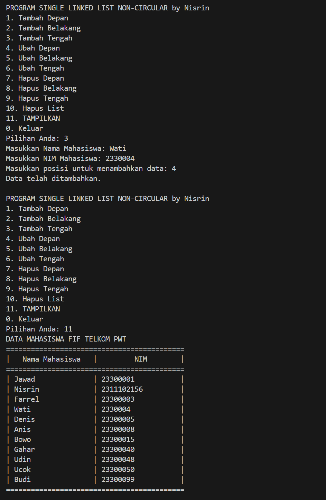

### Output Menghapus data Denis
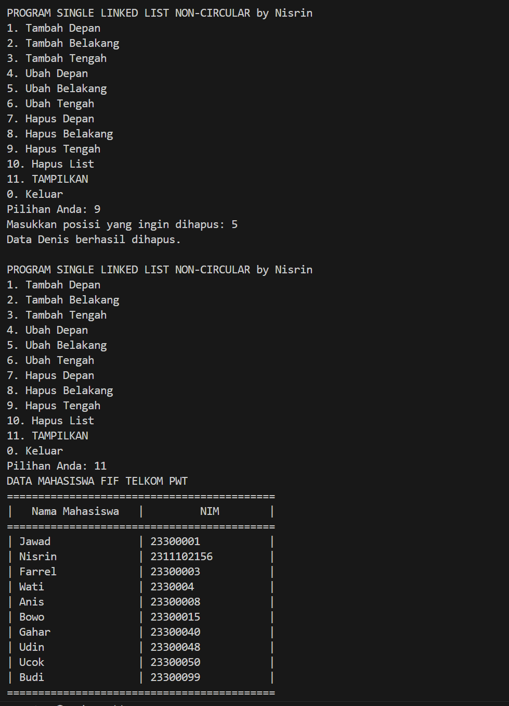

### Output Menambahkan data Owi diawal
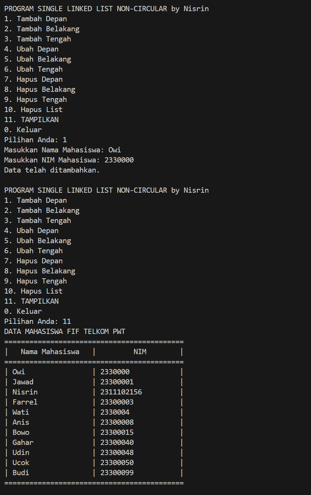

### Output Menambahkan data David diakhir
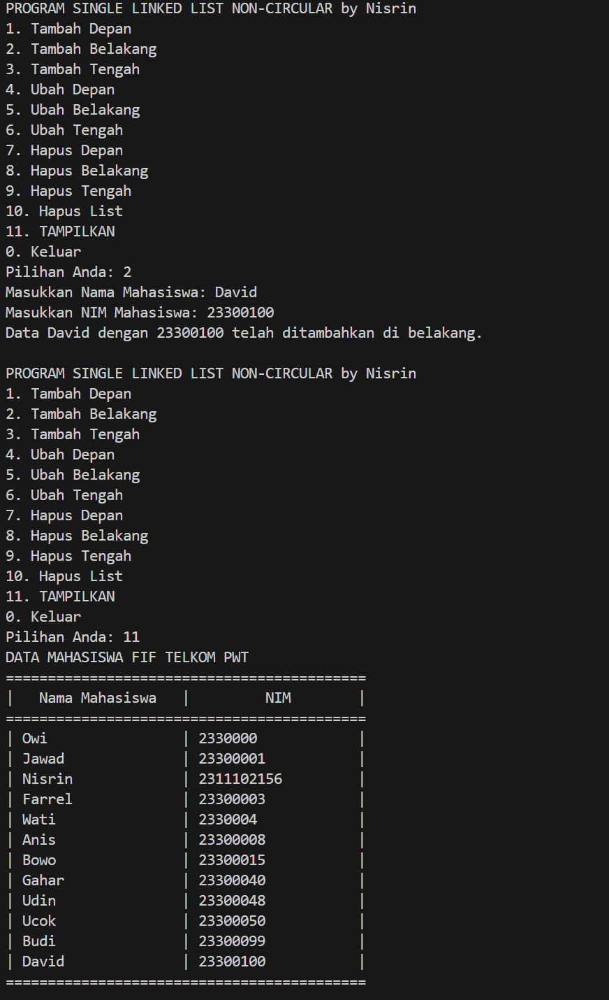

### Output Mengubah Udin menjadi Idin
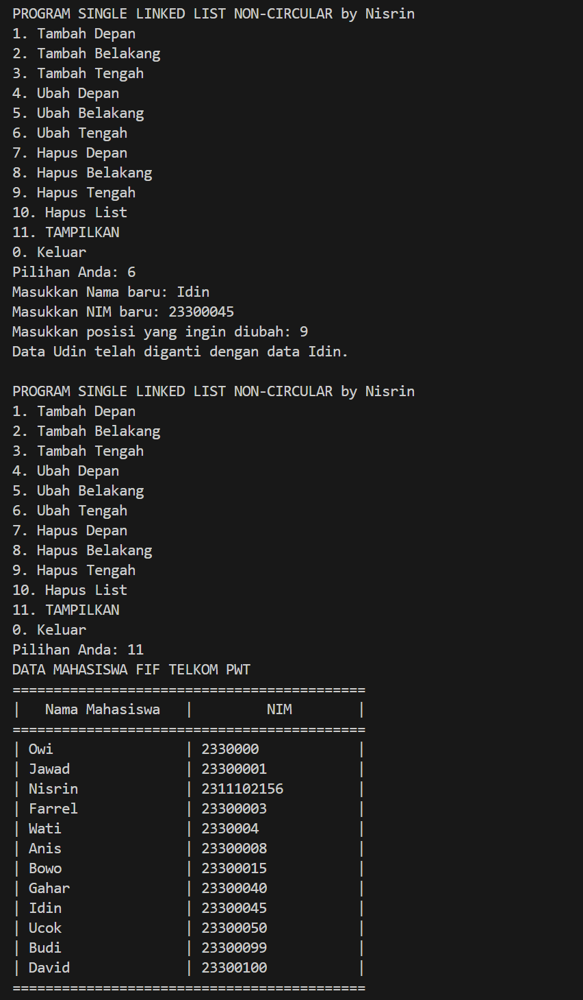

### Output Mengubah data terakhir menjadi Lucy
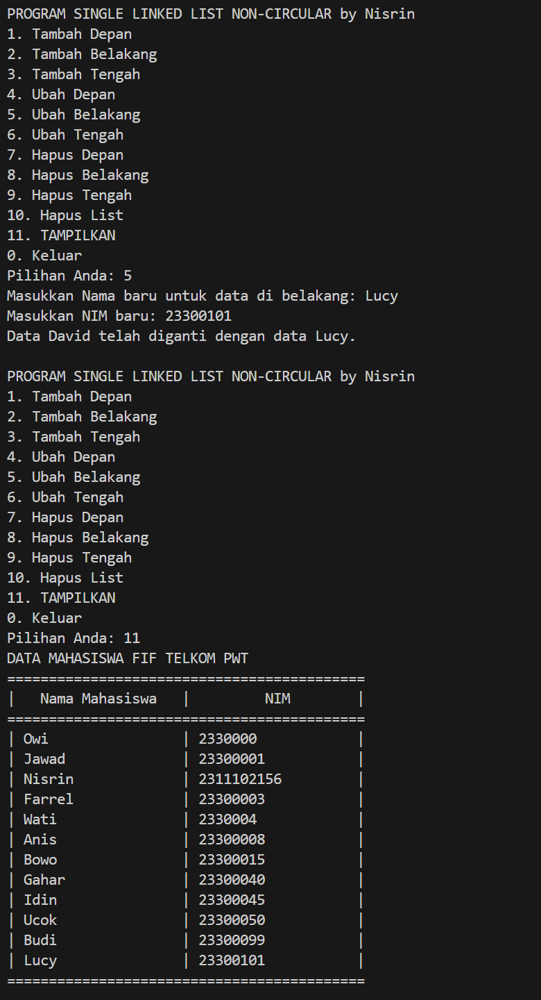

### Output Menghapus data awal
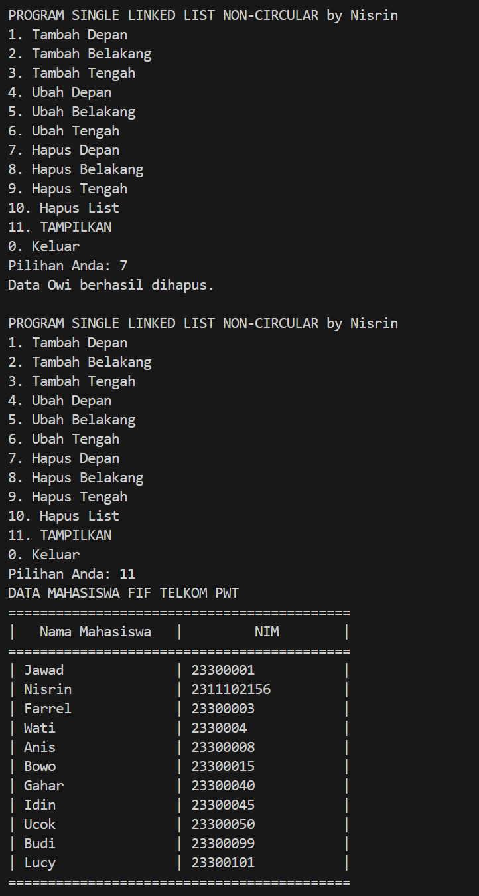

### Output Mengubah data awal menjadi Bagas
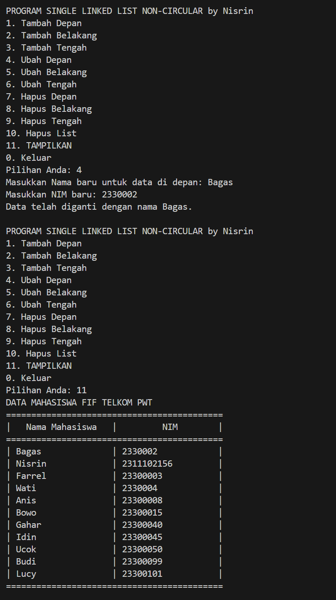

### Output Menghapus data akhir dan Tampilan Data
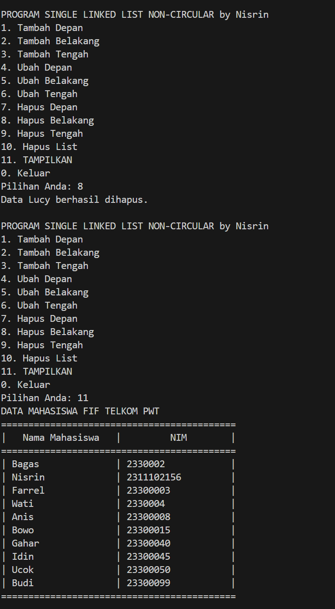

Kode di atas digunakan untuk mencetak nama dan NIM mahasiswa berdasarkan inputan dari pengguna dengan bentuk Single Linked List Non-Circular. Dengan menggunakan tambahDepan(), tambahTengah(), dan tambahBelakang(), ubahDepan(), ubahBelakang(), ubahTengah(), hapusDepan(), hapusBelakang(), hapusTengah(), hapusList(), tampilkanData().

a. Perintah pertama menambahkan data Wati diantara Farrel dan Denis menggunakan opsi Tambah Tengah dengan posisi node keempat</br>
b. Perintah kedua menghapus data Denis menggunakan opsi Hapus Tengah dengan posisi node kelima </br>
c. Perintah ketiga menambahkan data Owi di paling awal menggunakan opsi menu Tambah Depan</br>
d. Perintah keempat menambahkan data David di paling akhir menggunakan opsi menu Tambah Belakang </br>
e. Perintah kelima mengubah data Udin menjadi Idin menggunakan opsi menu Ubah Tengah dengan posisi node kesembilan </br>
f. Perintah keenam mengubah data terakhir menjadi Lucy menggunakan opsi menu Ubah Data Belakang </br>
g. Perintah ketujuh menghapus data di paling awal menggunakan opsi menu Hapus Depan </br>
h. Perintah kedelapan mengubah data awal menjadi Bagas menggunakan opsi menu Ubah Depan </br>
i. Perintah kesembilan menghapus data paling akhir dengan menggunakan opsi menu Hapus Belakang </br>
j. Perintah terakhir, menampilkan semua data dengan opsi menu TAMPILKAN

### Full Code Program


## Kesimpulan
Setelah melakukan praktikum  single linked list non circular (SLLNC) untuk data mahasiswa dengan nama dan NIM adalah bahwa penggunaan struktur data linked list merupakan salah satu cara yang efektif dalam pengelolaan data terstruktur. SLLNC hanya memerlukan memori untuk menyimpan elemen-elemen yang ada, tanpa memerlukan alokasi memori tambahan sehingga menjadi efisien.  Penambahan dan penghapusan node/elemen pada SLLNC dapat dilakukan dengan cepat, terutama jika operasi tersebut dilakukan di awal atau tengah linked list. Hal tersebut memudahkan dalam mengorganisir data secara dinamis sesuai dengan kebutuhan program.

## Referensi
[1] Santoso, Joseph Teguh. 2021. "Struktur Data dan Algoritma", Semarang : Yayasan Prima Agus Teknik.

[2] Triase. 2020. "Diktat Edisi Revisi Struktur Data", Medan : Fakultas Sains dan Teknologi UIN Sumatera Utara Medan.