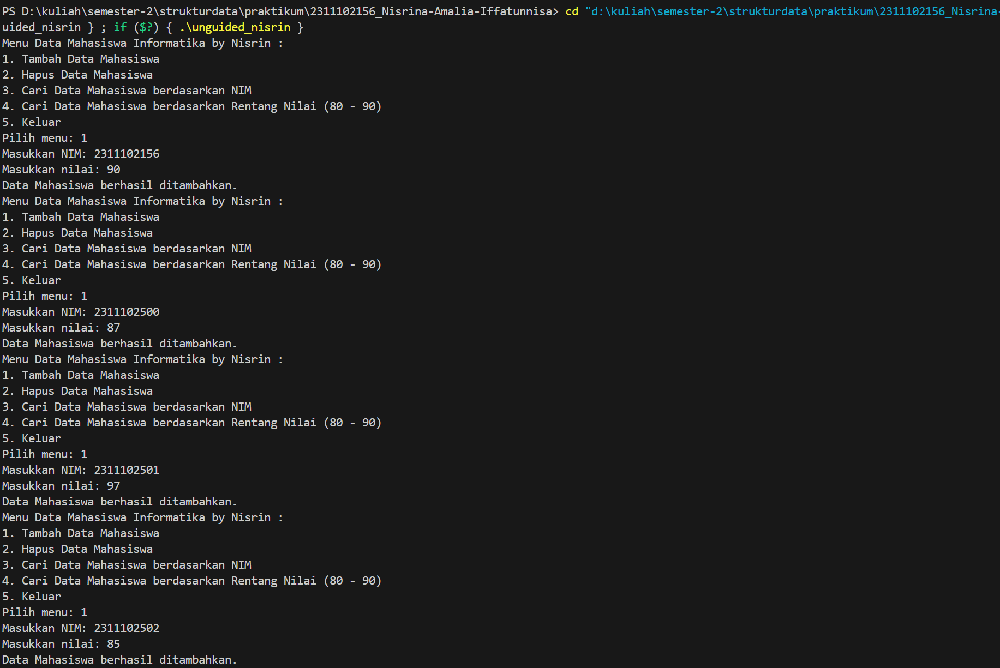
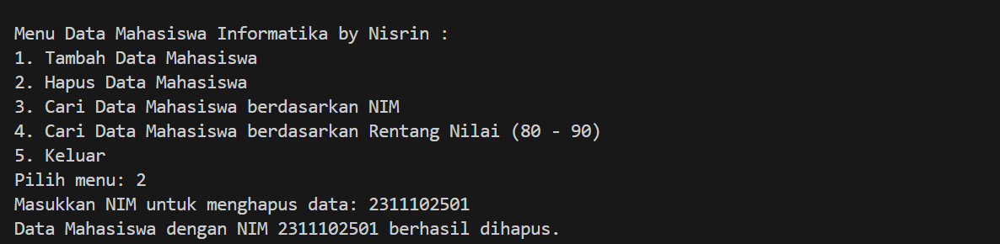
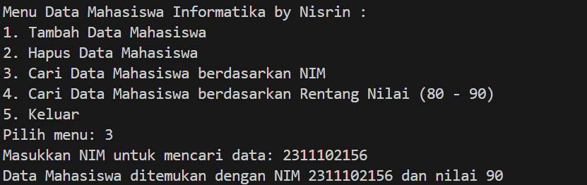
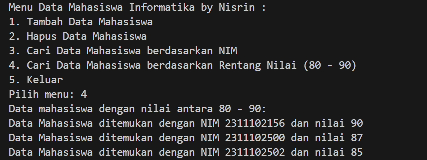
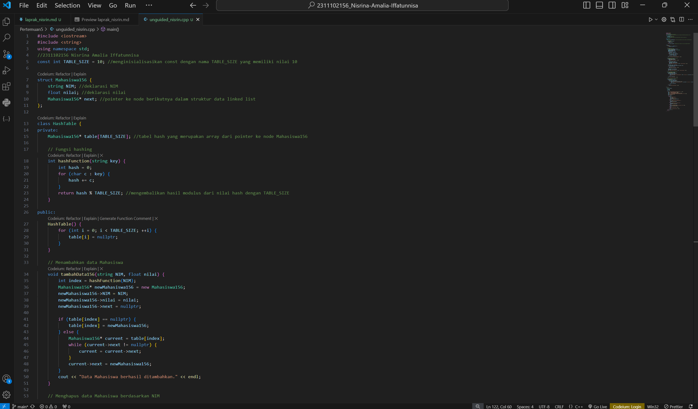

# <h1 align="center">Laporan Praktikum Modul 5 - Hash Table</h1>
<p align="center">2311102156 - Nisrina Amalia Iffatunnisa</p>

## Dasar Teori

Hash Table adalah sebuah struktur data yang terdiri atas sebuah tabel dan fungsi yang bertujuan untuk memetakan nilai kunci yang unik untuk setiap record (baris) menjadi angka (hash) lokasi record tersebut dalam sebuah tabel. Tabel hash biasanya disebut sebagai struktur data, yang digunakan untuk menyimpan data berdasarkan fungsi hash. Fungsi hash yang baik memiliki sifat berikut: mudah dihitung, cukup mampu mendistribusikan key, meminimalkan jumlah collision (tabrakan) yang terjadi. Fungsi
hash dapat menggunakan beberapa teknik, diantaranya: </br>
a. Truncation : mengambil beberapa digit dari key sebagai indeks </br>
b. Folding : menjumlahkan beberapa digit dari key, hasil penjumlahan sebagai indeks </br>
c. Modular : menggunakan sisa hasil bagi dari key (bilangan bulat) dengan ukuran hash table </br>

Collision adalah keterbatasan tabel hash adalah jika dua angka dimasukkan ke dalam fungsi hash menghasilkan nilai yang sama. Adapun teknik untuk menangani collision, hash table dapat dikategorikan menjadi: </br>
a. Open Hashing (Chaining). Pada teknik ini, permasalahan collision diselesaikan dengan menambah seluruh elemen yang memiliki nilai sama pada sebuah sel. Hal ini dilakukan dengan cara menyediakan sebuah linked list untuk setiap elemen yang memiliki nilai hash yang sama. Tiap sel pada hash table memiliki sebuah lisked list yang berisi data/elemen. </br>
b. Open Adressing. Pada teknik ini mencari alternatif sel lain pada table ketika terjadi collision. Pada proses insertion, ketika indeks yang telah ditentukan dari Fungsi hash
yang digunakan sudah berisi suatu item, maka akan mencari sel lain sesuai urutan menggunakan fungsi pencarian urutan, yaitu  yaitu: Linier probing, Quadratic probing, dan Double hashing.</br>
c. Bucket Addressing (Pengalamatan Bucket). Teknik ini mirip dengan chaining, tetapi tabrakan tidak ditangani dengan teknik menggunakan array. Pengalamatan buket itu sendiri didefinisikan sebagai ruang memori sehingga cukup untuk menampung banyak data dengan alamat hash yang sama.</br>

Operasi Hashtable, antara lain Insertion (memasukkan atau menyisipkan data baru ke dalam hash table), Deletion (menghapus data dari hash table), Searching (mencari data dalam hash table dengan memasukkan input kunci ke fungsi hash), Update (memperbarui data dalam hash table), Traversal (memproses semua data yang ada dalam tabel).

Keunggulan dari struktur hash table ini adalah waktu aksesnya yang cukup cepat, jika record yang dicari langsung berada pada angka hash lokasi penyimpanannya. Hash table menjadi struktur data di mana operasi penyisipan dan pencarian data terjadi sangat cepat terlepas dari ukuran data tersebut. Hash table menggunakan array sebagai media penyimpanan dan tekniknya untuk menghasilkan indeks suatu elemen yang dimasukkan atau ditempatkan.

## Guided 

### 1. Implementasi Array Dinamis

```C++
#include <iostream>
using namespace std;
const int MAX_SIZE = 10;
// Fungsi hash sederhana
int hash_func(int key)
{
    return key % MAX_SIZE;
}
// Struktur data untuk setiap node
struct Node
{
    int key;
    int value;
    Node *next;
    Node(int key, int value) : key(key), value(value),
                               next(nullptr) {}
};
// Class hash table
class HashTable
{
private:
    Node **table;

public:
    HashTable()
    {
        table = new Node *[MAX_SIZE]();
    }
    ~HashTable()
    {
        for (int i = 0; i < MAX_SIZE; i++)
        {
            Node *current = table[i];
            while (current != nullptr)
            {
                Node *temp = current;
                current = current->next;
                delete temp;
            }
        }
        delete[] table;
    }
    // Insertion
    void insert(int key, int value)
    {
        int index = hash_func(key);
        Node *current = table[index];
        while (current != nullptr)
        {
            if (current->key == key)
            {
                current->value = value;
                return;
            }
            current = current->next;
        }
        Node *node = new Node(key, value);
        node->next = table[index];
        table[index] = node;
    }
    // Searching
    int get(int key)
    {
        int index = hash_func(key);
        Node *current = table[index];
        while (current != nullptr)
        {
            if (current->key == key)
            {
                return current->value;
            }
            current = current->next;
        }
        return -1;
    }
    // Deletion
    void remove(int key)
    {
        int index = hash_func(key);
        Node *current = table[index];
        Node *prev = nullptr;
        while (current != nullptr)
        {
            if (current->key == key)
            {
                if (prev == nullptr)
                {
                    table[index] = current->next;
                }
                else
                {
                    prev->next = current->next;
                }
                delete current;
                return;
            }
            prev = current;
            current = current->next;
        }
    }
    // Traversal
    void traverse()
    {
        for (int i = 0; i < MAX_SIZE; i++)
        {
            Node *current = table[i];
            while (current != nullptr)
            {
                cout << current->key << ": " << current->value
                     << endl;
                current = current->next;
            }
        }
    }
};
int main()
{
    HashTable ht;
    // Insertion
    ht.insert(1, 10);
    ht.insert(2, 20);
    ht.insert(3, 30);
    // Searching
    cout << "Get key 1: " << ht.get(1) << endl;
    cout << "Get key 4: " << ht.get(4) << endl;
    // Deletion
    ht.remove(4);
    // Traversal
    ht.traverse();
    return 0;
}
```
Kode di atas merupakan sebuah program yang mengimplementasikan array dinamis “table” untuk menyimpan bucket dalam hash table. Setiap bucket diwakili oleh sebuah linked list dengan setiap node merepresentasikan satu item data. Fungsi hash yang ada ini sederhana, hanya menggunakan modulus terhadap kunci (key) dengan nilai maksimum (MAX_SIZE) untuk memetakan setiap input kunci ke nilai indeks array. Program tersebut menyediakan operasi dasar untuk hash table, termasuk penyisipan atau penambahan (insert), pencarian (get), penghapusan (remove), dan penelusuran (traverse). Void Insert digunakan untuk memasukkan sebuah pasangan kunci-nilai ke dalam tabel hash. Void get digunakan untuk mendapatkan nilai yang terkait dengan kunci yang diberikan dari tabel hash. Void remove digunakan untuk menghapus sebuah node dengan kunci yang diberikan dari tabel hash. Void traverse digunakan untuk melakukan traversal atau penelusuran dari seluruh elemen yang ada dalam tabel hash.

### 2. Implementasi Hash Map

```C++
#include <iostream>
#include <string>
#include <vector>
using namespace std;

const int TABLE_SIZE = 11;
string name;
string phone_number;
class HashNode
{
public:
    string name;
    string phone_number;
    HashNode(string name, string phone_number)
    {
        this->name = name;
        this->phone_number = phone_number;
    }
};
class HashMap
{
private:
    vector<HashNode *> table[TABLE_SIZE];

public:
    int hashFunc(string key)
    {
        int hash_val = 0;
        for (char c : key)
        {
            hash_val += c;
        }
        return hash_val % TABLE_SIZE;
    }
    void insert(string name, string phone_number)
    {
        int hash_val = hashFunc(name);
        for (auto node : table[hash_val])
        {
            if (node->name == name)
            {
                node->phone_number = phone_number;
                return;
            }
        }
        table[hash_val].push_back(new HashNode(name,
                                               phone_number));
    }
    void remove(string name)
    {
        int hash_val = hashFunc(name);
        for (auto it = table[hash_val].begin(); it !=
                                                table[hash_val].end();
             it++)
        {
            if ((*it)->name == name)
            {
                table[hash_val].erase(it);
                return;
            }
        }
    }
    string searchByName(string name)
    {
        int hash_val = hashFunc(name);
        for (auto node : table[hash_val])
        {
            if (node->name == name)
            {
                return node->phone_number;
            }
        }
        return "";
    }
    void print()
    {
        for (int i = 0; i < TABLE_SIZE; i++)
        {
            cout << i << ": ";
            for (auto pair : table[i])
            {
                if (pair != nullptr)
                {
                    cout << "[" << pair->name << ", " << pair->phone_number << "]";
                }
            }
            cout << endl;
        }
    }
};
int main()
{
    HashMap employee_map;
    employee_map.insert("Mistah", "1234");
    employee_map.insert("Pastah", "5678");
    employee_map.insert("Ghana", "91011");
    cout << "Nomer Hp Mistah : "
         << employee_map.searchByName("Mistah") << endl;
    cout << "Phone Hp Pastah : "
         << employee_map.searchByName("Pastah") << endl;
    employee_map.remove("Mistah");
    cout << "Nomer Hp Mistah setelah dihapus : "
         << employee_map.searchByName("Mistah") << endl
         << endl;
    cout << "Hash Table : " << endl;
    employee_map.print();
    return 0;
}
```
Kode diatas merupakan contoh implementasi hash map terdapat class HashNode merepresentasikan setiap node dalam hash table, yang terdiri dari nama dan nomor telepon karyawan. Class HashMap digunakan untuk mengimplementasikan struktur hash table dengan menggunakan vector yang menampung pointer ke HashNode. Fungsi hashFunc digunakan untuk menghitung nilai hash dari nama karyawan yang diberikan dengan menjumlahkan nilai ASCII dari setiap karakter dalam nama, kemudian mengembalikan hasil modulus dari nilai hash tersebut dengan ukuran tabel hash., dan fungsi insert digunakan untuk menambahkan data baru ke dalam hash table. Fungsi remove digunakan untuk menghapus data dari hash table, dan fungsi searchByName digunakan untuk mencari nomor telepon dari karyawan dengan nama yang diberikan. Serta void print digunakan untuk mencetak isi dari tabel hash, menampilkan nama dan nomor telepon setiap karyawan.

## Unguided 

### 1. Implementasikan hash table untuk menyimpan data mahasiswa. Setiap mahasiswa memiliki NIM dan nilai. Implementasikan fungsi untuk menambahkan data baru, menghapus data, mencari data berdasarkan NIM, dan mencari data berdasarkan nilai

```C++
#include <iostream>
#include <string>
using namespace std;
//2311102156 Nisrina Amalia Iffatunnisa
const int TABLE_SIZE = 10; //menginisialisasikan const dengan nama TABLE_SIZE yang memiliki nilai 10

struct Mahasiswa156 {
    string NIM; //deklarasi NIM
    float nilai; //deklarasi nilai
    Mahasiswa156* next; //pointer ke node berikutnya dalam struktur data linked list
};

class HashTable {
private:
    Mahasiswa156* table[TABLE_SIZE]; //tabel hash yang merupakan array dari pointer ke node Mahasiswa156
    
    // Fungsi hashing
    int hashFunction(string key) {
        int hash = 0;
        for (char c : key) {
            hash += c;
        }
        return hash % TABLE_SIZE; //mengembalikan hasil modulus dari nilai hash dengan TABLE_SIZE
    }

public:
    HashTable() {
        for (int i = 0; i < TABLE_SIZE; ++i) {
            table[i] = nullptr;
        }
    }

    // Menambahkan data Mahasiswa
    void tambahData156(string NIM, float nilai) {
        int index = hashFunction(NIM);
        Mahasiswa156* newMahasiswa156 = new Mahasiswa156;
        newMahasiswa156->NIM = NIM;
        newMahasiswa156->nilai = nilai;
        newMahasiswa156->next = nullptr;

        if (table[index] == nullptr) {
            table[index] = newMahasiswa156;
        } else {
            Mahasiswa156* current = table[index];
            while (current->next != nullptr) {
                current = current->next;
            }
            current->next = newMahasiswa156;
        }
        cout << "Data Mahasiswa berhasil ditambahkan." << endl;
    }

    // Menghapus data Mahasiswa berdasarkan NIM
    void hapusData156(string NIM) {
        int index = hashFunction(NIM);
        if (table[index] == nullptr) {
            cout << "Data tidak ditemukan." << endl;
            return;
        }
        if (table[index]->NIM == NIM) {
            Mahasiswa156* temp = table[index];
            table[index] = table[index]->next;
            delete temp;
            cout << "Data Mahasiswa dengan NIM " << NIM << " berhasil dihapus." << endl;
            return;
        }
        Mahasiswa156* current = table[index];
        while (current->next != nullptr && current->next->NIM != NIM) {
            current = current->next;
        }
        if (current->next == nullptr) {
            cout << "Data tidak ditemukan." << endl;
            return;
        }
        Mahasiswa156* temp = current->next;
        current->next = current->next->next;
        delete temp;
        cout << "Data Mahasiswa dengan NIM " << NIM << " berhasil dihapus." << endl;
    }

    // Mencari data Mahasiswa berdasarkan NIM
    void cariDataNIM156(string NIM) {
        int index = hashFunction(NIM);
        Mahasiswa156* current = table[index];
        while (current != nullptr) {
            if (current->NIM == NIM) {
                cout << "Data Mahasiswa ditemukan dengan NIM " << NIM << " dan nilai " << current->nilai << endl;
                return;
            }
            current = current->next;
        }
        cout << "Data tidak ditemukan." << endl;
    }

    // Mencari data Mahasiswa berdasarkan nilai
    void cariDataNilai156(float nilai) {
        bool found = false;
        for (int i = 0; i < TABLE_SIZE; ++i) {
            Mahasiswa156* current = table[i];
            while (current != nullptr) {
                if (current->nilai >= 80 && current->nilai <= 90) {
                    cout << "Data Mahasiswa ditemukan dengan NIM " << current->NIM << " dan nilai " << current->nilai << endl;
                    found = true;
                }
                current = current->next;
            }
        }
        if (!found) {
            cout << "Data tidak ditemukan." << endl;
        }
    }
};

int main() {
    HashTable hashTable;

    int choice;
    string NIM;
    float nilai;

    do {
        cout << "Menu Data Mahasiswa Informatika by Nisrin :" << endl;
        cout << "1. Tambah Data Mahasiswa" << endl;
        cout << "2. Hapus Data Mahasiswa" << endl;
        cout << "3. Cari Data Mahasiswa berdasarkan NIM" << endl;
        cout << "4. Cari Data Mahasiswa berdasarkan Rentang Nilai (80 - 90)" << endl;
        cout << "5. Keluar" << endl;
        cout << "Pilih menu: ";
        cin >> choice;

        switch (choice) {
            case 1:
                cout << "Masukkan NIM: ";
                cin >> NIM;
                cout << "Masukkan nilai: ";
                cin >> nilai;
                hashTable.tambahData156(NIM, nilai);
                break;
            case 2:
                cout << "Masukkan NIM untuk menghapus data: ";
                cin >> NIM;
                hashTable.hapusData156(NIM);
                break;
            case 3:
                cout << "Masukkan NIM untuk mencari data: ";
                cin >> NIM;
                hashTable.cariDataNIM156(NIM);
                break;
            case 4:
                cout << "Data mahasiswa dengan nilai antara 80 - 90:" << endl;
                hashTable.cariDataNilai156(80);
                break;
            case 5:
                cout << "Program selesai." << endl;
                break;
            default:
                cout << "Pilihan tidak valid." << endl;
        }
    } while (choice != 5);

    return 0;
}
```
#### Output Tambah Data Mahasiswa:


#### Output Hapus Data Mahasiswa:


#### Output Cari Data Mahasiswa Berdasarkan NIM:


#### Output Cari Data Mahasiswa Berdasarkan Nilai:


Kode di atas digunakan untuk menyimpan dan mencetak data mahasiswa berupa NIM dan nilai. Ini merupakan sebuah implementasi dari tabel hash untuk menyimpan data mahasiswa. Setiap node dalam tabel hash adalah pointer ke linked list yang menyimpan data mahasiswa dengan menggunakan NIM sebagai key. Dalam program ini, pengguna dapat melakukan menambahkan data mahasiswa baru, menghapus data berdasarkan NIM, mencari data berdasarkan NIM, dan mencari data mahasiswa yang memiliki nilai antara 80 hingga 90. Untuk menentukan indeks di mana data akan disimpan dalam tabel hash memanfaatkan fungsi hashing. Saat pencarian berdasarkan NIM, program menggunakan fungsi hashing untuk mencari dan menemukan indeks yang sesuai 

Saat proses penambahan data, fungsi hashing membantu dalam menemukan indeks yang sesuai dalam tabel, kemudian menambahkan data baru itu ke linked list di indeks tersebut. Saat menghapus data, program mencari data berdasarkan NIM kemudian terhapus dari linked list. Saat pencarian berdasarkan rentang nilai dilakukan dengan menelusuri setiap node dalam tabel hash dan menampilkan data mahasiswa yang memiliki nilai di antara 80 hingga 90.

#### Full Code Program:


## Kesimpulan
Hash Table adalah struktur data yang mengorganisir data ke dalam pasangan key-value. Hash table biasanya terdiri dari dua komponen utama: array (atau
vektor) dan fungsi hash. Hash Table adalah sebuah struktur data yang sangat cepat dalam insertion dan searching. Hash table diimplementasikan menggunakan array. Penambahan dan pencarian sebuah key pada hash table berdasarkan fungsi hash yang digunakan. Praktik di atas melakukan implementasi untuk insert data mahasiswa berupa NIM dan nilai, searching by NIM dan rentang nilai, serta deletion data tertentu.

## Referensi
[1] Asisten Praktikum, "Modul 5 Hash Table", Learning Management System, 2024. </br>
[2] Bahit, Muhammad. 2024. "Algoritma Pemrograman Terstruktur". Banjarmasin : Poliban Press.</br>
[3] Nasir., Junaidi, dkk. 2024. "Algoritma dan Struktur Data". Padang : CV. Gita Lentera.