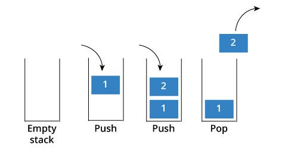

# <h1 align="center">Laporan Praktikum Modul 6 - Stack</h1>
<p align="center">2311102156 - Nisrina Amalia Iffatunnisa</p>

## Dasar Teori

Stack (Tumpukan) adalah struktur data sederhana yang digunakan untuk menyimpan data. Tumpukan  adalah  daftar  terurut  di  mana  penyisipan  dan penghapusan dilakukan  di  satu  ujung,  yang  disebut  atas. Data pada stack yang terakhir kali dimasukkan akan pertama kali keluar dari stack tersebut. Elemen  terakhir  yang  dimasukkan  adalah  yang pertama dihapus. Oleh karena itu,  ini disebut  daftar Last in First out (LIFO). 

Stack dikenal dengan elemen puncaknya (TOP). TOP adalah adalah satu satunya tujuan tempat terjadi operasi, dengan elemen yang ditambahkan paling akhir akan menjadi elemen yang akan dihapus, seperti konsep LIFO yang telah dijelaskan sebelumnya. Aturan penyisipan dan penghapusannya dengan elemen tertentu. Penyisipan selalu dilakukan "di atas" TOP dan penghapusan selalu dilakukan pada TOP.

Dua (2) perubahan yang dapat  dilakukan  pada tumpukan. Ketika sebuah elemen dimasukkan ke dalam Tumpukan, konsepnya disebut push, dan ketika sebuah elemen dikeluarkan dari Tumpukan, konsepnya disebut pop. Selain itu terdapat operasi lain seperti isEmpty(), is Full() yang biasa digunakan untuk mengecek apakah stack sudah penuh atau masih kosong, dan masih banyak operasi lainnya.

#### Gambar Konsep:


## Guided 

### 1. Mengolah Tumpukan Buku

```C++
#include <iostream>
using namespace std;

string arrayBuku[5];
int maksimal = 5, top = 0;

bool isFull (){
    return (top == maksimal); //akan true
} //function buat ngecek kosong apa ga

bool isEmpty(){
    return (top == 0); //false sudah penuh
}

void pushArrayBuku(string data){
    if(isFull()){
        cout << "Data telah penuh" <<endl;

    }else{
        arrayBuku [top] = data;
        top++;
    }
} //menambahkan tumpukkan

void popArrayBuku (){
    if (isEmpty()){
        cout << "Tidak ada data yang dihapus" <<endl;
    } else {
        arrayBuku [top - 1]= " ";
        top--;
    }
} //hapus

void peekArrayBuku(int posisi){
    if (isEmpty()){ //looping untuk menampilkan data paling atas hingga ke bawah
        cout << "Tidak ada data yang dilihat" <<endl;
    } else {
        int index = top;
        for (int i = 1; i <= posisi; i++){
            index--;
        }
        cout << "Posisi ke " << posisi << " adalah " << arrayBuku [index] << endl;
    }
}

int countStack(){
    return top;
}

void changeArrayBuku(int posisi, string data){
    if(posisi > top){
        cout << "Posisi melebihi data yang ada" <<endl;
    } else {
        int index = top;
        for (int i = 1; i <= posisi; i++){
            index--;
        }
        arrayBuku[index] = data;
    }
} //mengubah data posisi tertentu. paling baru diinputin

void destroyArrayBuku(){
    for(int i = top; i >= 0; i--){
        arrayBuku[i] = " ";
    }
    top = 0;
} //menghapus all data

void cetakArrayBuku(){
    if(isEmpty()){
        cout << "Tidak ada data yang dicetak" <<endl;

    } else{
        for(int i = top - 1; i>= 0; i--){
            cout << arrayBuku[i] <<endl;
        }
    }
} //menampilkan all data

int main(){
    pushArrayBuku("Kalkulus");
    pushArrayBuku("Struktur Data");
    pushArrayBuku("Matematika Diskrit");
    pushArrayBuku("Dasar Multimedia");
    pushArrayBuku("Inggris");

    cetakArrayBuku();
    cout << "\n";

    cout << "Apakah data stack penuh?" << isFull() <<endl;
    cout << "Apakah data stack kosong?" << isEmpty() <<endl;

    peekArrayBuku(2); //melihat posisi buku kedua
    popArrayBuku();

    cout << "Banyaknya data = " << countStack() <<endl;

    changeArrayBuku(2, "Bahasa Jerman");
    cetakArrayBuku();
    
    cout << "\n" ;

    destroyArrayBuku();
    cout << "Jumlah data setelah dihapus : " << top << endl;

    cetakArrayBuku();

    return 0;
}
```
Kode program diatas dibuat untuk proses simulasi tumpukan buku dengan menggunakan array dan struktur data stack. Terdapat deklarasi variabel </br>
a. arrayBuku: Array dengan 5 elemen untuk menyimpan judul buku. </br>
b. maksimal: Nilai maksimum elemen dalam array (5). </br>
c. top: Variabel untuk menunjuk ke elemen teratas dalam tumpukan (diinisialisasi 0). </br>

Fungsi "pushArrayBuku" yang ada di dalam program digunakan untuk menambahkan 5 buku ke tumpukan. Fungsi "cetakArrayBuku" digunakan untuk menampilkan semua buku. Jika ingin memeriksa apakah tumpukan penuh dan kosong menggunakan "isFull" dan "isEmpty". Fungsi "peekArrayBuku" digunakan untuk menampilkan judul buku pada posisi tertentu sesuai kebutuhan. Fungsi "popArrayBuku" digunakan untuk menghapus buku teratas dari tumpukan. Fungsi "countStack" digunakan untuk menampilkan jumlah buku yang ada dalam tumpukan. Fungsi "changeArrayBuku" digunakan untuk mengubah judul buku pada posisi tertentu. Fungsi "cetakArrayBuku" digunakan untuk menampilkan semua buku setelah perubahan. Fungsi "destroyArrayBuku" digunakan untuk menghapus semua data buku dari tumpukan. Pada intinya, program diatas berfungsi untuk menambahkan, menghapus, melihat, mengubah, dan menampilkan judul buku dalam sebuah tumpukan.

## Unguided 

### 1. Buatlah program untuk menentukan apakah kalimat tersebut yang diinputkan dalam program stack adalah palindrom/tidak. Palindrom kalimat yang dibaca dari depan dan belakang sama. Jelaskan bagaimana cara kerja programnya.

```C++
#include <iostream>
#include <stack> //library untuk struktur data stack
#include <string> //library untuk menggunakan string

using namespace std;
//2311102156 Nisrina Amalia Iffatunnisa
bool checkPalindrome_156(string kata156) { //fungsi cek palindrom. menerima string sebagai parameter
  stack<char> charStack; //menginisialisasi stack untuk menyimpan karakter

  for (char c : kata156) {
    c = tolower(c); // Mengubah karakter menjadi huruf kecil
    if (isalpha(c)) { //memeriksa apakah karakter tsb alfanumerik
      charStack.push(c); //jika yes, menambahkan karakter ke stack
    }
  }

  string kata_terbalik156; //menginisialisasi string untuk menyimpan kalimat terbalik
  while (!charStack.empty()) {
    kata_terbalik156 += charStack.top();
    charStack.pop();
  }

  return kata156 == kata_terbalik156; // Mengembalikan true jika string sama dengan kata_terbalik156 (palindrom), false jika tidak
}

int main() {
  for (int i = 1; i <= 2; i++) {
    string kata156;

    cout << "Masukkan kalimat " << i << ": ";
    getline(cin, kata156);

    if (checkPalindrome_156(kata156)) {
      cout << "Kalimat " << kata156 << " adalah palindrom." << endl;
    } else {
      cout << "Kalimat " << kata156 << " bukan palindrom." << endl;
    }
  }

  return 0;
}
```
#### Output:


Kode program di atas dibuat untuk mengecek apakah sebuah kalimat merupakan palindrom. Palindrom adalah kalimat yang dibaca sama baik dari depan maupun dari belakang. Struktur data stack berfungsi menyimpan data secara LIFO (Last In, First Out). Deklarasi Fungsi "checkPalindrome_156" akan menerima parameter dengan nama "kata156" yang merupakan string yang ingin dicek apakah palindrom. Fungsi ini mengembalikan nilai true jika string palindrom dan false jika bukan. Karakter-karakter dari string "kata156" disimpan di dalam "charStack". Karakter tersebut juga diperiksa apakah termasuk huruf atau angka (alfanumerik) menggunakan "isalpha(c)". Jika iya, karakter ditambahkan ke stack charStack menggunakan "charStack.push(c)". Kemudian inisialisasi string "kata_terbalik156" digunakan untuk menyimpan string yang terbalik. Kemudian akan ada loping selama stack tidak kosong. Karakter teratas di stack dikeluarkan menggunakan "charStack.pop()". Terakhir, mengembalikkan hasil dengan membandingkan String "kata156" dengan "kata_terbalik156". Jika kedua string sama, berarti kalimat kata156 merupakan palindrom. Namun, jika kedua string berbeda, maka kalimat "kata156" bukan palindrom.

### SS Kode Program


### 2. Buatlah program untuk melakukan pembalikan terhadap kalimat menggunakan stack dengan minimal 3 kata. Jelaskan output program dan source codenya beserta operasi/fungsi yang dibuat?

```C++
#include <iostream>
#include <stack> //library untuk struktur data stack
#include <string> //library untuk menggunakan string

using namespace std;
//2311102156 Nisrina Amalia Iffatunnisa
int main() {
  stack<char> charStack; //menginisialisasi stack untuk menyimpan karakter
  string kalimat_156, kalimat_terbalik156; //menginisialisasi variabel string untuk kalimat asli dan kalimat terbalik

  cout << "Masukkan kalimat minimal 3 kata: ";
  getline(cin, kalimat_156); //membaca input kalimat dari pengguna

  for (char c : kalimat_156) { //iterasi melalui setiap karakter dalam kalimat
    charStack.push(c); //menambahkan karakter ke stack
  }

  while (!charStack.empty()) {
    kalimat_terbalik156+= charStack.top(); //mengambil karakter teratas dari stack dan menambahkannya ke kakimat_terbalik156
    charStack.pop(); //meenghapus karakter teratas dari stack
  }

  cout << "\nKalimat yang sudah dibalikkan: " << kalimat_terbalik156<< endl;

  return 0;
}

```
#### Output:


Kode program di atas menggunakan struktur data stack untuk membalikkan kalimat. Stack digunakan untuk menyimpan karakter-karakter dari kalimat, kemudian dikeluarkan dan diubah menjadi string terbalik. String terbalik ditampilkan sebagai hasil pembalikan kalimat. Dengan deklarasi variabel "charStack" : Stack untuk menyimpan karakter-karakter dari kalimat, "kalimat_156" : untuk menyimpan kalimat asli/awal, dan "kalimat_terbalik156" : untuk menyimpan kalimat yang sudah dibalik. Setelah di run, pengguna diminta untuk memasukkan kalimat minimal 3 kata melalui cout dan "getline(cin, kalimat_156)". Kemudian setiap karakter ditambahkan ke Stack menggunakan "charStack.push(c) dan akan terus looping selama stack charStack tidak kosong. Karakter teratas dari stack dikeluarkan dan ditambahkan ke "kalimat_terbalik156" menggunakan "kalimat_terbalik156 += charStack.top()". Karakter teratas dihapus dari stack menggunakan "charStack.pop()".

### SS Kode Program


## Kesimpulan
Setelah melakukan praktikum, Stack (tumpukan) merupakan struktur data LIFO (Last In First Out), dimana elemen terakhir yang dimasukkan adalah elemen pertama yang dikeluarkan atau elemen pertama yang dimasukkan menjadi elemen terakhir yang dikeluarkan. Terdapat operasi dasar pada stack, antara lain push, pop, dan peek. Push digunakan untuk memasukkan elemen baru ke dalam stack, pop digunakan untuk mengeluarkan elemen terakhir dari stack, dan peek digunakan untuk melihat elemen teratas stack tanpa mengeluarkannya. Dalam stack kita tidak dapat melakukan operasi insert di sembarang posisi artinya lemen baru hanya dapat dimasukkan ke dalam stack melalui operasi push, di mana elemen baru akan berada di paling atas dari semua elemen yang sudah ada.

## Referensi
[1] Santoso, J. T. (2021). STRUKTUR DATA dan ALGORITMA (Bagian 1). Penerbit Yayasan Prima Agus Teknik, 120-121

[2] Triase. 2020. "Diktat Edisi Revisi Struktur Data", Medan : Fakultas Sains dan Teknologi UIN Sumatera Utara Medan.