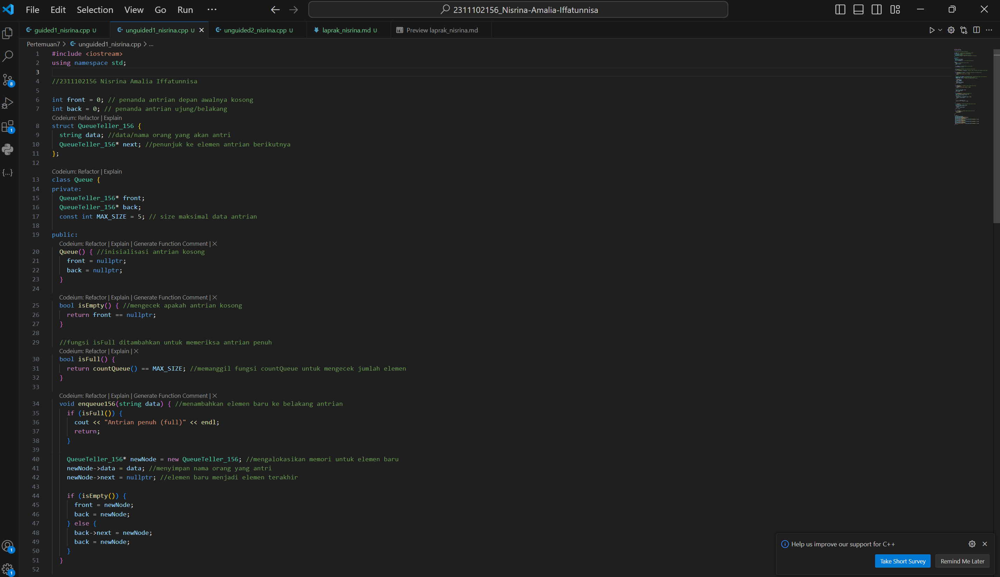

# <h1 align="center">Laporan Praktikum Modul 7 - Queue (Antrian) </h1>
<p align="center">2311102156 - Nisrina Amalia Iffatunnisa</p>

## Dasar Teori

Queue (Antrian) adalah struktur data daftar berurutan di mana penyisipan dilakukan di ujung belakang(rear) dan penghapusan dilakukan di ujung depan (front). Elemen pertama yang dimasukkan adalah yang pertama dihapus. Oleh karena itu, ini disebut First in First out (FIFO) atau Last in Last out (LILO). Contohnya adalah antrian pada kasir sebuah toko. Ketika seorang pelanggan datang, akan menuju ke belakang dari antrian. Setelah pelanggan dilayani, antrian yang berada di depan akan maju. Pada
saat menempatkan elemen pada ujung (tail atau rear) dari queue disebut dengan enqueue, pada saat memindahkan elemen dari kepala (head atau front) sebuah queue disebut dengan dequeue.

Operasi dasar queue yang umum digunakan adalah: <br>
 a. Enqueue: Menambahkan elemen baru ke belakang antrian. <br>
 b. Dequeue: Menghapus elemen terdepan dari antrian. <br>
 c. IsEmpty: Memeriksa apakah antrian kosong. <br>
 d. IsFull: Memeriksa apakah antrian penuh (hanya berlaku untuk implementasi array). <br>
 e. Count: Menghitung jumlah elemen dalam antrian. <br>
 f. Clear: Menghapus semua elemen dari antrian. <br>

 Terdapat dua kondisi pada antrian, yaitu :
 1. Penuh (full) ketika elemen pada antrian mencapai kapasitas maksimum antrian. Pada kondisi ini, tidak mungkin dilakukan penambahan ke antrian. 
 2. Kosong (empty) ketika tidak ada elemen pada antrian. Pada kondisi ini, tidak mungkin dilakukan pengambilan elemen dari antrian

#### Gambar Konsep:


## Guided 

### 1. Konsep Antrian pada Teller Bank

```C++
#include <iostream>
using namespace std;
const int maksimalQueue = 5; // Maksimal antrian
int front = 0;               // Penanda antrian
int back = 0;                // Penanda
string queueTeller[5];       // Fungsi pengecekan
bool isFull()
{ // Pengecekan antrian penuh atau tidak
    if (back == maksimalQueue)
    {
        return true; // =1
    }
    else
    {
        return false;
    }
}
bool isEmpty()
{ // Antriannya kosong atau tidak
    if (back == 0)
    {
        return true;
    }
    else
    {
        return false;
    }
}
void enqueueAntrian(string data)
{ // Fungsi menambahkan antrian
    if (isFull())
    {
        cout << "Antrian penuh" << endl;
    }
    else
    {
        if (isEmpty())
        { // Kondisi ketika queue kosong
            queueTeller[0] = data;
            front++;
            back++;
        }
        else
        { // Antrianya ada isi
            queueTeller[back] = data;
            back++;
        }
    }
}
void dequeueAntrian()
{ // Fungsi mengurangi antrian
    if (isEmpty())
    {
        cout << "Antrian kosong" << endl;
    }
    else
    {
        for (int i = 0; i < back; i++)
        {
            queueTeller[i] = queueTeller[i + 1];
        }
        back--;
    }
}
int countQueue()
{ // Fungsi menghitung banyak antrian
    return back;
}
void clearQueue()
{ // Fungsi menghapus semua antrian
    if (isEmpty())
    {
        cout << "Antrian kosong" << endl;
    }
    else
    {
        for (int i = 0; i < back; i++)
        {
            queueTeller[i] = "";
        }
        back = 0;
        front = 0;
    }
}
void viewQueue()
{ // Fungsi melihat antrian
    cout << "Data antrian teller:" << endl;
    for (int i = 0; i < maksimalQueue; i++)
    {
        if (queueTeller[i] != "")
        {
            cout << i + 1 << ". " << queueTeller[i] << endl;
        }
        else
        {
            cout << i + 1 << ". (kosong)" << endl;
        }
    }
}
int main()
{
    enqueueAntrian("Andi");
    enqueueAntrian("Maya");
    viewQueue();
    cout << "Jumlah antrian = " << countQueue() << endl;
    dequeueAntrian();
    viewQueue();
    cout << "Jumlah antrian = " << countQueue() << endl;
    clearQueue();
    viewQueue();
    cout << "Jumlah antrian = " << countQueue() << endl;
    return 0;
}
```
Kode program guided di atas berfungsi untuk mensimulasikan antrian pada sebuah teller bank. Pengguna dapat menambahkan nama orang ke antrian, melihat isi antrian, menghitung jumlah orang yang antri, dan menghapus orang dari antrian. Kode program ini menggunakan struktur data Array. Array bersifat lebih sederhana dan mudah dipahami dibandingkan struktur data antrian berantai, tetapi memiliki keterbatasan dalam hal penambahan dan penghapusan elemen di tengah antrian. Antrian diinisialisasi dengan 
 1. Deklarasi array queueTeller dengan ukuran maksimalQueue.
 2. Fungsi isEmpty() digunakan untuk memeriksa apakah antrian kosong.
 3. Fungsi isFull() digunakan untuk memeriksa apakah antrian penuh.
 4. Fungsi enqueueAntrian() digunakan untuk menambahkan elemen baru ke antrian. Elemen baru tersebut berupa nama orang yang ingin antri.
 5. Fungsi dequeueAntrian() digunakan untuk menghapus elemen terdepan dari antrian. Fungsi ini iterasi melalui elemen array queueTeller mulai dari indeks 1, menggeser elemen ke kiri untuk menghapus elemen terdepan. Hal ini dapat menjadi tidak efisien jika antrian sering diubah.
 6. Fungsi viewQueue() digunakan untuk menampilkan isi antrian.
 7. Fungsi countQueue() digunakan untuk menghitung jumlah elemen dalam antrian. 
 8. Fungsi clearQueue() digunakan untuk menghapus semua elemen dari antrian.

## Unguided 

### 1. Ubahlah penerapan konsep queue pada bagian guided dari array menjadi linked list.

```C++
#include <iostream>
using namespace std;

//2311102156 Nisrina Amalia Iffatunnisa

int front = 0; // penanda antrian depan awalnya kosong
int back = 0; // penanda antrian ujung/belakang
struct QueueTeller_156 {
  string data; //data/nama orang yang akan antri
  QueueTeller_156* next; //penunjuk ke elemen antrian berikutnya
};

class Queue {
private:
  QueueTeller_156* front;
  QueueTeller_156* back;
  const int MAX_SIZE = 5; // size maksimal data antrian

public:
  Queue() { //inisialisasi antrian kosong
    front = nullptr;
    back = nullptr;
  }

  bool isEmpty() { //mengecek apakah antrian kosong
    return front == nullptr;
  }

  //fungsi isFull ditambahkan untuk memeriksa antrian penuh
  bool isFull() {
    return countQueue() == MAX_SIZE; //memanggil fungsi countQueue untuk mengecek jumlah elemen
  }

  void enqueue156(string data) { //menambahkan elemen baru ke belakang antrian
    if (isFull()) {
      cout << "Antrian penuh (full)" << endl;
      return;
    }

    QueueTeller_156* newNode = new QueueTeller_156; //mengalokasikan memori untuk elemen baru
    newNode->data = data; //menyimpan nama orang yang antri
    newNode->next = nullptr; //elemen baru menjadi elemen terakhir

    if (isEmpty()) {
      front = newNode;
      back = newNode;
    } else {
      back->next = newNode;
      back = newNode;
    }
  }

  void dequeue156() { //menghapus elemen terdepan dari antrian
    if (isEmpty()) {
      cout << "Antrian kosong (empty)" << endl;
      return;
    }

    QueueTeller_156* temp = front;
    front = front->next;
    delete temp;
  }

  void viewQueue156() { //menampilkan isi antrian
    cout << "Data antrian teller:" << endl;
    QueueTeller_156* current = front;
    int i = 1;
    while (current != nullptr) {
      cout << i << ". " << current->data << endl;
      current = current->next;
      i++;
    }

    for (; i <= MAX_SIZE; i++) {
      cout << i << ". (kosong)" << endl;
    }
  }

  int countQueue() { //menghitung jumlah elemen dalam antrian
    int count = 0;
    QueueTeller_156* current = front;
    while (current != nullptr) {
      count++;
      current = current->next;
    }
    return count;
  }

  void clearQueue() { //enghapus semua elemen dari antrian
    while (!isEmpty()) {
      dequeue156();
    }
  }
};

int main() {
  Queue antrianTeller156;
  antrianTeller156.enqueue156("Nisrin");
  antrianTeller156.enqueue156("Amalia");
  antrianTeller156.viewQueue156();
  cout << "Jumlah antrian = " << antrianTeller156.countQueue() << endl;
  antrianTeller156.dequeue156();
  antrianTeller156.viewQueue156();
  cout << "Jumlah antrian = " << antrianTeller156.countQueue() << endl;
  antrianTeller156.clearQueue();
  antrianTeller156.viewQueue156();
  cout << "Jumlah antrian = " << antrianTeller156.countQueue() << endl;
  return 0;
}

```
#### Output:


Kode program di atas berfungsi untuk mensimulasikan antrian pada sebuah teller bank. Pengguna dapat menambahkan nama orang ke antrian, melihat isi antrian, menghitung jumlah orang yang antri, dan menghapus orang dari antrian. Kode program ini menggunakan struktur data LinkedList. Struktur data ini memungkinkan penambahan dan penghapusan elemen dengan mudah, tanpa perlu menggeser elemen lain dalam antrian. Pada awal program didefinisikan Struct data QueueTeller_156 yang digunakan untuk menyimpan data antrian. Struct tersebut memiliki dua anggota: <br>
 1. data: String yang menyimpan nama orang yang antri. <br>
 2. next: Pointer ke elemen antrian berikutnya. <br>

Kemudian terdapat deklarasi class Queue yang mengelola antrian teller. Fungsi Queue() digunakan untuk menginisialisasi antrian kosong. Isinya adalah: <br>
 1. front: Pointer ke elemen antrian terdepan.
 2. back: Pointer ke elemen antrian terakhir.
 3. MAX_SIZE: Konstanta integer yang menentukan ukuran maksimal antrian (dalam program ini maksimal 5).

Fungsi-fungsi lainnya yang ada antara lain: 
 1. isEmpty(): Mengecek apakah antrian kosong. Ini akan mengembalikan true jika antrian kosong dan false jika tidak.<br>
 2. isFull(): Mengecek apakah antrian penuh (maksimal 5 elemen). <br>
 3. enqueue156(string data): Menambahkan elemen baru ke belakang antrian. Elemen baru tersebut berupa nama orang yang akan mengantri. Fungsi ini terlebih dahulu memeriksa apakah antrian penuh. Jika penuh, program akan menampilkan pesan "Antrian penuh (full)". Jika tidak, elemen baru akan dialokasikan, data disimpan, dan dihubungkan ke elemen terakhir antrian. <br>
 4. dequeue156(): Menghapus elemen terdepan dari antrian.  Fungsi ini terlebih dahulu memeriksa apakah antrian kosong. Jika kosong, program akan menampilkan pesan "Antrian kosong (empty)". Jika tidak, elemen terdepan akan dihapus. <br>
 5. viewQueue156(): Menampilkan isi antrian dengan menampilkan data (nama orang) dan nomor urutnya. <br>
 6. countQueue(): Menghitung jumlah elemen dalam antrian. <br>
 7. clearQueue(): Menghapus semua elemen dari antrian. <br>

### SS Kode Program


### 2. Dari nomor 1 buatlah konsep antri dengan atribut Nama mahasiswa dan NIM Mahasiswa
```C++
#include <iostream>
using namespace std;

//2311102156 Nisrina Amalia Iffatunnisa

struct Mahasiswa {
  string namaMahasiswa; // atribut untuk nama mahasiswa
  string NIM;           // atribut untuk NIM mahasiswa
  Mahasiswa* next;     // penunjuk ke elemen antrian berikutnya
};

class Queue {
private:
  Mahasiswa* front;
  Mahasiswa* back;
  const int MAX_SIZE = 5; // size maksimal data antrian

public:
  Queue() { // inisialisasi antrian kosong
    front = nullptr;
    back = nullptr;
  }

  bool isEmpty() { // mengecek apakah antrian kosong
    return front == nullptr;
  }

  // fungsi isFull ditambahkan untuk memeriksa antrian penuh
  bool isFull() {
    return countQueue() == MAX_SIZE; // memanggil fungsi countQueue untuk mengecek jumlah elemen
  }

  void enqueue156(string namaMahasiswa, string NIM) { // menambahkan elemen baru ke belakang antrian
    if (isFull()) {
      cout << "Antrian penuh (full)" << endl;
      return;
    }

    Mahasiswa* newNode = new Mahasiswa; // mengalokasikan memori untuk elemen baru
    newNode->namaMahasiswa = namaMahasiswa; // menyimpan nama mahasiswa
    newNode->NIM = NIM;                 // menyimpan NIM mahasiswa
    newNode->next = nullptr;           // elemen baru menjadi elemen terakhir

    if (isEmpty()) {
      front = newNode;
      back = newNode;
    } else {
      back->next = newNode;
      back = newNode;
    }
  }

  void dequeue156() { // menghapus elemen terdepan dari antrian
    if (isEmpty()) {
      cout << "Antrian kosong (empty)" << endl;
      return;
    }

    Mahasiswa* temp = front;
    front = front->next;
    delete temp;
  }

  void viewQueue156() { // menampilkan isi antrian
    cout << "Data antrian mahasiswa:" << endl;
    Mahasiswa* current = front;
    int i = 1;
    while (current != nullptr) {
      cout << i << ". " << current->namaMahasiswa << " (" << current->NIM << ")" << endl;
      current = current->next;
      i++;
    }

    for (; i <= MAX_SIZE; i++) {
      cout << i << ". (kosong)" << endl;
    }
  }

  int countQueue() { // menghitung jumlah elemen dalam antrian
    int count = 0;
    Mahasiswa* current = front;
    while (current != nullptr) {
      count++;
      current = current->next;
    }
    return count;
  }

  void clearQueue() { // menghapus semua elemen dari antrian
    while (!isEmpty()) {
      dequeue156();
    }
  }
};

int main() {
  Queue antrianMahasiswa156;
  antrianMahasiswa156.enqueue156("Nisrin", "2311102156");
  antrianMahasiswa156.enqueue156("Amalia", "2311102600");
  antrianMahasiswa156.viewQueue156();
  cout << "Jumlah antrian = " << antrianMahasiswa156.countQueue() << endl;
  antrianMahasiswa156.dequeue156();
  antrianMahasiswa156.viewQueue156();
  cout << "Jumlah antrian = " << antrianMahasiswa156.countQueue() << endl;
  antrianMahasiswa156.clearQueue();
  antrianMahasiswa156.viewQueue156();
  cout << "Jumlah antrian = " << antrianMahasiswa156.countQueue() << endl;
  return 0;
}


```
#### Output:


Kode program di atas berfungsi untuk mensimulasikan antrian pada data mahasiswa dengan atribut nama dan NIM mereka. Pengguna dapat menambahkan nama orang ke antrian, melihat isi antrian, menghitung jumlah orang yang antri, dan menghapus orang dari antrian. Kode program ini menggunakan struktur data LinkedList. Struktur data ini memungkinkan penambahan dan penghapusan elemen dengan mudah, tanpa perlu menggeser elemen lain dalam antrian. Pada awal program didefinisikan Struct data Mahasiswa yang digunakan untuk menyimpan data antrian. Struct tersebut memiliki dua anggota: <br>
 1. namaMahasiswa: String yang menyimpan nama mahasiswa yang antri. <br>
 2. NIM : String yang menyimpan NIM mahasiswa yang antri. <br>
 3. next: Pointer ke elemen antrian berikutnya. <br>

Kemudian terdapat deklarasi class Queue yang mengelola antrian data mahasiswa. Fungsi Mahasiswa() digunakan untuk menginisialisasi antrian kosong. Isinya adalah: <br>
 1. front: Pointer ke elemen antrian terdepan.
 2. back: Pointer ke elemen antrian terakhir.
 3. MAX_SIZE: Konstanta integer yang menentukan ukuran maksimal antrian (dalam program ini maksimal 5).

Fungsi-fungsi lainnya yang ada antara lain: 
 1. isEmpty(): Mengecek apakah antrian kosong. Ini akan mengembalikan true jika antrian kosong dan false jika tidak.<br>
 2. isFull(): Mengecek apakah antrian penuh (maksimal 5 elemen). <br>
 3. enqueue156(): Menambahkan elemen baru ke belakang antrian. Elemen baru tersebut berupa nama mahasiswa dan NIM yang akan mengantri. Fungsi ini terlebih dahulu memeriksa apakah antrian penuh. Jika penuh, program akan menampilkan pesan "Antrian penuh (full)". Jika tidak, elemen baru akan dialokasikan, data disimpan, dan dihubungkan ke elemen terakhir antrian. <br>
 4. dequeue156(): Menghapus elemen terdepan dari antrian.  Fungsi ini terlebih dahulu memeriksa apakah antrian kosong. Jika kosong, program akan menampilkan pesan "Antrian kosong (empty)". Jika tidak, elemen terdepan akan dihapus. <br>
 5. viewQueue156(): Menampilkan isi antrian dengan menampilkan data (nama mahasiswa dan NIM) dan nomor urutnya. <br>
 6. countQueue(): Menghitung jumlah elemen dalam antrian. <br>
 7. clearQueue(): Menghapus semua elemen dari antrian. <br>

### SS Kode Program


## Kesimpulan
Setelah melakukan praktikum, Queue (antrian) adalah struktur data yang menerapkan prinsip First In First Out (FIFO), di mana elemen yang pertama masuk akan diproses pertama kali. Contohnya dalam antrian teller bank ataupun saat belanja.  Implementasi queue menggunakan array lebih sederhana dan mudah dipahami. Namun memiliki kelemahan ketika menambahkan dan menghapus elemen di tengah antrian tidak efisien karena membutuhkan pergeseran elemen lain. Sedangkan implementasi queue menggunakan linked list lebih fleksibel dan efisien untuk penambahan dan penghapusan elemen di tengah antrian. Dalam pengunaannya, ketika kita membutuhkan  kecepatan akses elemen acak, array dapat menjadi pilihan yang tepat. Namun, jika lebih membutuhkan efisiensi waktu penambahan/penghapusan elemen di tengah, linked list lebih disarankan.

## Referensi
[1] Erkamim, E., Abdurrohim, I., Yuliyanti, S., Karim, R., Rahman, A., Admira, T. M. A., & Ridwan, A. (2024). Buku Ajar Algoritma dan Struktur Data. PT. Sonpedia Publishing Indonesia. <br>
[2] Santoso, J. T. (2021). STRUKTUR DATA dan ALGORITMA (Bagian 1). Penerbit Yayasan Prima Agus Teknik, 155-163
