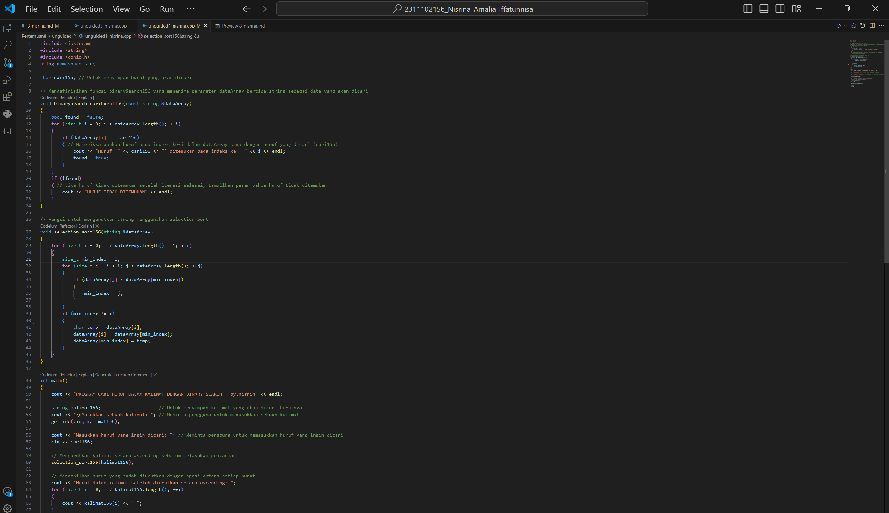
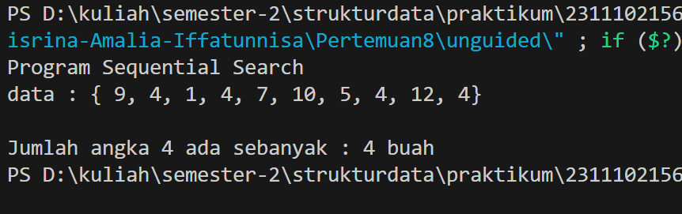

# <h1 align="center">Laporan Praktikum Modul 8 -  ALGORITMA SEARCHING </h1>
<p align="center">2311102156 - Nisrina Amalia Iffatunnisa</p>

## Dasar Teori
Pencarian merupakan proses yang sangat penting dalam pengolahan data. Proses pencarian dasar adalah menemukan nilai (data) tertentu didalam
sekumpulan data yang bertipe sama. Searching (pencarian) pada struktur data mengacu pada proses algoritma dalam memeriksa, menemukan, mengambil posisi elemen tertentu (target) dari kumpulan elemen di sebuah data. Kumpulan elemen tersebut dapat berupa array, list, linked list, tree, dan lain sebagainya. Berdasarkan jenis operasinya, dua algoritma pencarian yang dibahas pada pertemuan 8 ini, yaitu: <br>

    a. Sequential Search merupakan metode pencarian yang paling sederhana. Pencarian berurutan menggunakan prinsip sebagai berikut : data yang ada dibandingkan satu per satu secara berurutan dengan yang dicari sampai data tersebut ditemukan atau tidak ditemukan. Biasa dilakukan pada data yang tidak terurut. Pada dasarnya, pencarian ini hanya melakukan pengulangan dari 1 sampai dengan jumlah data. Pada setiap pengulangan, dibandingkan data ke-i dengan yang dicari. Apabila sama, berarti data telah ditemukan. Sebaliknya apabila sampai akhir pengulangan tidak ada data yang sama, berarti data tidak ada. Algoritma ini tidak efisien untuk data yang list/data yang besar. Langkah-langkah pencarian dengan sequential search sebagai berikut :
        1.) Melakukan perbandingan beruntun pada kumpulan data dengan menggunakan keyword atau kata kunci yang akan dicari.
        2.) Pencarian ini melakukan loopingatau pengulangan dari data pertama hingga jumlah data ke-n.
        3.) Setiap perulangan dilakukan pencocokan data dengan kata kunci yang dicari.
        4.) Apabila terdapat kecocokan data dengan kata kunci yang di cari maka data berhasil ditemukan dan pencarian di hentikan, sebaliknya apabila tidak ada kecocokan data hingga data terakhir maka pencarian dihentikan dan data tidak ditemukan.

    Salah satu teknik pencarian yang mendasar adalah Sequential Search, yaitu pencarian berdasarkan array yang ada dengan membandingkan input pada pencarian pertama dengan data yang ditemukan. Proses Algoritma Sequential Search :
    
    a.) S ← 0 
    b.) Data Ditemukan ← False 
    c.) Jika data S = Key maka ketemu ← True jika tidak S ← S+1 dan False 
    d.) Jika Data Ditemukan maka S adalah index atau keyword yang dicari

    b. Binary Search harus diawali dengan mengurutkan (sorting) array terlebih dahulu sebelum melakukan proses pencarian. Jika data belum dalam keadaan urut, pencarian biner tidak dapat dilakukan. Dalam kehidupan sehari-hari, sebenarnya kita juga sering menggunakan pencarian biner. Misalnya saat ingin mencari suatu kata dalam sebuah kamus. Binary search dapat melakukan pencarian lebih cepat jika dibanding dengan sequential search, dimana proses pencarian data dalam binary search akan dimulai dari bagian tengah list. Jika item yang dicari berada di tengah pencarian maka pencarian akan berakhir, tetapi jika item tidak ditemukan di tengah, pencarian berikutnya dapat dilakukan di setengah bagian atas atau setengah bagian bawah, hal ini tergantung pada besar atau kecilnya data yang dicari. Langkah-langkah pencarian dengan binary search sebagai berikut :
        1.) Mengurutkan  data  terlebih  dahulubisa  secara ascending (dari depan ke belakang) atau descending (dari belakang ke depan)
        2.) Membagi dua array atau keseluruhan data. Apabila data yang dicari lebih kecil dari data yang terletak di tengah, maka pencarian data akan berlanjut ke sebelah kiri. Apabila data yang dicari lebih besar dari data terletak ditengah, maka  pencarian data akan berlanjut ke sebelah kanan  kemudian proses pencarian tersebut akan terus berulang sampai data yang dimaksud atau dicari dapat ditemukan.

#### Gambar Konsep:


## Guided 

### 1. Program sederhana untuk melakukan pencarian data berupa angka menggunakan algoritma Sequential Search 


```C++
#include <iostream>
using namespace std;

int main(){
    int n = 10;
    int data[n] = {9,4,1,7,5,12,4,13,4,10};
    int cari = 10;
    bool ketemu = false;
    int i;

    for(i = 0; i < n; i++){
        if (data[i] == cari){
            ketemu = true;
            break;
        }
    } 

    cout << "Program Sequential Search" <<endl;
    cout << "data : {9,4,1,7,5,12,4,13,4,10} " <<endl;

    if (ketemu){
        cout << "\nAngka " <<cari<< " ditemukan pada indeks ke - " << i <<endl;
    } else {
        cout << "Data tidak ditemukan" <<endl;
    }

    return 0;
}
```
Kode program di atas berfungsi untuk mencari keberadaan atau letak suatu huruf dalam sebuah kalimat di indeks mana. Program tersebut mengimplementasikan Algoritma Sequential Search. Program tersebut didefinisikan dengan sebuah array data dengan ukuran 10 elemen serta dinisialisasi dengan nilai-nilai tertentu. Kemudian program bekerja mencari angka yang ditentukan, yaitu angka 10, dalam array menggunakan loop `for`. Proses pencarian dilakukan dengan iterasi melalui setiap elemen array dan memeriksa apakah nilai elemen tersebut sama dengan nilai yang dicari. Jika nilai yang dicari ditemukan, program akan menetapkan variabel ketemu menjadi `true` dan menyimpan indeks tempat angka tersebut ditemukan dalam variabel `i`. Proses pencarian akan berhenti setelah nilai yang dicari ditemukan. Setelah selesai melakukan pencarian, program akan menampilkan pesan yang sesuai berdasarkan hasil pencarian. Jika nilai yang dicari ditemukan, program akan menampilkan angka `10` tersebut ditemukan beserta indeksnya. Jika nilai yang dicari tidak ditemukan, program akan menampilkan bahwa `data tidak ditemukan`. Program akan menampilkan bahwa angka `10` terdapat di antara data `{9,4,1,7,5,12,4,13,4,10}` pada indeks ke-9.

### 2. Program sederhana untuk melakukan pencarian dan selection data berupa angka menggunakan algoritma Binary Search 


```C++
#include <iostream>
#include <conio.h>
#include <iomanip>
using namespace std;

int dataArray [7] = {1,8,2,5,4,9,7};
int cari;

void selection_sort(){
    int temp, min, i, j;
    for( i = 0; i < 7; i++){
        min = i;
        for ( j = i+1; j<7; j++){
            if (dataArray[j] < dataArray[min]){
                min = j;
            }
        }
        temp = dataArray[i];
        dataArray[i] = dataArray[min];
        dataArray[min] = temp;
    }
}

void binarySearch(){
    int awal, akhir, tengah;
    bool b_flag = false;
    awal = 0;
    akhir = 6;
    while(!b_flag && awal <= akhir){
        tengah = (awal + akhir) / 2;
        if(dataArray[tengah] == cari){
            b_flag = true;
        } else if (dataArray[tengah] < cari){
            awal = tengah + 1;
        } else {
            akhir = tengah - 1;
        }
    }
    if (b_flag){
        cout<< "\nData ditemukan pada index ke - " << tengah <<endl;
    } else {
        cout<<"\n DATA TIDAK DITEMUKAN" << endl;
    }
}

int main(){
    cout << "BINARY SEARCH" <<endl;
    cout << "\nData : " <<endl;

    for(int x = 0; x < 7; x++ ){
        cout << setw(3) << dataArray[x] ;
    }

    cout << endl;

    cout << "Masukkan data yang ingin dicari : " ;
    cin >> cari;

    cout << "\nData diurutkan : " ;
    selection_sort();

    for (int x = 0; x < 7; x++){
        cout << setw(3) << dataArray[x];
    }
    cout <<endl;
    binarySearch();
    _getche();
    return 0;

}
```
Kode program di atas berfungsi untuk mencari suatu nilai dalam array yang telah diurutkan sebelumnya menggunakan prosedur algoritma `selection_sort`. Program tersebut mengimplementasikan Algoritma Binary Search. Program didefinisikan dengan sebuah array `dataArray` yang berisi nilai-nilai yang akan dicari. Selanjutnya, terdapat prosedur atau fungsi `selection_sort` yang digunakan untuk mengurutkan elemen-elemen array secara ascending (kecil ke besar). Algoritma ini bekerja dengan mencari nilai terkecil dalam array dan menukarnya dengan elemen pertama, lalu mencari nilai terkecil dalam sisa array dan menukarnya dengan elemen kedua, dan seterusnya hingga array terurut.

Kemudian fungsi `binarySearch` berfungsi melakukan pencarian nilai dalam array yang telah diurutkan sebelumnya dengan `selection_sort`. Binary search merupakan algoritma yang membagi array menjadi dua bagian dan memeriksa apakah nilai yang dicari berada di bagian kiri atau kanan dari titik tengah. Proses ini terus berlanjut dengan mengurangi rentang pencarian hingga nilai yang dicari ditemukan atau pencarian menjadi kosong. 

Setelah dijalankan, pengguna diminta untuk memasukkan data yang akan dicari, program akan mengurutkan array `{1,8,2,5,4,9,7}` terlebih dahulu menjadi ` 1  2  4  5  7  8  9` lalu dicetak. Setelah itu program melakukan pencarian menggunakan algoritma binarySearch. Ketika nilai yang dicari ditemukan dalam array, program akan mencetak pesan yang menyatakan `indeks` di mana nilai tersebut `ditemukan`. Jika nilai tidak ditemukan, program akan mencetak pesan bahwa `data tidak ditemukan`.

## Unguided 

### 1. Buatlah sebuah program untuk mencari sebuah huruf pada sebuah kalimat yang sudah di input dengan menggunakan Binary Search!

```C++
#include <iostream>
#include <string>
#include <conio.h>
using namespace std;

char cari156; // Untuk menyimpan huruf yang akan dicari

// Mendefinisikan fungsi binarySearch156 yang menerima parameter dataArray bertipe string sebagai data yang akan dicari
void binarySearch_carihuruf156(const string &dataArray)
{
    bool found = false;
    for (size_t i = 0; i < dataArray.length(); ++i)
    {
        if (dataArray[i] == cari156)
        { // Memeriksa apakah huruf pada indeks ke-i dalam dataArray sama dengan huruf yang dicari (cari156)
            cout << "Huruf '" << cari156 << "' ditemukan pada indeks ke - " << i << endl;
            found = true;
        }
    }
    if (!found)
    { // Jika huruf tidak ditemukan setelah iterasi selesai, tampilkan pesan bahwa huruf tidak ditemukan
        cout << "HURUF TIDAK DITEMUKAN" << endl;
    }
}

// Fungsi untuk mengurutkan string menggunakan Selection Sort
void selection_sort156(string &dataArray)
{
    for (size_t i = 0; i < dataArray.length() - 1; ++i)
    {
        size_t min_index = i;
        for (size_t j = i + 1; j < dataArray.length(); ++j)
        {
            if (dataArray[j] < dataArray[min_index])
            {
                min_index = j;
            }
        }
        if (min_index != i)
        {
            char temp = dataArray[i];
            dataArray[i] = dataArray[min_index];
            dataArray[min_index] = temp;
        }
    }
}

int main()
{
    cout << "PROGRAM CARI HURUF DALAM KALIMAT DENGAN BINARY SEARCH - by.nisrin" << endl;

    string kalimat156;                     // Untuk menyimpan kalimat yang akan dicari hurufnya
    cout << "\nMasukkan sebuah kalimat: "; // Meminta pengguna untuk memasukkan sebuah kalimat
    getline(cin, kalimat156);

    cout << "Masukkan huruf yang ingin dicari: "; // Meminta pengguna untuk memasukkan huruf yang ingin dicari
    cin >> cari156;

    // Mengurutkan kalimat secara ascending sebelum melakukan pencarian
    selection_sort156(kalimat156);

    // Menampilkan huruf yang sudah diurutkan dengan spasi antara setiap huruf
    cout << "Huruf dalam kalimat setelah diurutkan secara ascending: ";
    for (size_t i = 0; i < kalimat156.length(); ++i)
    {
        cout << kalimat156[i] << " ";
    }
    cout << endl;

    // Melakukan pencarian dengan binary search setelah pengurutan
    binarySearch_carihuruf156(kalimat156);

    // Menunggu satu karakter sebelum program selesai
    _getche();

    return 0;
}
```
#### Output:


Kode program di atas berfungsi untuk mencari keberadaan atau letak suatu huruf dalam sebuah kalimat di indeks mana setelah diurutkan. Program tersebut mengimplementasikan Algoritma Binary Search. Terdapat prosedur atau fungsi `binarySearch_carihuruf156` yang digunakan untuk melakukan pencarian. Fungsi `selection_sort156` untuk mengurutkan kalimat yang terdiri dari huruf dengan urutan  ascending (kecil ke besar). Selain itu, terdapat deklarasi variabel global `cari156` untuk menyimpan huruf yang akan dicari. Fungsi `binarySearch_carihuruf156` menerima parameter berupa string `dataArray` yang merupakan kalimat yang akan dicari hurufnya.

Program akan dieksekusi dengan mencari huruf yang dicari (`cari156`) dalam array karakter `dataArray`. Iterasi dilakukan melalui setiap karakter dalam `dataArray`, dan pada setiap iterasi, dilakukan pengecekan apakah karakter pada indeks ke-i sama dengan `cari156`. Jika ditemukan, program akan menampilkan pesan bahwa huruf tersebut ditemukan beserta indeksnya. Jika tidak ditemukan setelah iterasi selesai, program akan menampilkan pesan bahwa huruf tidak ditemukan. 

Setelah program dijalankan oleh pengguna, pada intinya nilai huruf yang dimasukkan akan disimpan dalam variabel `cari156`. Setelah masukkan diterima, program mengurutkan kalimat tersebut menggunakan algoritma `selection_sort156`, yang secara berulang mencari elemen terkecil dan menukarnya dengan elemen pertama, sehingga elemen-elemen menjadi terurut secara ascending. Setelah proses pengurutan selesai, program menampilkan huruf-huruf dalam kalimat yang sudah diurutkan dengan spasi di antara setiap huruf. Setelah itu, program menggunakan algoritma binary search untuk mencari huruf yang diinginkan.

#### SS Kode Program


### 2. Buatlah sebuah program yang dapat menghitung banyaknya huruf vocal dalam sebuah kalimat!
```C++
#include <iostream>
#include <string>
using namespace std;
//2311102156 Nisrina Amalia Iffatunnisa

// Fungsi untuk memeriksa apakah karakter adalah huruf vokal
bool adalahVokal156(char c) {
    // Ubah ke huruf kecil untuk menangani huruf vokal besar dan kecil
    c = tolower(c);
    return c == 'a' || c == 'i' || c == 'u' || c == 'e' || c == 'o';
}

// Fungsi dengan binary search untuk menghitung jumlah huruf vokal dalam kalimat
void hitungVokal156(const string& kalimat) {
    int jumlahVokal156 = 0;
    for (size_t i = 0; i < kalimat.length(); ++i) {
        if (adalahVokal156(kalimat[i])) {
            ++jumlahVokal156;
        }
    }
    cout << "Jumlah huruf vokal dalam kalimat adalah: " << jumlahVokal156 << endl;
}

// Fungsi untuk sorting huruf terlebih dahulu
void selection_sort156(string& kalimat) {
    int n = kalimat.length();
    for (int i = 0; i < n - 1; ++i) {
        int min_index = i;
        for (int j = i + 1; j < n; ++j) {
            if (kalimat[j] < kalimat[min_index]) {
                min_index = j;
            }
        }
        if (min_index != i) {
            swap(kalimat[i], kalimat[min_index]);
        }
    }
}

int main() {
    cout << "PROGRAM MENGHITUNG HURUF VOKAL DALAM KALIMAT by.nisrin" << endl;

    string kalimat;
    cout << "\nMasukkan sebuah kalimat: ";
    getline(cin, kalimat);

    selection_sort156(kalimat); // Mengurutkan kalimat secara ascending

    // Menampilkan kalimat dengan spasi antar setiap huruf
    cout << "\nKalimat setelah diurutkan:\n";
    for (size_t i = 0; i < kalimat.length(); ++i) {
        cout << kalimat[i] << " ";
    }
    cout << endl;

    hitungVokal156(kalimat);

    return 0;
}

```
#### Output:


Kode program di atas berfungsi untuk membantu seseorang dalam menghitung jumlah huruf vokal yang ada dalam sebuah kalimat. Mereka memasukkan kalimat sendiri, kemudian program akan menampilkan jumlah huruf vokal yang ada. Pada awalnya, program ini mendefinisikan tiga (3) prosedur atau fungsi, yaitu `adalahVokal156`,`hitungVokal156`, dan `selection_sort156`. 

Fungsi pertama, `adalahVokal156` berfungsi untuk memeriksa apakah suatu karakter merupakan huruf vokal. Di dalamnya, terdapat operasi `tolower(c)` yang berfungsi untuk mengubah karakter menjadi huruf kecil. Hal tersebut dilakukan agar proses pengecekan huruf vokal tidak sensitif terhadap huruf besar maupun kecil sekaligus. Setelah itu, dilakukan pengecekan apakah karakter tersebut adalah salah satu dari huruf vokal `'a', 'i', 'u', 'e', atau 'o'`. Jika benar, maka fungsi akan mengembalikan nilai true. Namun jika tidak, maka akan mengembalikan nilai false.

Fungsi kedua, `selection_sort156` berfungsi dalam mengurutkan karakter huruf dalam kalimat secara ascending (sesuai urutan abjad a-z) menggunakan algoritma Selection Sort. Pengurutan dilakukan dengan cara mencari karakter terkecil dalam sisa array yang belum diurutkan dan menukarnya dengan karakter pertama dalam sisa array. Ini dilakukan secara berulang hingga seluruh karakter diurutkan. 

Fungsi ketiga, `hitungVokal156` berfungsi untuk menghitung jumlah huruf vokal dalam sebuah kalimat. Fungsi ini menerima parameter berupa string kalimat yang akan dieksekusi. Di dalamnya, dilakukan iterasi melalui setiap karakter dalam kalimat menggunakan loop `for`, dan setiap karakter huruf diperiksa menggunakan fungsi `adalahVokal156`. Jika karakter tersebut adalah huruf vokal, maka variabel `jumlahVokal156` akan bertambah satu. Setelah proses iterasi selesai, program akan menampilkan jumlah huruf vokal yang ditemukan dalam kalimat sesuai kalimat yang dimasukkan oleh pengguna.

#### SS Kode Program


### 3. Diketahui data = 9, 4, 1, 4, 7, 10, 5, 4, 12, 4. Hitunglah berapa banyak angka 4 dengan menggunakan algoritma Sequential Search!
```C++
#include <iostream>
using namespace std;
//2311102156 Nisrina Amalia Iffatunnisa

int main(){
  // Deklarasi array
  int n = 10;
  int data[n] = { 9, 4, 1, 4, 7, 10, 5, 4, 12, 4};
  int cari156 = 4; // Angka yang dicari (4)
  int count156 = 0; // Penghitung angka 4

  // Algoritma Sequential Search
  for (int i = 0; i < n; i++) {
    if (data[i] == cari156) {
      count156++; // Menambahkan ke penghitung jika 4 ditemukan
    }
  }

  // Menampilkan hasil
  cout << "Program Sequential Search" <<endl;
  cout << "data : { 9, 4, 1, 4, 7, 10, 5, 4, 12, 4} " <<endl;
  cout << "\nJumlah angka " << cari156 << " ada sebanyak : " << count156 << " buah" << endl;

  return 0;
}

```
#### Output:


Kode program di atas berfungsi untuk mencari angka 4 dalam sebuah array dengan 10 elemen dengan implementasi algoritma Sequential Search. Pada Sequential Search setiap elemen dalam array diperiksa satu per satu untuk mencari elemen yang dicari. Pada program di atas terdapat 10 elemen tersebut disimpan, dideklarasikan, dan diinisialisasi dengan nilai-nilai tertentu pada sebuah array bernama `data`. Kemudian terdapat variabel `cari156` untuk mencari kemunculan angka 4. Variabel `count156` yang bertugas sebagai penghitung jumlah atau total kemunculan angka 4. Selanjutnya, dilakukan iterasi melalui seluruh elemen array menggunakan loop `for`, dimulai dari indeks 0 hingga n-1. Setiap kali ditemukan elemen array yang nilainya sama dengan nilai yang dicari (`cari`), variabel `count156` akan bertambah satu. Setelah iterasi selesai, program akan menampilkan hasil berupa jumlah kemunculan angka 4 dalam array `data`. Pada array `{9, 4, 1, 4, 7, 10, 5, 4, 12, 4}` tersebut terdapat terdapat angka 4 sebanyak 3 buah.

#### SS Kode Program


## Kesimpulan
Setelah melakukan praktikum, Algirtma Searcing pada c++ terdapat dua jenis yang dipelajari, yaitu `Binary Search` dan `Sequential Search`. Pada sequential search, elemen data dibandingkan satu per satu hingga elemen yang dicari ditemukan atau seluruh data terperiksa. Algoritma Sequential bersifat sederhana dan mudah diimplementasikan, tetapi tidak efisien untuk data besar. Sedangkan Binary search hanya berlaku untuk data terurut. Algoritma Binary membagi data menjadi dua bagian secara berulang, membandingkan elemen tengah dengan elemen yang dicari. Jika tidak cocok, pencarian dilanjutkan pada bagian yang sesuai (kiri atau kanan) hingga elemen ditemukan atau seluruh data terperiksa. Binary search jauh lebih efisien daripada sequential search untuk penanganan atau pencarian dengan data yang besar.

## Referensi
[1] Efendi, Y. (2022). Buku Ajar Pendidikan Algoritma dan Struktur Data. Purbalingga : CV.EUREKA MEDIA AKSARA  <br>
[2] Putri, M. P., Barovih, G., Azdy, R. A., Yuniansyah, Y., Saputra, A., Sriyeni, Y., ... & Admojo, F. T. (2022). Algoritma dan Struktur Data.
