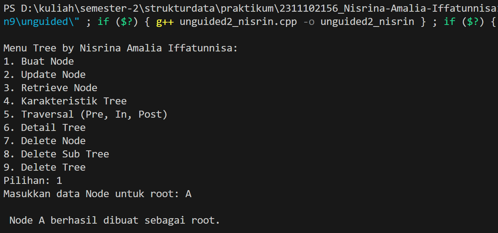

# <h1 align="center">Laporan Praktikum Modul 9 -  Graph dan Tree </h1>
<p align="center">2311102156 - Nisrina Amalia Iffatunnisa</p>

## Dasar Teori
1. Graph (Lintasan) <br>


adalah struktur data graph adalah semua tentang node dan edge. Graph adalah struktur data (V, E) yang terdiri dari : kumpulan vertices (V), kumpulan edge (E) yang diwakili oleh pasangan vertices (u, v).Biasanya graf digambarkan sebagai kumpulan titik-titik (melambangkan verteks) yang dihubungkan oleh garis-garis (melambangkan sisi). Ada 2 macam grafh yaitu: <br>

- Graph tak terarah (Undirected graph) : adalah graph yang menghubungkan 2 simpul V1  ke V2 dan V2 ke V1 (2 arah).  Graph tak terarah lengkap akan mempunyai busur sama dengan n (n - 1) / 2.
- Graph terarah (Directed  graph) : adalah graph yang hanya dapat menghubungkan 2 simpul V1  ke V2 saja (1 arah). Dengan maksimum jumlah busur dari n simpul adalah n (n - 1) <br>
- Weight Graph : Graph yang mempunyai nilai pada tiap edgenya. <br>
Beberapa operasi dasar graph yang bisa dijalankan, antara lain adalah: <br>
- Cari (Search) 
- Lintasan Grafik (Graph Traversing) 
- Insert 
- Menemukan jalur dari satu simpul ke simpul lainnya (Find)

Secara umum terdapat dua macam representasi dari struktur data graf yang dapat diimplementasi, yaitu: <br>
a. Adjacency list, dan diimplementasi dengan menampilkan masing-masing simpul sebagai sebuah struktur data yang mengandung senarai dari semua simpul yang saling berhubungan. Bentuk representasi dari seluruh sisi atau busur dalam suatu graf sebagai suatu senarai. Simpul-simpul yang dihubungkan sisi atau busur tersebut dinyatakan sebagai simpul yang saling terkait <br>

b. Adjacency Matriks merupakan bentuk representasi matriks n x n yang menyatakan hubungan antar simpul dalam suatu graf. Kolom dan baris dari matriks ini merepresentasikan simpul-simpul, dan nilai entri dalam matriks ini menyatakan hubungan antar simpul, apakah terdapat sisi yang menghubungkan kedua simpul tersebut.<br>


2. Tree (Pohon) <br>
<br>
Tree atau pohon didefinisikan sebagai kumpulan elemen yang salah satu elemennya disebut dengan Akar (Root) dan sisa elemen yang lain (simpul) terpecah menjadi sejumlah himpunan yang saling tidak berhubungan satu sama lain, yang disebut dengan Subpohon (Subtree), atau cabang. Sebuah pohon tersusun dari satu atau lebih  simpul (node) yang terdiri dari  satu simpul akar (root) sedang sisanya membentuk subtree dari akar. Jumlah subtree dari satu simpul tersebut dinamakan derajat atau degree. Terdapat simpul anak (children) dan orangtua dari anak (parent). Simpul anak yang memiliki derajat nol disebut daun (leaf). Dalam sebuah pohon memiliki kedalaman height dan depth dan terdapat suatu pohon ditentukan oleh level maksimum dari simpul dalam pohon. Susunan beberapa ppohon membentuk hutan (forest). Istilah lainnya dalam tree yang biasa digunakan adalah <br>
- Predecessor, node yang berada di atas node tertentu <br>
- Successor, node yang berada di bawah node tertentu <br>
- Ancestor, seluruh node yang terletak sebelum node tertentu pada jalur yang sama<br>
- Descendant, seluruh node yang terletak sesudah node tertentu pada jalur yang sama<br>
- Sibling, node-node yang memiliki father yang sama dengan suatu node<br>
- Subtree, bagian tree yang berupa suatu node beserta descendant-nya dan memiliki semua karakteristik dari tree tersebut<br>
- Size, banyaknya node dalam suatu tree<br>
- Height, banyaknya tingkatan atau level dalam suatu tree<br>

Penelusuran pohon biner (Binary Tree Traversal) merupakan suatu kegiatan melakukan penelusuran (traversing) atau kunjungan (visiting) masing-masing simpul sebanyak satu kali. Penelusuran satu pohon biner secara penuh akan menghasilkan urutan linier dari 
informasi dalam pohon tersebut. Ada 3 macam traversal, yaitu:<br>
a. Pre Order : dimulai dari mengunjungi akar (root), kemudian kiri, dan terakhir kanan dari akar yang ditinjau begitu seterusnya (Root-Kiri-Kanan)<br>
b. In Order : dimulai dari mengunjungi simpul kiri, kemudian ke akar dari  
simpul tersebut dilanjutkan ke kanan dari akar yang ditinjau, begitu seterusnya (Kiri-Root-Kanan)<br>
c. Post Order : dimulai dari mengunjungi simpul kiri, kemudian simpul kanan, dan terakhir kanan mengunjungi akar (Kiri-Kanan-Root)<br>

Operasi pada Tree antara lain : <br>
- Add Node adalah operasi untuk menambahkan node baru ke dalam struktur pohon yang telah didefinisikan. Node pertama akan dijadikan sebagai root, selajutnya sebagai child baik kanan maupun kiri. <br>
- Update Node adalah operasi untuk meng-update informasi suatu node, baik itu informasi mengenai isi node, maupun informasi parent atau children dari node tersebut. <br>
- Delete Node adalah operasi untuk menghapus suatu node dari struktur tree <br>
- Clear: digunakan untuk mengosongkan binary tree yang sudah ada atau menghapus semua node pada binary tree. <br> 
- View Tree adalah operasi untuk menampilkan sebagian atau keseluruhan node yang menyusun suatu struktur pohon <br>
- isEmpty berfungsi untuk memeriksa apakah binary tree masih kosong atau sudah terisi. <br>
- Retrive adalah operasi untuk mengetahui isi dari node yang ditunjuk pointer current dengan syarat tree tidak boleh kosong.<br> 
- Find adalah operasi untuk digunakan untuk mencari root, parent, left child, atau right child dari suatu node dengan syarat tree tidak boleh kosong. <br>

## Guided 

### 1. Program Graph

```C++
#include <iostream>
#include <iomanip>
using namespace std;

// Deklarasi array simpul yang berisi 7 string nama kota
string simpul[7] = {
    "Ciamis", "Bandung", "Bekasi", "Tasikmalaya", "Cianjur", "Purwokerto", "Yogyakarta"
};

// Deklarasi array 2 dimensi busur yang mewakili jarak antar kota
int busur[7][7] = {
    {0,7,8,0,0,0,0}, // Jarak dari kota pertama ke semua kota lainnya
    {0,0,5,0,0,15,0}, // Jarak dari kota kedua ke semua kota lainnya
    {0,6,0,0,5,0,0}, // ketiga dst
    {0,5,0,0,2,4,0},
    {23,0,0,10,0,0,8},
    {0,0,0,0,7,0,3},
    {0,0,0,0,9,4,0}
};

void tampilGraph(){ // Fungsi graph
    for(int baris = 0; baris<7; baris++){
        cout << " " << setiosflags(ios::left) << 
        setw(15) << simpul [baris] << " : " ; // Mencetak nama kota
        
        for (int kolom = 0; kolom<7; kolom++){
            if (busur[baris] [kolom] != 0){ // Mengecek adanya koneksi antar kota (bukan 0)
                cout << " " << simpul [kolom] << "(" << // Mencetak nama kota tujuan dan jaraknya
                busur[baris] [kolom] << ")";
            }
        } cout << endl;
    }
}

int main(){
    tampilGraph(); //Memanggil fungsi tampilGraph() untuk menampilkan graf
}
```
Kode program di atas berfungsi untuk menampilkan informasi berupa jarak antar kota satu dengan yang lain, 7 kota tersebut di antaranya : Ciamis, Bandung, Bekasi, Tasikmalaya, Cianjur, Purwokerto, Yogyakarta. Dengan menampilkan jarak dari rute terpanjang dan terpendek antar kota. Dalam kode tersebut terdapat: <br>
a. Definisikan array dua dimensi: ```simpul``` untuk nama-nama kota dan ```busur``` untuk jarak antar kota. Di ```busur```, elemen pada baris i dan kolom j mewakili jarak dari kota simpul [i] ke kota simpul [j].<br>

a. Fungsi ```tampilGraph()``` iterasi melalui array ```simpul``` dan ```busur``` untuk menampilkan nama-nama kota dan jarak antar kota dalam format yang rapi dengan memanfaatkan setw. <br>
b. Loop ```for``` pertama mengulangi semua baris dalam matriks busur. Loop ```for``` kedua mengulangi semua kolom dalam baris saat ini. <br>
c. Menampilkan nama kota: Akan menampilkan nama kota yang direpresentasikan oleh baris menggunakan spasi dan ```setw``` untuk mengatur lebar kolom.  <br>
d. Memeriksa jarak: Akan memeriksa apakah elemen matriks ```busur``` pada baris dan kolom saat ini tidak sama dengan 0. Jika tidak sama dengan 0, maka elemen tersebut mewakili jarak antar kota, lalu menampilkan nama kota tujuan dan jaraknya. <br>
e. Fungsi ```main()``` memanggil fungsi ```tampilGraph()``` untuk menampilkan atau menjalankan graf. <br>

### 2. Program Tree


```C++
#include <iostream>
#include <iomanip>
using namespace std;
struct Pohon
{
    char data;
    Pohon *left, *right, *parent;
};
Pohon *root, *baru;
void init()
{
    root = NULL;
}
bool isEmpty()
{
    return root == NULL;
}
void buatNode(char data)
{
    if (isEmpty())
    {
        root = new Pohon();
        root->data = data;
        root->left = NULL;
        root->right = NULL;
        root->parent = NULL;
        cout << "\n Node " << data << " berhasil dibuat sebagai root."
             << endl;
    }
    else
    {
        cout << "\n Tree sudah ada!" << endl;
    }
}
Pohon *insertLeft(char data, Pohon *node)
{
    if (isEmpty())
    {
        cout << "\n Buat tree terlebih dahulu!" << endl;
        return NULL;
    }
    else
    {
        if (node->left != NULL)
        {
            cout << "\n Node " << node->data << " sudah ada child kiri !" << endl;
                return NULL;
        }
        else
        {
            Pohon *baru = new Pohon();
            baru->data = data;
            baru->left = NULL;
            baru->right = NULL;
            baru->parent = node;
            node->left = baru;
            cout << "\n Node " << data << " berhasil ditambahkan ke child kiri " << baru->parent->data << endl;
                return baru;
        }
    }
}
Pohon *insertRight(char data, Pohon *node)
{
    if (isEmpty())
    {
        cout << "\n Buat tree terlebih dahulu!" << endl;
        return NULL;
    }
    else
    {
        if (node->right != NULL)
        {
            cout << "\n Node " << node->data << " sudah ada child  kanan !" << endl;
                return NULL;
        }
        else
        {
            Pohon *baru = new Pohon();
            baru->data = data;
            baru->left = NULL;
            baru->right = NULL;
            baru->parent = node;
            node->right = baru;
            cout << "\n Node " << data << " berhasil ditambahkan ke child kanan " << baru->parent->data << endl;
                return baru;
        }
    }
}
void update(char data, Pohon *node)
{
    if (isEmpty())
    {
        cout << "\n Buat tree terlebih dahulu!" << endl;
    }
    else
    {
        if (!node)
        {
            cout << "\n Node yang ingin diganti tidak ada!!" << endl;
        }
        else
        {
            char temp = node->data;
            node->data = data;
            cout << "\n Node " << temp << " berhasil diubah menjadi "
                 << data << endl;
        }
    }
}
void retrieve(Pohon *node)
{
    if (isEmpty())
    {
        cout << "\n Buat tree terlebih dahulu!" << endl;
    }
    else
    {
        if (!node)
        {
            cout << "\n Node yang ditunjuk tidak ada!" << endl;
        }
        else
        {
            cout << "\n Data node : " << node->data << endl;
        }
    }
}
void find(Pohon *node)
{
    if (isEmpty())
    {
        cout << "\n Buat tree terlebih dahulu!" << endl;
    }
    else
    {
        if (!node)
        {
            cout << "\n Node yang ditunjuk tidak ada!" << endl;
        }
        else
        {
            cout << "\n Data Node : " << node->data << endl;
            cout << " Root : " << root->data << endl;
            if (!node->parent)
                cout << " Parent : (tidak punya parent)" << endl;
            else
                cout << " Parent : " << node->parent->data << endl;
            if (node->parent != NULL && node->parent->left != node &&
                node->parent->right == node)
                cout << " Sibling : " << node->parent->left->data << endl;
            else if (node->parent != NULL && node->parent->right != node && node->parent->left == node)
                cout << " Sibling : " << node->parent->right->data << endl;
            else
                cout << " Sibling : (tidak punya sibling)" << endl;
            if (!node->left)
                cout << " Child Kiri : (tidak punya Child kiri)" << endl;
            else
                cout << " Child Kiri : " << node->left->data << endl;
            if (!node->right)
                cout << " Child Kanan : (tidak punya Child kanan)" << endl;
            else
                cout << " Child Kanan : " << node->right->data << endl;
        }
    }
}
// Penelusuran (Traversal)
// preOrder
void preOrder(Pohon *node = root)
{
    if (isEmpty())
    {
        cout << "\n Buat tree terlebih dahulu!" << endl;
    }
    else
    {
        if (node != NULL)
        {
            cout << " " << node->data << ", ";
            preOrder(node->left);
            preOrder(node->right);
        }
    }
}
// inOrder
void inOrder(Pohon *node = root)
{
    if (isEmpty())
    {
        cout << "\n Buat tree terlebih dahulu!" << endl;
    }
    else
    {
        if (node != NULL)
        {
            inOrder(node->left);
            cout << " " << node->data << ", ";
            inOrder(node->right);
        }
    }
}
// postOrder
void postOrder(Pohon *node = root)
{
    if (isEmpty())
    {
        cout << "\n Buat tree terlebih dahulu!" << endl;
    }
    else
    {
        if (node != NULL)
        {
            postOrder(node->left);
            postOrder(node->right);
            cout << " " << node->data << ", ";
        }
    }
}
// Hapus Node Tree
void deleteTree(Pohon *node)
{
    if (isEmpty())
    {
        cout << "\n Buat tree terlebih dahulu!" << endl;
    }
    else
    {
        if (node != NULL)
        {
            if (node != root)
            {
                node->parent->left = NULL;
                node->parent->right = NULL;
            }
            deleteTree(node->left);
            deleteTree(node->right);
            if (node == root)
            {
                delete root;
                root = NULL;
            }
            else
            {
                delete node;
            }
        }
    }
}
// Hapus SubTree
void deleteSub(Pohon *node)
{
    if (isEmpty())
    {
        cout << "\n Buat tree terlebih dahulu!" << endl;
    }
    else
    {
        deleteTree(node->left);
        deleteTree(node->right);
        cout << "\n Node subtree " << node->data << " berhasil dihapus." << endl;
    }
}
// Hapus Tree
void clear()
{
    if (isEmpty())
    {
        cout << "\n Buat tree terlebih dahulu!!" << endl;
    }
    else
    {
        deleteTree(root);
        cout << "\n Pohon berhasil dihapus." << endl;
    }
}
// Cek Size Tree
int size(Pohon *node = root)
{
    if (isEmpty())
    {
        cout << "\n Buat tree terlebih dahulu!!" << endl;
        return 0;
    }
    else
    {
        if (!node)
        {
            return 0;
        }
        else
        {
            return 1 + size(node->left) + size(node->right);
        }
    }
}
// Cek Height Level Tree
int height(Pohon *node = root)
{
    if (isEmpty())
    {
        cout << "\n Buat tree terlebih dahulu!" << endl;
        return 0;
    }
    else
    {
        if (!node)
        {
            return 0;
        }
        else
        {
            int heightKiri = height(node->left);
            int heightKanan = height(node->right);
            if (heightKiri >= heightKanan)
            {
                return heightKiri + 1;
            }
            else
            {
                return heightKanan + 1;
            }
        }
    }
}
// Karakteristik Tree
void characteristic()
{
    cout << "\n Size Tree : " << size() << endl;
    cout << " Height Tree : " << height() << endl;
    cout << " Average Node of Tree : " << size() / height() << endl;
}
int main()
{
   buatNode('A');
    Pohon *nodeB, *nodeC, *nodeD, *nodeE, *nodeF, *nodeG, *nodeH, *nodeI, *nodeJ;

    nodeB = insertLeft('B', root);
    nodeC = insertRight('C', root);
    nodeD = insertLeft('D', nodeB);
    nodeE = insertRight('E', nodeB);
    nodeF = insertLeft('F', nodeC);
    nodeG = insertLeft('G', nodeE);
    nodeH = insertRight('H', nodeE);
    nodeI = insertLeft('I', nodeG);
    nodeJ = insertRight('J', nodeG);

    update('Z', nodeC);
    update('C', nodeC);
    retrieve(nodeC);
    find(nodeC);
    characteristic();

    cout << "\n PreOrder :" << endl;
    preOrder(root);
    cout << "\n" << endl;

    cout << " InOrder :" << endl;
    inOrder(root);
    cout << "\n" << endl;
    
    cout << " PostOrder :" << endl;
    postOrder(root);
    cout << "\n" << endl;
}
```

Kode program di atas berfungsi untuk menampilkan hasil dari memanipulasi struktur data pohon. Program ini pertama-tama membuat sebuah ```node root``` dengan data karakter 'A'.  Kemudian program ini menyisipkan beberapa node anak (```child```) ke dalam pohon menggunakan fungsi ```insertLeft``` dan ```insertRight```.  Setelah itu program memperbarui data pada salah satu node (node C) menggunakan fungsi ```update```, kemudian menampilkan informasi mengenai node C menggunakan fungsi ```retrieve``` dan ```find```. Selanjutnya program menampilkan karakteristik pohon menggunakan fungsi ```characteristic```, yang meliputi ukuran pohon, tinggi pohon, dan rata-rata node per level. Terakhir program menampilkan isi pohon dengan cara menelusuri pohon secara traversal dengan fungsi ```preOrder```, ```inOrder```, dan ```postOrder```. Penjelasan setiap fungsi lebih detail sebagai berikut: <br>
a. Di definisikan dengan ```struct Pohon``` : struct digunakan untuk mendefinisikan struktur data yang diberi nama ```Pohon```. <br>
b. ```{ char data; Pohon *left, *right, *parent; };``` : digunakan untuk deklarasi variabel mendefinisikan anggota-anggota struktur ```Pohon```. Tipe ```char``` digunakan untuk menyimpan data pada node pohonh yang berupa karakter tunggal. <br>
c. ```Pohon *left, *right, *parent;```: merupakan pointer yang digunakan untuk menunjuk ke node anak sebelah kiri (```left```), anak sebelah kanan (```right```), dan parent (orang tua)```node``` pada pohon. <br>
d. ```Pohon *root, *baru;```: mendeklarasikan dua pointer global yang diberi nama ```root``` dan ```baru```. Pointer ```root``` digunakan untuk menunjuk ke node root (akar) pohon, sedangkan pointer ```baru``` digunakan sebagai pointer temporer yang akan dipakai saat pembuatan node baru pada pohon. <br>
e. ```bool isEmpty()``` : ```bool``` menandakan bahwa fungsi ini tidak memiliki parameter, mengembalikan nilai bertipe bool (true atau false). <br>
f. Fungsi ```buatNode``` yang menerima satu parameter bertipe char dan tidak mengembalikan nilai (bertipe ```void```). Parameter tersebut digunakan untuk mengisi nilai data pada node baru yang akan dibuat. <br>
g. Fungsi ```insertLeft``` yang  menerima dua parameter.  Parameter pertama bertipe char yang digunakan untuk mengisi nilai data pada node anak yang akan dibuat.  Parameter kedua bertipe Pohon* yang menunjukkan node referensi tempat penyisipan node anak baru.  Fungsi ini tidak mengembalikan nilai (bertipe void). <br>
h. Fungsi ```insertRight``` untuk menambahkan node anak baru pada sebuah pohon atau menyisipkan node baru di sebelah kiri node referensi. ```node->right``` = NULL mengosongkan pointer right pada node yang menandakan bahwa node referensi belum memiliki anak sebelah kanan. <br>
i. Fungsi ```update``` digunakan untuk memperbarui nilai data pada sebuah node.  Fungsi ini menerima dua parameter, yaitu : ```char data``` merupakan Data baru yang akan digunakan untuk memperbarui node. Dan kedua ```Pohon *node```: Pointer ke node yang ingin diperbarui datanya. <br>
j. Fungsi ```retrieve``` digunakan untuk menampilkan data pada sebuah node.  Fungsi ini menerima satu parameter bertipe ```Pohon*``` serta tidak mengembalikan nilai (bertipe ```void```). <br>
k. Fungsi ```find``` digunakan untuk menampilkan informasi mengenai sebuah node tertentu pada pohon. Fungsi ini menerima satu parameter bertipe ```Pohon*``` serta tidak mengembalikan nilai (bertipe ```void```). Perbedaan fungsi ```retrieve``` dengan ```find```terletak pada informasi tambahan yang ditampilkan, yaitu informasi parent (orang tua/induk), sibling (saudara), dan child (anak) dari node referensi.<br>
l. Fungsi ```preOrder, inOrder, dan postOrder``` digunakan untuk melakukan penelusuran (traversal) pada struktur pohon.  Masing-masing fungsi memiliki urutan kunjungan node yang berbeda.

- pre-order : pertama akan mengunjungi ```node root``` terlebih dahulu, lalu mengunjungi secara rekursif semua node anak pada sub-pohon sebelah ```kiri``` dari node root, dan terakhir sebelah ```kanan```dari node root. <br>
- in-order: pertama akan mengunjungi secara rekursif semua node anak pada sub-pohon sebelah ```kiri```, lalu ```node root```, dan terakhir mengunjungi sebelah ```kanan``` dari node root. <br>
- post-order : pertama akan mengunjungi secara rekursif semua node anak pada sub-pohon sebelah ```kiri``` dari node root, lalu mengunjungi sebelah ```kanan```, terakhir mengunjungi ```node root```. <br>

m. Fungsi ```deleteTree``` digunakan untuk menghapus seluruh node pada pohon.  Fungsi ini menerima satu parameter bertipe ```Pohon*``` serta ini tidak mengembalikan nilai (bertipe ```void```).<br>
n. Fungsi ```deleteSub``` digunakan untuk menghapus sub-pohon atau upa-pohon yang berakar pada node tertentu.<br>
o. Fungsi ```clear``` digunakan untuk menghapus seluruh node pada pohon dan mengembalikan pohon ke keadaan kosong. <br>
p. Fungsi ```size``` digunakan untuk menghitung jumlah node pada pohon.  Fungsi ini tidak menerima parameter dan mengembalikan nilai bertipe ```int``` yang menunjukkan jumlah node pada pohon. Fungsi ini  akan menelusuri seluruh node pada pohon dan menghitung jumlahnya. <br>
q. Fungsi ```height``` digunakan untuk menghitung tinggi pohon.  Fungsi ini tidak menerima parameter dan mengembalikan nilai bertipe int yang menunjukkan tinggi atau level pohon. Kemudian nilainya ditambah 1 (karena level teratas dihitung sebagai level 0). <br>
r. Fungsi ```characteristic``` ini digunakan untuk menampilkan beberapa karakteristik dari pohon yang sedang aktif yang ditampilkan adalah : Ukuran Pohon (Size Tree), Tinggi Pohon (Height Tree), dan Rata-rata Node per Level (Average Node of Tree)<br>

## Unguided

### 1. Buatlah program graph dengan menggunakan inputan user untuk menghitung jarak dari sebuah kota ke kota lainnya. 
```C++
#include <iostream>
#include <iomanip>
#include <string>
using namespace std;

const int MAX = 100; 

void tampilMatrix(string simpul[], int busur[][MAX], int jumlahSimpul) {
    cout << "\nJarak antar kota (graf) oleh Nisrina :" << endl;
    cout << setw(10) << " ";
    for (int i = 0; i < jumlahSimpul; i++) {
        cout << setw(10) << simpul[i];
    }
    cout << endl;
    for (int i = 0; i < jumlahSimpul; i++) {
        cout << setw(10) << simpul[i];
        for (int j = 0; j < jumlahSimpul; j++) {
            cout << setw(10) << busur[i][j];
        }
        cout << endl;
    }
}

int main() {
    int jumlahSimpulNisrina_2311102156;
    cout << "Program Hitung Jarak Antar Kota by.nisrin" <<endl;
    cout << "Silahkan masukkan jumlah simpul: ";
    cin >> jumlahSimpulNisrina_2311102156;
    cin.ignore(); 

    string simpul[MAX];
    int busur[MAX][MAX] = {0};

    cout << "Silahkan masukkan nama simpul:" << endl;
    for (int i = 0; i < jumlahSimpulNisrina_2311102156; i++) {
        cout << "Simpul " << i + 1 << " : ";
        getline(cin, simpul[i]);
    }

    cout << "Silahkan masukkan bobot antar simpul (masukkan 0 jika tidak ada jalur):" << endl;
    for (int i = 0; i < jumlahSimpulNisrina_2311102156; i++) {
        for (int j = 0; j < jumlahSimpulNisrina_2311102156; j++) {
            cout << simpul[i] << " ke " << simpul[j] << " : ";
            cin >> busur[i][j];
        }
    }

    tampilMatrix(simpul, busur, jumlahSimpulNisrina_2311102156);

    return 0;
}
```
#### Output:


Kode program di atas berfungsi untuk menampilkan matriks jarak antar simpul (titik) dalam suatu rute antar kota. Pertama, program ini meminta pengguna memasukkan jumlah simpul yang ada. Kemudian, pengguna diminta untuk memberi nama setiap simpul. Lalu, pengguna harus mengisi jarak antara tiap pasang simpul. Program ini menganggap jarak bisa 0, yang menandakan tidak ada jalur penghubung antara dua simpul tersebut. Terakhir, program menampilkan matriks jarak yang berisi jarak antar semua simpul yang telah dimasukkan sebelumnya. <br>

- Fungsi ```tampilMatrix``` berfungsi untuk menampilkan matriks jarak antar simpul, dengan ```string simpul[]```: Array untuk menyimpan nama-nama simpul (maks. 100). Lalu ```int busur[][MAX]```: Array dua dimensi untuk menyimpan jarak antar simpul, dan ```int jumlahSimpul``` : Variabel yang menyimpan jumlah simpul yang dimasukkan pengguna. <br>
- int ```jumlahSimpulNisrina_2311102156;```: Deklarasi variabel untuk menyimpan jumlah simpul yang akan dimasukkan. <br>
- ```cout << "Silahkan masukkan nama simpul:" << endl;``` meminta pengguna untuk memasukkan nama-nama simpul.
- Looping ```for``` digunakan untuk meminta pengguna memasukkan nama untuk setiap simpul (sebanyak jumlah simpul).
- Dalam main fungsi ```tampilMatrix``` untuk menampilkan matriks jarak yang sudah diisi.

#### SS Kode Program


### 2. Modifikasi guided tree diatas dengan program menu menggunakan input data tree dari user dan berikan fungsi tambahan untuk menampilkan node child dan descendant dari node yang diinput kan! 

```C++
#include <iostream>
#include <iomanip>
using namespace std;

struct Pohon_nisrina156
{
    char dataNisrina_2311102156;
    Pohon_nisrina156 *left, *right, *parent;
};

Pohon_nisrina156 *root, *baru;

void init()
{
    root = NULL;
}

bool isEmpty()
{
    return root == NULL;
}

void buatNode_156(char dataNisrina_2311102156)
{
    if (isEmpty())
    {
        root = new Pohon_nisrina156();
        root->dataNisrina_2311102156 = dataNisrina_2311102156;
        root->left = NULL;
        root->right = NULL;
        root->parent = NULL;
        cout << "\n Node " << dataNisrina_2311102156 << " berhasil dibuat sebagai root." << endl;
    }
    else
    {
        cout << "\n Tree sudah ada!" << endl;
    }
}

Pohon_nisrina156 *insertLeft(char dataNisrina_2311102156, Pohon_nisrina156 *node)
{
    if (isEmpty())
    {
        cout << "\n Buat tree terlebih dahulu!" << endl;
        return NULL;
    }
    else
    {
        if (node->left != NULL)
        {
            cout << "\n Node " << node->dataNisrina_2311102156 << " sudah ada child kiri !" << endl;
            return NULL;
        }
        else
        {
            Pohon_nisrina156 *baru = new Pohon_nisrina156();
            baru->dataNisrina_2311102156 = dataNisrina_2311102156;
            baru->left = NULL;
            baru->right = NULL;
            baru->parent = node;
            node->left = baru;
            cout << "\n Node " << dataNisrina_2311102156 << " berhasil ditambahkan ke child kiri " << baru->parent->dataNisrina_2311102156 << endl;
            return baru;
        }
    }
}

Pohon_nisrina156 *insertRight(char dataNisrina_2311102156, Pohon_nisrina156 *node)
{
    if (isEmpty())
    {
        cout << "\n Buat tree terlebih dahulu!" << endl;
        return NULL;
    }
    else
    {
        if (node->right != NULL)
        {
            cout << "\n Node " << node->dataNisrina_2311102156 << " sudah ada child  kanan !" << endl;
            return NULL;
        }
        else
        {
            Pohon_nisrina156 *baru = new Pohon_nisrina156();
            baru->dataNisrina_2311102156 = dataNisrina_2311102156;
            baru->left = NULL;
            baru->right = NULL;
            baru->parent = node;
            node->right = baru;
            cout << "\n Node " << dataNisrina_2311102156 << " berhasil ditambahkan ke child kanan " << baru->parent->dataNisrina_2311102156 << endl;
            return baru;
        }
    }
}

void update(char dataNisrina_2311102156, Pohon_nisrina156 *node)
{
    if (isEmpty())
    {
        cout << "\n Buat tree terlebih dahulu!" << endl;
    }
    else
    {
        if (!node)
        {
            cout << "\n Node yang ingin diganti tidak ada!!" << endl;
        }
        else
        {
            char temp = node->dataNisrina_2311102156;
            node->dataNisrina_2311102156 = dataNisrina_2311102156;
            cout << "\n Node " << temp << " berhasil diubah menjadi " << dataNisrina_2311102156 << endl;
        }
    }
}
void retrieve(Pohon_nisrina156 *node)
{
    if (isEmpty())
    {
        cout << "\n Buat tree terlebih dahulu!" << endl;
    }
    else
    {
        if (!node)
        {
            cout << "\n Node yang ditunjuk tidak ada!" << endl;
        }
        else
        {
            cout << "\n Data node : " << node->dataNisrina_2311102156 << endl;
        }
    }
}
// Fungsi untuk mencari node berdasarkan dataNisrina_2311102156
Pohon_nisrina156 *find(Pohon_nisrina156 *node, char dataNisrina_2311102156)
{
    if (node == NULL)
    {
        return NULL;
    }
    if (node->dataNisrina_2311102156 == dataNisrina_2311102156)
    {
        return node;
    }
    Pohon_nisrina156 *leftResult = find(node->left, dataNisrina_2311102156);
    if (leftResult != NULL)
    {
        return leftResult;
    }
    return find(node->right, dataNisrina_2311102156);
}
void preOrder(Pohon_nisrina156 *node = root) // Penelusuran (Traversal) preOrder
{
    if (isEmpty())
    {
        cout << "\n Buat tree terlebih dahulu!" << endl;
    }
    else
    {
        if (node != NULL)
        {
            cout << " " << node->dataNisrina_2311102156 << ", ";
            preOrder(node->left);
            preOrder(node->right);
        }
    }
}

// inOrder
void inOrder(Pohon_nisrina156 *node = root)
{
    if (isEmpty())
    {
        cout << "\n Buat tree terlebih dahulu!" << endl;
    }
    else
    {
        if (node != NULL)
        {
            inOrder(node->left);
            cout << " " << node->dataNisrina_2311102156 << ", ";
            inOrder(node->right);
        }
    }
}

// postOrder
void postOrder(Pohon_nisrina156 *node = root)
{
    if (isEmpty())
    {
        cout << "\n Buat tree terlebih dahulu!" << endl;
    }
    else
    {
        if (node != NULL)
        {
            postOrder(node->left);
            postOrder(node->right);
            cout << " " << node->dataNisrina_2311102156 << ", ";
        }
    }
}
// Hapus Node Tree
void deleteNode(Pohon_nisrina156 *node)
{
    if (isEmpty())
    {
        cout << "\n Buat tree terlebih dahulu!" << endl;
    }
    else
    {
        if (node != NULL)
        {
            if (node != root)
            {
                node->parent->left = NULL;
                node->parent->right = NULL;
            }
            deleteNode(node->left);
            deleteNode(node->right);
            if (node == root)
            {
                delete root;
                root = NULL;
            }
            else
            {
                cout << "Node " << node->dataNisrina_2311102156 << " berhasil dihapus" << endl;
                delete node;
            }
        }
    }
}
// Hapus SubTree
void deleteSub(Pohon_nisrina156 *node)
{
    if (isEmpty())
    {
        cout << "\n Buat tree terlebih dahulu!" << endl;
        return;
    }
    if (node == NULL)
    {
        cout << "\n Node yang ingin dihapus tidak ada!" << endl;
        return;
    }
    // Menghapus subtree kiri dan kanan dari node yang diberikan
    deleteNode(node->left);
    deleteNode(node->right);
    // Memutus hubungan node dari parentnya
    if (node->parent != NULL)
    {
        if (node->parent->left == node)
            node->parent->left = NULL;
        else if (node->parent->right == node)
            node->parent->right = NULL;
    }
    // Menghapus node itu sendiri jika bukan root
    if (node != root)
    {
        delete node;
    }
    else
    {
        root = NULL;
    }
    cout << "\n Subtree berhasil dihapus." << endl;
}
// Hapus Tree
void clear()
{
    if (isEmpty())
    {
        cout << "\n Buat tree terlebih dahulu!!" << endl;
    }
    else
    {
        deleteNode(root);
        cout << "\n Pohon berhasil dihapus." << endl;
    }
}

int size(Pohon_nisrina156 *node = root) // Cek Size Tree
{
    if (isEmpty())
    {
        cout << "\n Buat tree terlebih dahulu!!" << endl;
        return 0;
    }
    else
    {
        if (!node)
        {
            return 0;
        }
        else
        {
            return 1 + size(node->left) + size(node->right);
        }
    }
}
int height(Pohon_nisrina156 *node = root) // Cek Height Level Tree
{
    if (isEmpty())
    {
        cout << "\n Buat tree terlebih dahulu!" << endl;
        return 0;
    }
    else
    {
        if (!node)
        {
            return 0;
        }
        else
        {
            int heightKiri = height(node->left);
            int heightKanan = height(node->right);
            if (heightKiri >= heightKanan)
            {
                return heightKiri + 1;
            }
            else
            {
                return heightKanan + 1;
            }
        }
    }
}
void printDescendant(Pohon_nisrina156 *node) // Fungsi tambahan untuk menampilkan descendant
{
    if (node != NULL)
    {
        if (node->left != NULL || node->right != NULL)
        {
            if (node->left != NULL)
            {
                cout << node->left->dataNisrina_2311102156 << " ";
                printDescendant(node->left);
            }
            if (node->right != NULL)
            {
                cout << node->right->dataNisrina_2311102156 << " ";
                printDescendant(node->right);
            }
        }
    }
}
void printChildren(Pohon_nisrina156 *node)
{
    if (node != NULL)
    {
        if (node->left != NULL)
        {
            cout << node->left->dataNisrina_2311102156 << " ";
            printChildren(node->left);
        }
        if (node->right != NULL)
        {
            cout << node->right->dataNisrina_2311102156 << " ";
            printChildren(node->right);
        }
    }
}
void characteristic(Pohon_nisrina156 *node) // Karakteristik Tree
{
    if (isEmpty())
    {
        cout << "\n Buat tree terlebih dahulu!" << endl;
        return;
    }

    if (!node)
    {
        cout << "\n Node yang ditunjuk tidak ada!" << endl;
        return;
    }

    cout << "\n Data Node : " << node->dataNisrina_2311102156 << endl;
    cout << "Root : " << root->dataNisrina_2311102156 << endl;
    if (!node->parent)
        cout << "Parent : (tidak punya parent)" << endl;
    else
        cout << "Parent : " << node->parent->dataNisrina_2311102156 << endl;

    if (node->parent != NULL && node->parent->left != node && node->parent->right == node)
        cout << "Sibling : " << node->parent->left->dataNisrina_2311102156 << endl;
    else if (node->parent != NULL && node->parent->right != node && node->parent->left == node)
        cout << "Sibling : " << node->parent->right->dataNisrina_2311102156 << endl;
    else
        cout << "Sibling : (tidak punya sibling)" << endl;

    if (!node->left)
        cout << "Child Kiri : (tidak punya Child kiri)" << endl;
    else
        cout << "Child Kiri : " << node->left->dataNisrina_2311102156 << endl;

    if (!node->right)
        cout << "Child Kanan : (tidak punya Child kanan)" << endl;
    else
        cout << "Child Kanan : " << node->right->dataNisrina_2311102156 << endl;

    // Menampilkan semua child
    cout << "Child Nodes : ";
    printChildren(node);
    cout << endl;

    // Menampilkan descendant
    cout << "Descendant : ";
    printDescendant(node);
    cout << endl;
}

int main()
{
    char pilihan;
    do
    {
        cout << "\nMenu Tree by Nisrina Amalia Iffatunnisa:" << endl;
        cout << "1. Buat Node" << endl;
        cout << "2. Update Node" << endl;
        cout << "3. Retrieve Node" << endl;
        cout << "4. Karakteristik Tree" << endl;
        cout << "5. Traversal (Pre, In, Post)" << endl;
        cout << "6. Detail Tree" << endl;
        cout << "7. Delete Node" << endl;
        cout << "8. Delete Sub Tree" << endl;
        cout << "9. Delete Tree" << endl;
        cout << "Pilihan: ";
        cin >> pilihan;
        char dataNisrina_2311102156, parentdataNisrina_2311102156;
        Pohon_nisrina156 *parentNode, *node;

        switch (pilihan)
        {
        case '1':
            if (isEmpty())
            {
                cout << "Masukkan data Node untuk root: ";
                cin >> dataNisrina_2311102156;
                buatNode_156(dataNisrina_2311102156);
            }
            else
            {
                cout << "Masukkan data node baru: ";
                cin >> dataNisrina_2311102156;
                cout << "Masukkan data parent node: ";
                cin >> parentdataNisrina_2311102156;
                node = find(root, parentdataNisrina_2311102156);
                if (node == NULL)
                {
                    cout << "Node induk tidak ditemukan!" << endl;
                    break;
                }
                cout << "Pilih 1 untuk Child Kiri, 2 untuk Kanan: ";
                int choice;
                cin >> choice;
                if (choice == 1)
                {
                    insertLeft(dataNisrina_2311102156, node);
                }
                else if (choice == 2)
                {
                    insertRight(dataNisrina_2311102156, node);
                }
                else
                {
                    cout << "Pilihan tidak valid!" << endl;
                }
            }
            break;
        case '2':
            cout << "Masukkan data baru: ";
            cin >> dataNisrina_2311102156;
            cout << "Masukkan data node yang ingin diupdate: ";
            cin >> parentdataNisrina_2311102156;
            node = find(root, parentdataNisrina_2311102156);
            update(dataNisrina_2311102156, node);
            break;
        case '3':
            cout << "Masukkan node yang akan diambil: ";
            cin >> parentdataNisrina_2311102156;
            node = find(root, parentdataNisrina_2311102156);
            retrieve(node);
            break;
        case '4':
            cout << "Masukkan data node yang ingin ditampilkan karakteristiknya: ";
            cin >> parentdataNisrina_2311102156;
            node = find(root, parentdataNisrina_2311102156);
            characteristic(node);
            break;
        case '5':
            cout << "Traversal Pre Order: ";
            preOrder(root);
            cout << endl;

            cout << "Traversal In Order: ";
            inOrder(root);
            cout << endl;

            cout << "Traversal Post Order: ";
            postOrder(root);
            cout << endl;
            break;
        case '6':
            if (!isEmpty())
            {
                cout << "\nSize of Tree: " << size() << endl;
                cout << "Height of Tree: " << height() << endl;
                cout << "Average Value of Nodes: " << fixed << setprecision(2) << size() / height() << endl;
            }
            else
            {
                cout << "\nTree is empty." << endl;
            }
            break;
        case '7':
            cout << "Masukkan node yang ingin di hapus: ";
            cin >> parentdataNisrina_2311102156;
            node = find(root, parentdataNisrina_2311102156);
            deleteNode(node);
            break;
        case '8':
            cout << "Masukkan data node yang ingin dihapus subtreenya: ";
            cin >> parentdataNisrina_2311102156;
            node = find(root, parentdataNisrina_2311102156);
            deleteSub(node);
            break;
        case '9':
            clear();
            break;
        default:
            cout << "Mohon maaf pilihan tidak valid! Terima kasih sudah menggunakan program ini" << endl;
            break;
        }
    } while (pilihan != '0');

    return 0;
}
```
#### Output:
#### Menambahkan Node A sebagai root atau akar

#### Menambahkan Node tertentu di kanan maupun kiri


#### Mengubah Node tertentu

#### Mengambil Node tertentu

#### Menampilkan karakteristik Node tertentu

#### Menampilkan data Traversal (preOrder, inOrder, dan postOrder)

#### Menampilkan Informasi Tree/Pohon

#### Menghapus Node tertentu

#### Menghapus Sub Tree atau upa-pohon

#### Menghapus data Tree/Pohon keseluruhan


Kode program di atas menunjukkan implementasi dasar operasi dasar pada pohon/tree yang berfungsi menampilkan berbagai menu operasi. Pada unguided 2 merupakan modifikasi dan ini memiliki cara kerja yang sama dengan guided 2 di atas. Perbedannya hanya terletak pada unguided 2 ini pengguna menginputkan/memasukkan sendiri data-data node. Fungsi ```main``` berisi menu utama program dengan 9 pilihan: <br>
1. Buat Node: Memasukkan data baru untuk membuat node baru di pohon. Pengguna dapat memilih untuk menambahkan node sebagai anak kiri atau kanan dari node lain.<br>
2. Update Node: Memperbarui data pada node yang sudah ada. Pengguna perlu memasukkan data baru dan data node yang ingin diubah.<br>
3. Retrieve Node: Mengambil dan menampilkan data dari node tertentu. Pengguna perlu memasukkan data node yang ingin diambil.<br>
4. Karakteristik Tree: Menampilkan informasi tentang pohon, seperti jumlah node (ukuran), tinggi pohon, dan rata-rata nilai node.<br>
5. Traversal (Pre, In, Post): Melakukan traversal (penelusuran) pada pohon dengan tiga metode: Pre-order, In-order, dan Post-order. Hasil traversal ditampilkan ke layar.<br>
6. Detail Tree: Menampilkan informasi detail tentang pohon, seperti Size of Tree, Height of Tree, dan Average Value of Nodes, hanya jika pohon tidak kosong.<br>
7. Delete Node: Menghapus node tertentu dari pohon. Pengguna perlu memasukkan data node yang ingin dihapus.<br>
8. Delete Sub Tree: Menghapus seluruh subtree (upa-pohon) dari node tertentu. Pengguna perlu memasukkan data node yang ingin dihapus subtreenya.<br>
9. Delete Tree: Menghapus seluruh pohon, termasuk semua node dan datanya.<br>

Dalam program di atas juga menggunakan ```loop``` (perulangan) do-while untuk menjalankan menu utama berulang kali hingga pengguna memilih opsi 0 untuk keluar. Di dalam loop, program membaca pilihan pengguna dan melakukan tindakan yang sesuai dengan pilihan tersebut. Penjelasan fungsi lainnya, ada di bawah ini: <br>
- ```isEmpty()```: Memeriksa apakah sebuah pohon kosong.<br>
- ```find(root, data)```: Mencari node dengan data tertentu dalam pohon.<br>
- ```insertLeft(data, node)```: Memasukkan node baru sebagai anak kiri dari node yang diberikan.<br>
- ```insertRight(data, node)```: Memasukkan node baru sebagai anak kanan dari node yang diberikan.<br>
- ```update(data, node)```: Memperbarui data pada node yang diberikan.<br>
- ```preOrder(root)```: Melakukan traversal pre-order pada pohon, mengunjungi node akar terlebih dahulu, kemudian anak kiri dan kanan secara rekursif.<br>
- ```inOrder(root)```: Melakukan traversal in-order pada pohon, mengunjungi anak kiri, node akar, dan anak kanan secara rekursif.<br>
- ```postOrder(root)```: Melakukan traversal post-order pada pohon, mengunjungi anak kiri, anak kanan, dan node akar secara rekursif. <br>
- ```size()```: Menghitung jumlah node dalam pohon. <br>
- ```height()```: Menghitung tinggi pohon<br>
- ```clear()```: Menghapus seluruh pohon<br>

#### SS Kode Program


## Kesimpulan
Setelah melakukan praktikum modul 9 mempelajari Graph dan Tree yang dapat membantu dalam menyelesaikan masalah di kehidupan sehari-hari. Implementasi graph terbukti bermanfaat untuk merepresentasikan rute antar kota, dengan node mewakili kota dan edge (sisi) mewakili koneksi antar kota sehingga dapat digunakan untuk menemukan rute terpendek, terpanjang, atau rute dengan kriteria tertentu. Struktur data tree, dengan node sebagai elemen utama dan child (anak) dan descendant (keturunan), menunjukkan hierarki antar elemen. Operasi traversal seperti pre-order, in-order, dan post-order memungkinkan penelusuran elemen tree secara sistematis. Subtree (sub-pohon/upa-pohon) merupakan bagian dari tree yang berakar pada node tertentu, dan dapat dihapus atau dimodifikasi tanpa memengaruhi keseluruhan struktur tree.

## Referensi
[1] Purwono, P. (2023). Belajar Struktur Data dengan Python. Purwokerto : UHB Press, 2(1). <br>
[2] Soetanto, Hari. 2021. STRUKTUR DATA DASAR DASAR PEMROGRAMAN. Jakarta : Penerbit Universitas Budi Luhur. <br>
[3] Triase, T. (2020). Struktur Data: Diktat Edisi Revisi. <br>
[4] Zein, A., & Eriana, E. S. (2022). ALGORITMA DAN STRUKTUR DATA. Tangerang Selatan : UNPAM Press.<br>
